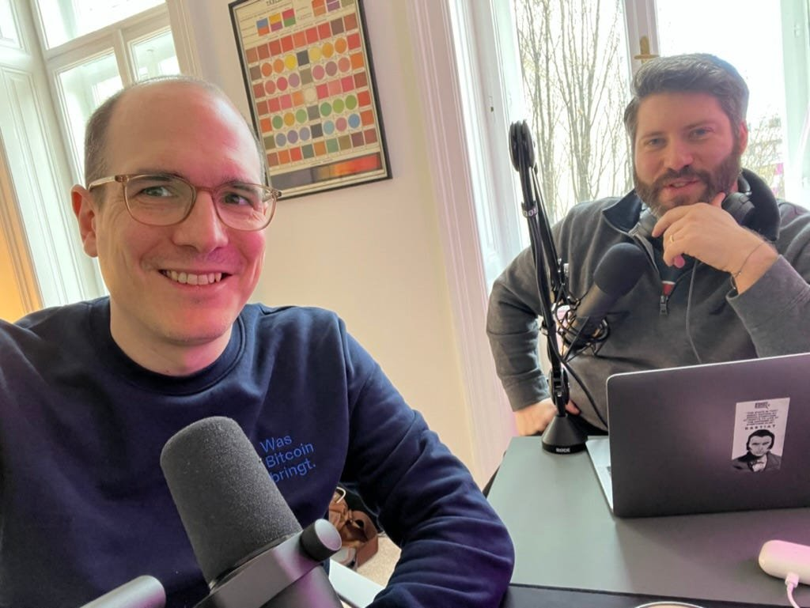

The green candles are adding up and another block has cleared the mempool.

For this edition of the _Fix The Money_ podcast, Niko and Yaël cover the latest articles from the Substack:

- The importance of publishing on “block time”

- A small BTC rally and some fiat pontificiations

- The Davos crowd and Bitcoin (FT on the crypto train?)

- Use of satoshis by ordinary Ukrainians

- The rise of maximalism (as a good thing)

- The fragile excitement of the Bitcoin Lightning Network.

_Recent articles:_

[Getting 'Down and Dirty' on the Bitcoin Lightning Network](https://fixthemoney.substack.com/p/getting-down-and-dirty-on-the-bitcoin)

[May the fireworks continue: three trends in Bitcoin that will strengthen in 2023](https://fixthemoney.substack.com/p/may-the-fireworks-continue-three)

_Contact:_

[fixthemoney@substack.com](mailto:fixthemoney@substack.com)

**Niko**: [@nikojilch](https://twitter.com/nikojilch)

**Yaël**: [@yaeloss](https://twitter.com/yaeloss) / nostr: a367f9eb1cb3a241a7f3646f31cd6d597bbbbf8eaeb5cd2e707d09b00633efea

_Published on the [Fix The Money podcast and Substack](https://open.substack.com/pub/fixthemoney/p/ftm4-the-davos-crypto-crowd-and-the?r=mjp1&utm_campaign=post&utm_medium=web)._
