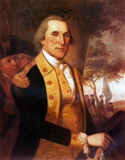

> 1 The period for a new election of a citizen, to administer the executive government of the United States, being not far distant, and the time actually arrived, when your thoughts must be employed designating the person, who is to be clothed with that important trust, it appears to me proper, especially as it may conduce to a more distinct expression of the public voice, that I should now apprize you of the resolution I have formed, to decline being considered among the number of those out of whom a choice is to be made.
> 
> 37 Europe has a set of primary interests, which to us have none, or a very remote relation. Hence she must be engaged in frequent controversies, the causes of which are essentially foreign to our concerns. **Hence, therefore, it must be unwise in us to implicate ourselves, by artificial ties, in the ordinary vicissitudes of her politics, or the ordinary combinations and collisions of her friendships or enmities.**
> 
> **** 
> 
> 40 **It is our true policy to steer clear of permanent alliances with any portion of the foreign world**; so far, I mean, as we are now
> 
> at liberty to do it; for let me not be understood as capable of patronizing infidelity to existing engagements. I hold the maxim no less applicable to public than to private affairs, that honesty is always the best policy. I repeat it, therefore, let those engagements be observed in their genuine sense. **But, in my opinion, it is unnecessary and would be unwise to extend them.**

  
  
  
  
  
  
  
  
  
**George Washington  
United States - September 17, 1796   
Source: [The Independent Chronicle, September 26, 1796.](http://www.earlyamerica.com/earlyamerica/milestones/farewell/text.html)**
