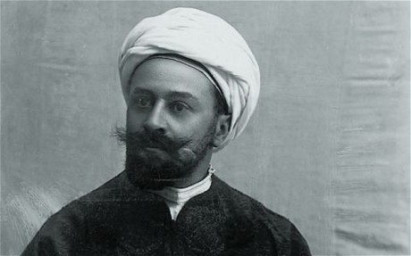

_Max von Oppenheim, Oriental enthusiast and the Germans’ secret weapon during the First World War_  

* * *

A few weeks ago, I made a brief stint in Istanbul, the former capital known as Constantinople in the former Ottoman Empire.

Much to the chagrin of my family and loved ones, my boots hit the ground not more than 24 hours after a [terrorist attack](https://en.wikipedia.org/wiki/2016_Istanbul_bombing) took out 11 German tourists and injured a dozen other individuals near the Sultan Ahmet Mosque, known to westerners as the “Blue Mosque”.

The timing of the trip, I’ll admit, was not perfect, but it was a strange coincidence considering my re-examination of Ottoman-German relations during the events of the First World War.  

Watching clips of the Turkish news after the bombing from my hotel room, Germany’s Minister of the Interior Thomas de Maziere [was seen](http://www.dw.com/en/germanys-interior-minister-to-visit-turkey-following-istanbul-terrorist-attack/a-18974855) holding hands with his Turkish counterparts, visiting the site of the blast in a great entourage and mourning victims with small white flowers and candles.

What made it all the more eerie was that the attack happened directly at the Alman Çeşmesi, the German Fountain. As I read in Sean McMeekin’s _**The Berlin-Baghdad Express**_, the fountain was a gift from the German Kaiser Wilhelm II, celebrating the second anniversary of his visit to Constantinople in 1898.

That initial trip, as well as the close relationship and policies of both the Sultan of the Ottoman Empire and the Kaiser at the time, laid the ground work for an alliance which would aim to break the Anglo domination of world affairs and the balance of power in the first two decades of the 20th century.

Key to this plan was Max von Oppenheim, a German diplomat and lawyer who would become the chief provocateur for a campaign to radicalize Muslim subjects of the British Empire and the peripheries. An immensely-skilled linguist and Orientalist of all strides, [most attention in later years](http://www.tabletmag.com/jewish-arts-and-culture/books/141788/hitler-jews-oppenheim) has been paid to von Oppenheim’s Jewish origins and his legacy against the rise of anti-semitism and the Nazi Party. But considering his significant contributions to archeological, diplomatic, and historical achievements of Germany during the First World War, he is anything but a caricature.

He was a fascinating man who had a vision of countering British influence throughout the Middle East and northern Africa, eventually making way for German steel to laid all the way to the majestic Indian subcontinent to pry the vast riches of the East from British hands.

The best way to achieve this, noted von Oppenheim, was to use the definitive spiritual, religious, and political power enjoyed by the Sultan of the Ottoman Empire, the Caliph of the Islamic world, to call a worldwide jihad against all colonial masters – save for those of German origin. The document wherein he described this plan was the _[Denkschrift betreffend die Revolutionierung der islamischen Gebiete unserer Feind](http://www.openbookpublishers.com/htmlreader/TPOMVO/chapter05.html)_ \[Memorandum on revolutionizing the Islamic territories of our enemies\], written in September of 1914.

Such would lead to the opening up of the _Nachrichtenstelle für den Orient_ \[Intelligence Bureau for the East\] which von Oppenheim would lead in Berlin throughout the duration of the World War.

The exact plans and individual campaigns to achieve this are best described in  _**The Berlin-Baghdad Express**,_ detailing the adventures of the saboteurs who reached the Arabian peninsula, Afghanistan, India, and beyond in order to spread propaganda to incite jihad and revolution against British and French colonies. Aided by the Ottoman Sultan, the German jihad campaign set the Islamic world on fire, causing complications and loss of lives up and down His Majesty’s grand empire.

While it ultimately did not make the difference in the war, which the Entente powers won after years of stalemate on the European continent, it certainly did set Great Britain up for its eventual losses of territories and subjects. With that in mind, von Oppenheim and his dedicated agents did succeed in their long-term goal.

What makes this story so vital in the understanding of the current age is the pattern of radicalization sweeping throughout portions of Syria, Iraq, Afghanistan, and parts of Africa. 

Though it was once in the German Empire’s interest to incite Muslim hatred against British or French colonial masters, the same plan was adopted by the Americans against the occupying Soviet forces who invaded Afghanistan in 1979. Local tribes and powers such as the Taliban were radicalized to defeat the Soviet’s invasion, ending in a disastrous defeat for the occupiers and likely a collapse of their empire. With additional interventions in the region by invading Iraq and placing troops on sacred Islamic soil in Saudi Arabia, however, the Americans went further than the Germans ever did. Or the British or French for that matter.

Unlike Germany, the United States and its western allies have had to deal with the blowback from these radicalizations and interventions for the last 15 years, stemming from the 9/11 terrorist attacks.

That leads to an interesting question about what made the German jihad campaign so different from that of the Americans’ throughout the 1980s. 

For the Germans, it was seen as a grand-scale plan to wither the influence of a grand empire across its many territories. For the Americans, it was yet another attempt to halt the spread of Soviet troops and ideology, which saw other manifestations in the jungles of Vietnam, the hills of Korea, and throughout Latin America.

But whereas the Germans were eventually countered by opposing powers near the end of the First World War and at the end of the Second World War, the Americans have not had to face that challenge. Rather, their geopolitical challenges rest primarily on the one-off terrorist attacks and campaigns to claim back land in Mesopotamia by ISIS. That was, until Russia cast off any pretension of a global alliance of terrorism and begin advancing into Ukraine and openly supporting the governmental forces in Syria.

That has left the United States and its allies backing all sides in Syria and across the Middle East, dealing with the blowback of a campaign of jihad which, in a way, has never been over. Germany and the European states, as a result, have been saddled with the millions of refugees who have poured out from the Middle East to avoid the carnage of bombs and jihadi crusaders.

While Max von Oppenheim could never have predicted the huge ramifications of his German Holy War over 100 years ago, he surely would be in awe to see how its modern form currently dominates the oil politics and geopolitical strategies of the great powers today. 

What would be his idea of what to do to counter the whole mess?
