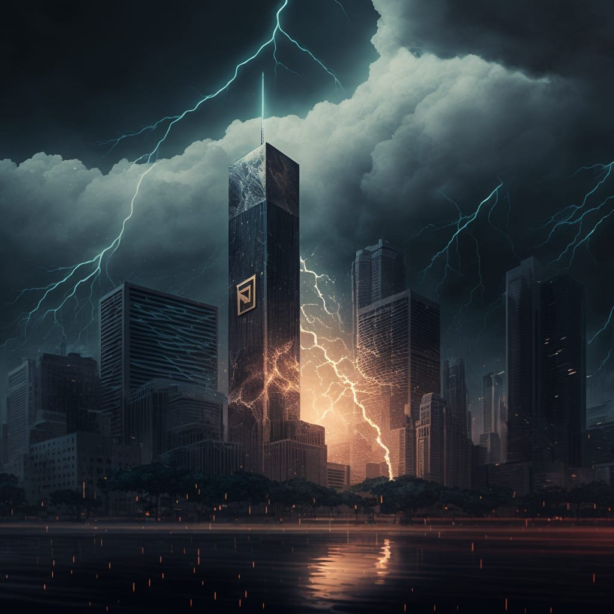

In the blocksize wars of 2015-2017, the Bitcoin protocol became trapped in opposing manifestations.

The quandary? Could Bitcoin scale effectively scale to compete with Visa, Mastercard, and the traditional banking and credit system while still providing its decentralized, cryptographic benefits?

As _Blocksize War_ author Jonathan Bier [explains](https://www.amazon.com/Blocksize-War-control-Bitcoins-protocol-ebook/dp/B08Z18GWD6), the more corporate-aligned “big blockers” — Coinbase CEO [Brian Armstrong](https://cointelegraph.com/news/coinbase-ceo-armstrong-id-like-to-increase-the-block-size-in-december), Bitcoin developer Gavin Andresen, Digital Currency Group CEO Barry Silbert, etc. — wanted to grow the blockchain’s blocks to achieve faster settlement times and much higher volume. They wanted a quicker path to scalability.

The opposing side, known as the “small blockers” — mainly early adopters, tinkerers, and philosophically-inclined developers — were satisfied with Satoshi’s 1MB block limit, arguing it made running a node for a sovereign user much easier, encouraging decentralization of the network and long-term incentives for miners competing for rewards. The scalability would take place off-chain on another layer, they insisted, rather than on the base layer itself.

#### _Who won the scaling wars?_

The eventual consensus that won out (read Bier’s book for a more colorful description) left Bitcoin with the same block size limit (small blockers), a new protocol upgrade known as _[SegWit](https://web.archive.org/web/20210224032019/https://bitcoinmagazine.com/articles/long-road-segwit-how-bitcoins-biggest-protocol-upgrade-became-reality//)_, and a few hard forks in the dust, notably **Bitcoin Cash**, **Bitcoin Classic**, and later **Bitcoin SV**.

With SegWit in place, which [separates signatures](https://en.wikipedia.org/wiki/SegWit) from the rest of a transaction and reduces the overall size, it was now possible to implement a second layer.

What has evolved since [it was proposed](https://lightning.network/lightning-network-paper.pdf) in 2015 is the **Lightning Network**, a scalable off-chain payment network that offers instant settlement and fast speeds via public and private “channels” eventually settled on-chain.

#### _Oh, but you already know plenty about Lightning, right?_

While every Bitcoiner has somewhat of a grasp of how the LN works, I’d argue it takes practical experience (and failures) to really understand how your Bitcoin bounces around at the speed of light above the base layer. You need to get down and dirty by spinning up your own lightning node and learning to balance liquidity and channel partners.

There are a variety of both custodial and non-custodial lightning implementations and wallets you can start using today.

#### _How can I get started quickly on the lightning network?_

If you want the simplest solution, you download a mobile lightning wallet that runs on your phone ([Phoenix](https://phoenix.acinq.co/), [Breez](https://breez.technology/), [Wallet of Satoshi](https://www.walletofsatoshi.com/), [BitKit](https://bitkit.to/), [Muun](https://muun.com/) (somewhat), etc.) or on your Desktop browser ([Alby](https://getalby.com/)).

By sending small amounts of Bitcoin (beginning at 3,000 satoshis) to the on-chain addresses they provide, they will either open channels for you to other lightning nodes or create a [submarine swap](https://blog.muun.com/a-closer-look-at-submarine-swaps-in-the-lightning-network/) to allow you access to the micropayments network.

An opening channel transaction then becomes a 2 of 2 multi-sig, creating liquidity between two separate lightning nodes. Any lightning payments that happen between these liquidity partners, whether directly or through “routed” payments, then happen off the main blockchain, and eventually settle in a closing transaction.

The value of that channel can be traded up and down millions of times, offering liquidity to the broader lightning network, and private and secure payments for anyone who uses that liquidity.

Lightning transactions can be routed multiple times, but each bounce off another lightning network reduces the probability of success.

#### _Why not just use standard Bitcoin transactions for everything?_

Because blocks are every ~10 minutes, and because often you must pay higher fees to be in the next block, you may often be in a situation where you need to pay ASAP.

Whether it’s at the checkout line, paying for a meal, or wanting to confirm an online delivery, there’s always a reason to want to pay quickly and with finality. Lightning allows you to do that, instantly beaming money from your node to theirs.

Transaction fees are usually fractions of a cent and can settle in seconds, giving certainty to the merchant and peace of mind to the sender.

An on-chain transaction is secure and also final, but only after miners have added it to the block, accepted it (and your miner fees), and it’s been verified by network nodes.

As long as you apply the appropriate miner fees, your on-chain transaction is virtually guaranteed to happen within a short period of time. Still, the instantaneous transaction, which normal debit and credit card users are used to, will likely be the future of Bitcoin’s bulk commerce.

#### _Why not use lightning transactions for everything?_

Once you’ve used lightning to pay other people or receive funds, it becomes addictive. Quick and easy micropayments as low as 1 satoshi or even as high as multiple Bitcoin.

All you need is a lightning invoice from your payment partner, either sent via chat, scanned via QR code, or generated by software like **BTCPay Server**.

But as you’ll soon learn, you’ll be somewhat limited in how much you can send and receive and to whom, all based on your own liquidity and your position in the “[network graph](https://github.com/lnbook/lnbook/blob/develop/03_how_ln_works.asciidoc)”.

If you run a sovereign lightning node at home with pocket change, whether on a Raspberry Pi or Mini PC using an interface like **Umbre**l, **RaspiBlitz**, **Citadel**, or a command-line implementation like **Core Lightning**, you’ll notice the many cracks that limit your micropayment spree.

For large and well-connected nodes, those with many different channels of larger size (anything above 50 million satoshis, let’s say), transactions will likely always succeed. You have many channel partners and have enough liquidity to find virtually anyone else’s node on the network.

For the plebs who don’t want to lock the entirety of their Bitcoin stash in lightning channels and keep only a modest amount, the next best solution is usually to connect directly to a [larger node](https://lightningnetwork.plus/nodes), usually run by exchanges or “routing nodes” to have the best available paths to those you wish to transact with.

#### _How much value is locked up in lightning?_

As of [writing](https://bitcoin.clarkmoody.com/dashboard/), there are over 5,218 BTC of capacity in 75,000 channels on the lightning network of nearly 16,000 nodes, approximately $100 million in fiat.

But considering a good number of nodes run over Tor, obfuscating many details, it’s hard to know if that’s for certain.

#### _Do I have more privacy on Lightning or on-chain?_

Overall, you’re bound to have more private transactions using off-chain lightning payments than ordinary payments on the public Bitcoin blockchain.

Once the channel-closing transactions settle, only the final value for each channel partner is recorded, meaning all the value traded up and down the channels remains private.

A lightning invoice you send to another party does point users to the key ID of your destination node, which they can then probe for your total liquidity (amount in all channels), but they won’t know how much is on your side.

Your total measure of privacy depends on your own threat assessment, but for the vast majority of lightning nodes, this isn’t a problem.

As I’ve [written before](https://fixthemoney.substack.com/p/not-your-keys-not-your-coins-claiming), there are many ways to also transact privately on-chain, but lighting offers a quicker and more efficient way to be private (though not perfect).

#### _Can I spend Bitcoin via lightning in “real” life?_

Absolutely you can. Sites like [Bitrefill](https://www.bitrefill.com/) and [Coin Corner](https://www.coincorner.com/) allow you to buy fiat gift cards with lightning payments, granting you a private and secure off-ramp when needed.

Merchants that have Bitcoin terminals are also more likely to integrate lightning, either through apps like **Breez**, **OpenNode**, or **BTCPay Server**, avoiding the “buying coffee” problem that plagues many (once waited 45 minutes for a cappuccino transaction to settle!).

#### _Are there other layer-2 stacks for Bitcoin?_

Yes. There are sidechains, federated services, and other stack projects that aim to add additional functionality to Bitcoin or give it some spin. Some are dubious, while others are in their infancy and may soon provide dividends.

The other most prominent is likely **[Liquid](https://blockstream.com/2018/10/10/liquid-launch/)**, a federated “sidechain” by **Blockstream** that offers liquid token swaps one-for-one with Bitcoin. There are about 3,500 BTC locked up on Liquid at the moment, but it hasn’t had as wide of adoption as lightning.

There are also new e-cash and mint solutions like **[Cashu](https://cashu.space/)** and **[Fedimint](https://fedimint.org/)** that provide additional functionality to the Lightning Network, allowing for decentralized custodians that may help privacy or easily enable Bitcoin transfers between exchange wallets or within a large institution.

#### _Will lightning be the tool that brings Bitcoin to the mainstream?_

This point is a controversial one, but a main selling point of the nearly hundred lighting companies out there today. People will want to use Bitcoin as a store of value, but it will also need to be used as a daily payment mechanism.

The scaling potentials of lightning are definitely already there, and the growing number of custodial solutions that offer lightning wallets on mobile phones or desktop browsers is only growing stronger. And because people are used to Visa and Mastercard, they’ll want that rapid payment ability before they even think of touching a node.

#### _What about the lightning skeptics?_

While I’ve gushed a lot about lightning, it is true that there are still many prominent issues with liquidity, functionality, and privacy that many _base-layer maximalists_ will point out — and rightly so.

Developers of the privacy wallet [Samourai](https://samouraiwallet.com/), for instance, believe lightning is an overhyped “[failed science project](https://twitter.com/SamouraiDev/status/1601929965125226496)” that offers fake privacy while enriching a few dozen lightning companies.

Shinobi [believes](https://medium.com/block-digest-mempool/lightning-network-yield-and-incentives-b2b624375094) lightning creates bad incentives for the entire network, and will eventually be attacked because it must necessarily move toward centralization. Other critics point out that only the massive nodes can be sustainably run, meaning pleb networks will eventually be phased out.

These claims are all valid and worth merit, but it’s up to you to decide. The universality of Bitcoin’s base layer is the first attraction for all, and other layers are only there to add to its functionality.

#### _What’s the best way for me to experiment with lightning?_

Apart from trying out one of the phone wallet solutions, spinning up an **Umbrel** on Raspberry Pi or using **BTCPay Server** on a cloud solution offers great ways for you to learn and understand how the network works. Connect with your buddies, open channels, and send payments to open-source projects you like.

There will be frustrations and learning curves, but that is essentially the core of every facet of Bitcoin.

\*\*

There is much I didn’t cover — either technically or because of space — but I hope you’ll get down and dirty with Bitcoin’s lightning network. I’m by no means an expert, and I’m only starting my own journey, but I hope I see you out there on the Pleb net.

Ultimately, we’ll never know the future of Bitcoin unless we contribute to it in our own way. Now, get back to building.

_Originally published on **[Fix the Money](https://fixthemoney.substack.com/p/getting-down-and-dirty-on-the-bitcoin)**._

* * *

##### _This post is **sponsored** by…_

#### **[21bitcoin](https://21bitcoin.app.link/invite/?code=FIXTHEMONEY) - The easy way to buy, sell, save and send Bitcoin.**

**21bitcoin** is a Bitcoin-only app, not an exchange. No distractions, individual savings plan, very low fees, first-class personal support, and a German bank account. Based in the Austrian Alps, available throughout Europe. **[Download now](https://21bitcoin.app.link/invite/?code=FIXTHEMONEY)**.

[Check out 21bitcoin](https://21bitcoin.app.link/invite/?code=FIXTHEMONEY)

**Use code “FIXTHEMONEY” to get up to 20% off your fees :)**

* * *

**Not your keys, not your coins!** You need a hardware wallet. Check out the **[Bitbox02](https://shiftcrypto.ch/fixthemoney)** - Swiss-made, secure, beautiful, open source, Tor support, _Bitcoin only_ and all-around awesome!

**Use code “FIXTHEMONEY” to get 5% off :)**

[Show me the Bitbox02](https://shiftcrypto.ch/fixthemoney)

