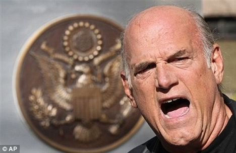
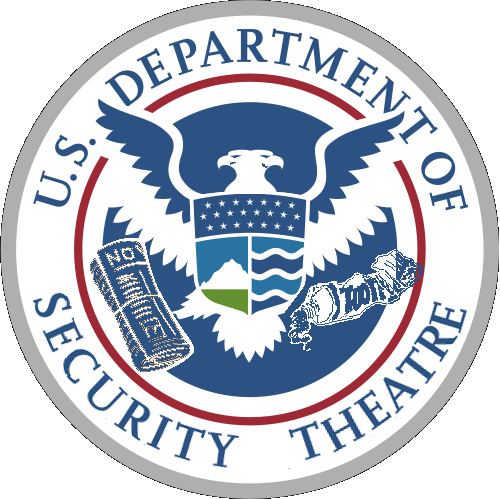

As Thanksgiving holiday approaches, Americans across the continent are preparing for quaint family gatherings, mountains of extra calories, and thousands of miles of long-distance travel. If the events of the past year are any indication, they should also prepare for the cold, unforgiving blue-latex hands of Transportation Security Administration agents. 

According to the [Air Transport Association](http://www.philly.com/philly/business/133211238.html), close to 23.2 million passengers will be boarding flights and feeling the frisk during Thanksgiving weekend, a bit less than traveled this same time last year. This is due in part to the well-documented [“Opt-Out” day](http://www.wired.com/threatlevel/2010/11/national-opt-out/) held last year, encouraging scores of travelers to opt-out of the new full body scanner machines in order to air their general dissatisfaction with the new procedure. This event drew great public and media interest but was not as great a success as had been hoped, mostly due to the TSA’s [agency-wide decision](http://www.naturalnews.com/030509_TSA_opt_out_day.html) to turn off the majority of the scanners across the country. Despite the outrage of the American public, the TSA and Homeland Security Department were determined to convince the broader populace of the inherent “benefits” such a policy would bring. Writing in USA Today, Homeland Security Secretary Janet Napolitano [justified](http://www.usatoday.com/news/opinion/forum/2010-11-15-column15_ST1_N.htm?csp=hf) seeking the American people’s “cooperation, patience and a commitment” so as to defeat “the face of a determined enemy”, even going so far as to praise the “safety, efficiency, and commitment to privacy” that such full body scanners would employ.

Reacting to the introduction of the searches, [grassroots campaigns](http://www.wired.com/threatlevel/2010/11/national-opt-out/) were mounted, [politicians weighed in](http://www.c-spanvideo.org/videoLibrary/event.php?id=190916&timeline), and public outrage sparked a [national conversation](http://amibeingdetained.com/2011/06/23/tsa-grilled-by-rand-paul-on-invasive-procedures-change-policy/) on the state of security and privacy in the airports. A plethora of offended Americans began turning to Youtube and [social media](http://www.google.com/url?sa=t&rct=j&q=tsa%20and%20social%20media&source=web&cd=4&ved=0CDkQFjAD&url=http%3A%2F%2Fwww.informationweek.com%2Fnews%2Fgovernment%2Fpolicy%2F228300442&ei=zbu1Tu6KEPGs0AGPv6zxBw&usg=AFQjCNF6r6g-Bnfe9Lrea3p1NNrGTlZF6A&sig2=owQqhdUx51fMkaoJtcu6qw) to document the latest instances of airport screening they considered abusive and unnecessary, such as the video of a [six-year old girl being patted down](http://www.youtube.com/watch?v=-3sH1GaO_nw) which drew millions of viewers from across the world. This prompted then Republican congressman and now current Presidential Candidate Ron Paul to [remark](http://www.rawstory.com/rs/2010/11/24/ron-paul-tsa-if-tolerate-wrong-us/): “Government being so bold as to maul us in public and say they’re doing it for our interests. If we tolerate this, there’s something wrong with us”.

It is fitting to note, however, that not all amongst us are willing to take it without protest. Reacting to the judge’s decision to throw out his lawsuit against the TSA, former Minnesota Governor Jesse Ventura [vented his frustrations](http://minnesota.publicradio.org/collections/special/columns/polinaut/archive/2011/11/jesse_ventura_i.shtml) on the state of freedom in his country. In a press conference before the Federal courthouse in St. Paul, he vowed [never to stand for another pledge of allegiance](http://www.youtube.com/watch?v=XhXDIH9KTOc&w=560&h=315) in the “Fascist States of America” again, and is considering seeking Mexican citizenship. At one point, he even threw out the [idea of running for President](http://www.dailymail.co.uk/news/article-2057955/Jesse-Ventura-says-hes-fed-airport-security-hes-getting-Mexican-citizenship.html), so as to “defeat these two parties that are destroying our country. Maybe that’s what it takes… When are we going to stop allowing the Government to violate our Constitution and the Bill of Rights?”.

As the turkey and cranberry sauce are distributed this holiday season, and President Obama makes his case for broad acceptance of his expansive foreign policy and furtherance of Bush-era executive powers, invasions of privacy at the nation’s airports are issues bound to be rehashed once more. Notwithstanding the eradication of most of the so-called “terrorists” by [unmanned aerial vehicles](http://www.google.com/url?sa=t&rct=j&q=amwar%20al-awlaki%20is%20dead&source=web&cd=4&ved=0CEgQFjAD&url=http%3A%2F%2Fwww.huffingtonpost.com%2F2011%2F10%2F10%2Fal-qaeda-al-awlaki-death_n_1003413.html&ei=67-1TrzaFqrm0QGz0_XNBA&usg=AFQjCNHOqVLfXnI2YLIkQYrxNJmbW7Re6Q&sig2=xm0nweclj_3_y1t5jkTVaA) and [night raids](http://www.google.com/url?sa=t&rct=j&q=osama%20bin%20laden%20daed&source=web&cd=1&ved=0CEEQFjAA&url=http%3A%2F%2Fwww.cbsnews.com%2Fstories%2F2011%2F05%2F01%2Fnational%2Fmain20058777.shtml&ei=AMC1TsrCOoXc0QGdm4DSBw&usg=AFQjCNEMV_BzGfBZDZ5G2pf2iDPp0WMOxw&sig2=dcsJQdPLwiUcAtnYBIMiVQ) in Pakistan, Yemen, Iraq, Libya, Somalia, Afghanistan, and Kenya, the government will continue to make the case that even more liberties must be given up in order to secure privacy. This is underscored by leagues of [American politicians and thinktanks](http://www.americanprogress.org/issues/2011/08/islamophobia.html) alike who continue to push for increased security and vigilance against an unseen enemy, while at the same time expanding wars and occupations abroad which fuel them.

While those are all other issues to be discussed at length, the reigning concern is the criminialization of traveling anywhere in the United States. The past year has seen the introduction of the TSA on [highways](http://www.techdirt.com/articles/20111020/11465616440/tsa-decides-terrorists-must-be-driving-partners-with-tenn-law-enforcement-to-randomly-search-vehicles.shtml) and [bus stations](http://www.washingtontimes.com/news/2011/oct/26/tsas-power-grope/), and its reach could even be expanded to [shopping malls](http://www.google.com/url?sa=t&rct=j&q=tsa%20at%20mall&source=web&cd=4&ved=0CDUQFjAD&url=http%3A%2F%2Fnews.antiwar.com%2F2010%2F12%2F26%2Ftsa-coming-to-a-mall-near-you%2F&ei=T8q1TqvHNcfb0QGfnP3QBw&usg=AFQjCNEhTxlKuc2Ujw2eHyk1rjiBxG37BQ&sig2=Ohz4xy_d72YWTFv6IF_kZA) and [sidewalks](http://www.rawstory.com/rs/2011/03/08/exclusive-if-we-dont-fight-tsa-like-security-coming-to-sidewalks-football-games-texas-rep-warns/).  This agency, now a $9 billion, 62,000 bureaucracy, has grown exponentially beyond where its creators had intentioned, proved by congressman John Mica’s own remarks, himself one of the many congressman to support its creation, to journalists at [Human Events](http://www.humanevents.com/article.php?id=46114):

> “The whole program has been hijacked by bureaucrats,” said Rep. John Mica (R. -Fla.), chairman of the House Transportation Committee.
> 
> “It mushroomed into an army,” Mica said.  “It’s gone from a couple-billion-dollar enterprise to close to $9 billion.” As for keeping the American public safe, Mica says, “They’ve failed to actually detect any threat in 10 years.” “Everything they have done has been reactive.  They take shoes off because of \[shoe-bomber\] Richard Reid, passengers are patted down because of the diaper bomber, and you can’t pack liquids because the British uncovered a plot using liquids,” Mica said. “It’s an agency that is always one step out of step,” Mica said. It cost $1 billion just to train workers, which now number more than 62,000, and “they actually trained more workers than they have on the job,” Mica said. “The whole thing is a complete fiasco,” Mica said.

Whereas previously flying was seen as a luxury for constant travelers, it is now seen as an inevitable hassle for thousands of people, due to arbitrary limits on liquids, bag weights, fingernail clippers, and shampoos, as well as forced X-rays by machines which are [constantly re-determined to be unsafe](http://www.wral.com/news/local/story/10339614/) by medical authorities.

This holiday season, do yourself and your country a favor. Do not support the out-of-control [airport security theatre](http://libertyinexile.com/2011/02/14/security-theatre-in-north-american-airports/) agency known as the TSA. Opt-out of invasive body-scanner machines. Do it for [privacy](http://gizmodo.com/5690749/these-are-the-first-100-leaked-body-scans), [health](http://www.google.com/url?sa=t&rct=j&q=x%20ray%20machines%20unsafe&source=web&cd=7&ved=0CHAQFjAG&url=http%3A%2F%2Fwww.npr.org%2Ftemplates%2Fstory%2Fstory.php%3FstoryId%3D126833083&ei=9ce1TtzdGcfi0QGZz-nRBw&usg=AFQjCNFL47FCq7YxBHjMu9a5P2oTsVKe5w&sig2=RFLu_H08HPZ0vM_jsdeBPg), and [moral](http://www.forbes.com/sites/artcarden/2010/11/14/full-frontal-nudity-doesnt-make-us-safer-abolish-the-tsa/) reasons. A nation’s government is mainly reflected by the will of the people. Never should one be forced to lose one ounce of liberty for the sake of security. Herein lies your mantra during this Thanksgiving season.
