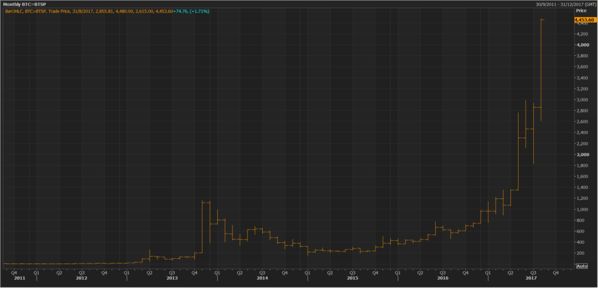

By Yaël Ossowski | [Devolution Review](https://devolutionreview.com/bearish-on-bitcoin/)

Admitting you’ve changed your mind is daunting.  

Even more so when you’ve poured money, time, and effort into promoting a particular cause and idea.

For me, that time has come with cryptocurrencies like Bitcoin and the promise of the underlying Blockchain technology.

In the beginning, Bitcoin was something of a revolution to me. The digital currency represented everything from my rebellious youth.

It was a decentralized, denationalized, and digital currency operating outside the traditional banking and governmental system. It used tools of cryptography and connected buyers and sellers across national borders at minimal transaction costs.

[I first heard of Bitcoin in 2011](https://twitter.com/YaelOss/statuses/253556309641797632?tw_i=253556309641797632&tw_e=details&tw_p=archive) and sold its virtues on a regular basis. It became a main topic in my articles in German, Swiss, Canadian, and American media, was the subject of several lectures in various European cities, and I steered many private conversations in that direction, all glowing and positive.

Day-to-day use became normal, I invested some of my savings into it, and implemented it into my organization. I was hooked and I thought we were living in the future. But that future never came.

Now, I’m bearish on Bitcoin and its digital cousins.

Instead of the vastly changed future with digital currencies and the breakthrough of the Blockchain technology we were promised, we’ve just been stuck with a huge bubble and growing complications. Investor craziness. A new tulip mania, [just like the speculative bubble of 17th century Amsterdam](https://en.wikipedia.org/wiki/Tulip_mania).

The 21st century version has welcomed a plethora of slick consultants, hazy schemes dressed up as investor possibilities, and too much wishy-washy language for anything to really make sense to anyone who wants to use a digital currency to make purchases.

Austrian economist Doug French’s [book on early speculative bubbles](https://mises.org/system/tdf/Early%20Speculative%20Bubbles%20and%20Increases%20in%20the%20Supply%20of%20Money_2.pdf?file=1&type=document) claims that a huge currency devaluing was the greater culprit for tulip mania. Regardless of the genesis, the mania was real and it wiped out millions in real wealth. Is that what we could be facing today?

**It wasn’t supposed to be about price, but it’s only become about price**

> “A bearish trifecta — the Elliott wave pattern, optimistic psychology and even fundamentals in the form of blockchain bottlenecks — will lead to the collapse of today’s crypto-mania."– [Market analyst Elliott Prechter](https://www.cnbc.com/2017/07/20/bitcoin-bubble-dwarfs-tulip-mania-from-400-years-ago-elliott-wave.html)

Early advocates of Bitcoin made certain not to tie the usefulness of Bitcoin to its price. Indeed, the promise of Bitcoin laid in its fundamental technology: it was digital, decentralized, and denationalized. It could evade restrictions, shed costs, and help the most vulnerable gain access to currency without middlemen.

\[caption id="attachment\_460” align=“alignnone” width=“1024”\] A chart of Bitcoin’s price since 2011.\[/caption\]

But the reason your taxi driver, former college roommate, and Wall Street whiz kids know about Bitcoin now has barely anything to do with its underlying technology. It’s about the speculation and the drive to become rich. Everyone wants a payday for free.

Early bets on cryptocurrencies such as Ethereum, Litecoin, Ripple, Dash, and Monero have surely made some people very rich. The price of Bitcoin has risen more than 500% in a year. Litecoin more than 1300% and Ethereum more than 2000%. But that’s not the point. It was never about price and it never should be. That’s a recipe for disaster.

Investor Mark Spitznagel [makes the point](https://mises.org/blog/why-cryptocurrencies-will-never-be-safe-havens) that cryptocurrencies are a huge potential, but still in no way represent a store-of-value nor safe haven for anyone’s assets. They’re experiments. They’re speculative bubbles that make some people very rich, some people poor, and create barriers of entry to ordinary people who want to use the technology.

Of course, there is innovation on the horizon and there is a huge potential for cryptocurrencies.

But merely examining the usefulness of them through the lens of price is misleading and draws attention away from the real benefits which could take root. That’s what the dreamers at the [Institute of Cryptoanarchy](https://www.paralelnipolis.cz/koncepty/cryptoanarchy-institute/) in Prague, Czech Republic taught me on my frequent visits. And what many other innovators do understand.

When a rally hits and the bull market is clear, that doesn’t mean it’s become accepted. More than likely, it just means there’s been huge movement in supply in China or some other country. So it goes.

**The ideas are there, but the technology in practice isn’t**

I conducted a small experiment last year and tried to “set up” a small company on the Blockchain. [It failed miserably](http://www.huffingtonpost.ca/yael-ossowski/technological-literacy-is-doomed_b_12669440.html). Online forums weren’t helpful, the official consultants had no answers, and I couldn’t get further than getting a digitized time stamp on a PDF.

Plenty of websites and Blockchain companies claimed the new world of business would take place there, but there were no practical steps available for making it happen. There are proposals for changing real estate, the music industry, construction, journalism, banking, and you name it. Wherever there is a glut of transaction costs, the Blockchain will solve it. But even now, there is no significant practical use case. And that’s a problem.

Too many startup companies are taking advantage of people looking to “get rich quick” on Bitcoin and Blockchain technology, and that’s leading people to speculate and pump up the market.

Some serious banks and financial firms are doing intensive research on how Blockchain technologies can be utilized practically in the business world, but haven’t promoted this externally. IBM and PricewaterhouseCoopers are examples. [Montreal-based Blockchain firm Catallaxy](http://www.rcgt.com/en/news/catallaxy-blockchain-expertise-centre-announcement-creates-buzz/) was recently acquired by Raymond Chabot Grant Thornton, Quebec’s largest actuarial firm. They’ve put together some use cases and they could lead on this topic.

**But how will this evolve?**

In his book [_Attack of the 50 Foot Blockchain: Bitcoin, Blockchain, Ethereum & Smart Contracts_](http://amzn.to/2h3Rgr9), programmer and author David Gerard deflates a lot of the hype, peeling the layers on the shady Initial Coin Offerings (ICOs) which have scammed thousands of investors on the Ethereum platform and more.

These have been the main vehicles for supposedly tech-savvy entrepreneurs to raise funds for their cool crypto ventures. Again, we still haven’t seen anything significant, but there are plenty of ideas out there. And they all need money, of course.

Now we have a dubious situation.

We still haven’t achieved mass adoption and more user-friendly platforms without significant red tape and bureaucracy. Anyone who has had a cancelled account at Coinbase or MtGox can attest. And the government is always ready to shut down any new financial venture that could skim tax money from its coffers.

Where is the revolution we’re waiting for?

**Maturity and prosperity**

The [Bitcoin scaling debate](http://www.investopedia.com/news/war-between-segwit-vs-bip148-vs-bitcoin-unlimited-explained/) of the summer of 2017 revealed a lot of the limitations of the currency.

Transactions in Bitcoin now require higher and higher fees to pay the miners for their work. The blocks are becoming too full, transaction times too long, and confirmations take forever. The comparative advantage of Bitcoin, that being its digital use and instantaneous transactions, is no longer true.

And the worst part of it all?

People in smaller developing countries, usually ravaged with inflation, poor monetary policies, and no real financial infrastructure, are the ones that would most benefit from a truly useable cryptocurrency. The spike in mobile phone ownership across the African continent provides hope that electronic currency and transactions will work.

The question becomes then, will cryptocurrencies mature enough to provide the prosperity they are promising everyone?

There are enough good ideas out there surrounding Bitcoin and Blockchain technology and it should make us hopeful. But there are a lot of bad ones, and they deserve to be called out. Only then will the innovation we desire come to fruition.

I may be bearish, but I’m still hopeful. I’ll wait until tomorrow.
