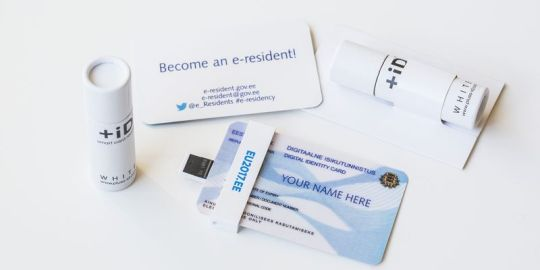

[DOWNLOAD THE MP3](https://api.soundcloud.com/tracks/443943492/download?client_id=LBCcHmRB8XSStWL6wKH2HPACspQlXg2P)

Estonia is a European country known for pioneering e-governance, which makes life easier for citizens. They can pay taxes, set up companies, and even vote—all online.

Since 2014, Estonia has attracted individuals from all over the world by letting anyone [apply for residency](https://e-resident.gov.ee/) without leaving their homes and enjoy these benefits.

[Yaël Ossowski](https://twitter.com/YaelOss), a Canadian journalist, activist, and entrepreneur based in Vienna, joins us to discuss how virtual-residency programs can foster competition between states for global businesses.

The e-resident card is delivered to the nearest embassy and lets non-Estonians open companies, bank accounts, pay taxes, and sign and verify documents. ([Aaron Urb](https://www.flickr.com/photos/eu2017ee/37590072691))

Recommended Links

- Follow Yaël on [Twitter](https://twitter.com/YaelOss) and [Facebook](https://www.facebook.com/yaeloss). He is also deputy director of the [Consumer Choice Center](https://consumerchoicecenter.org/) and the founder and editor of [Devolution Review](https://devolutionreview.com/).
- [Official website](https://e-resident.gov.ee/) of Estonia’s e-residency program.
- [I Tried to Reach Liberland and Here’s What I Learned](https://panampost.com/yael-ossowski/2015/08/19/i-tried-to-reach-liberland-and-heres-what-i-learned/), by Yaël.
- [TransferWise](https://transferwise.com/).
