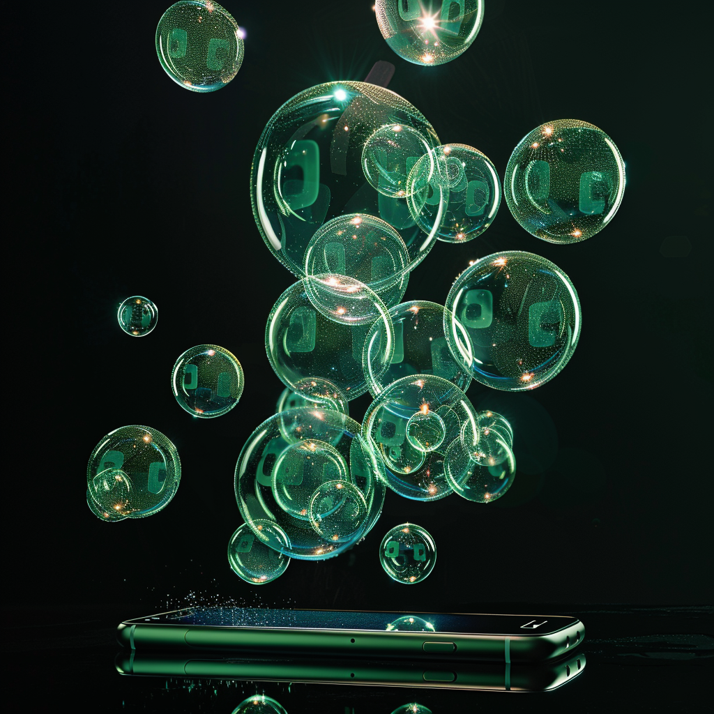

When iPhone users see a green bubble pop up in their text messages, it has a way of dulling the experience. Emoji reactions, Facetime video calls, or even high-quality images over WiFi are immediately broken once a green-bubbled Android user slides into a group thread. 

This is the reality of Apple’s iMessage protocol, the default messaging app for its users. These consumers enjoy end-to-end encryption, high-quality image sharing, and a full range of emoji and message reactions all in tidy blue chat bubbles. Android users texting iPhones, though, have their messages carried over the limited SMS protocol with none of those features, yielding the green bubbles you may see in your chats. 

Rather than use similarly encrypted messaging apps like WhatsApp, Signal or Telegram, which remain more popular overseas, over 125 million Americans are plugged into the iPhone ecosystem. It’s no wonder, then, that social pressure exists for non-Apple users, particularly teens, who prefer iMessage over its competitors. 

To solve this, innovative developers have created Android apps to route around Apple’s strict [“walled garden.”](https://www.computerworld.com/article/3682761/apple-looks-poised-to-open-its-walled-garden-in-2023.html) Some apps offer [third-party relay servers](https://www.theverge.com/2023/11/14/23960516/nothing-chats-imessage-android-phone) running on Mac computers, allowing Android users to communicate on iMessage while breaking Apple’s proprietary encryption. 

The company Beeper found a way to [reverse-engineer](https://www.theverge.com/2023/12/5/23987817/beeper-mini-imessage-android-reverse-engineer) iMessage’s protocol without relays, giving Android users a direct connection with Apple’s servers and all iPhones. The app quickly [became popular](https://blog.beeper.com/p/beeper-mini-is-back) on Android devices — but Apple soon took notice. 

In December, Beeper [announced](https://blog.beeper.com/p/beeper-moving-forward) it would abandon its service after Apple made protocol changes that blocked the app’s workaround. It’s a typical cycle for an innovative startup looking to disrupt an industry. 

But then came the politicians.  

That same week, a bipartisan group of senators and congressmen, including Big Tech foes Sens. Mike Lee of Utah and Amy Klobuchar of Minnesota, [sent a letter](https://twitter.com/jolingkent/status/1736601539790446592?ref_src=twsrc%5Etfw%7Ctwcamp%5Etweetembed%7Ctwterm%5E1736601539790446592%7Ctwgr%5E8d1f52b7e9a167b06d44b7e847caaa7558b3c769%7Ctwcon%5Es1_c10&ref_url=https%3A%2F%2Ftechcrunch.com%2F2023%2F12%2F18%2Fu-s-lawmakers-call-for-doj-to-investigate-apple-for-blocking-beepers-imessage-app%2F) to the Department of Justice demanding an antitrust investigation against Apple. Their letter claimed Apple’s de facto block on Beeper’s workaround “harms competition” and “eliminates choices for consumers.”  

On Monday, FCC Chair Brendan Carr [called on his agency](https://x.com/BrendanCarrFCC/status/1757145971295695226?s=20) to investigate Apple’s iMessage based on [Part 14](https://www.ecfr.gov/current/title-47/chapter-I/subchapter-A/part-14) of the commission’s rules regarding accessibility, usability and compatibility. Carr claims the iMessage experience harms consumers with disabilities who may not be able to read the “low contrast” green bubbles coming from Android users. 

Add that to the growing list of grievances being brought against American tech firms by Washington. 

Is this truly a situation that warrants intervention by the nation’s telecom regulator and antitrust hawks in Congress?  

There are meaningful market solutions available to consumers. While Apple defends its iMessage protocol, the company has also pledged to upgrade how its tech interacts with non-Apple devices. 

This month, Apple [announced](https://www.thetechedvocate.org/apples-bringing-rcs-support-to-iphone-next-year/) it will soon upgrade its SMS and MMS messaging to what’s known as the RCS protocol (Rich Communications Services), allowing more multimedia features and functionality with other devices that would closely match the iMessage experience. 

This is unlikely to silence Apple’s critics, however, because this is about far more than blue and green chat bubbles. 

A [growing number](https://apnews.com/article/7306dd3c85a0413aad9c4fdfc807619a) of public and law enforcement officials are advocating for outlawing messaging encryption altogether, which iMessage uses by default. The FBI has already [battled Apple](https://www.techradar.com/news/fbi-says-apples-new-encryption-launch-is-deeply-concerning) numerous times over its encryption protocol and routinely attempts to crack it. 

The same goes for rival companies that rely on Apple’s App Store to deliver their products to Apple users. 

In 2020, video game maker Epic Games [sued](https://law.justia.com/cases/federal/appellate-courts/ca9/21-16506/21-16506-2023-04-24.html) Apple and won a partial victory, classifying Apple’s management of its App Store as “anti-competitive.” In 2023, Damus, an iPhone app for the decentralized messaging protocol known as Nostr, [revealed](https://twitter.com/jb55/status/1673976897582030849) Apple was threatening to delist their app if it allowed users to make [Bitcoin payments](https://www.fixthemoney.net/p/apples-wallet-garden-versus-nostr) for content instead of Apple Pay. 

At the same time, the Justice Department is [likely to issue](https://www.nytimes.com/2024/01/05/technology/antitrust-apple-lawsuit-us.html) a sweeping antitrust lawsuit against the company, with the aim of breaking apart the hardware and software integrations that Apple has made so central to its product ecosystem. Apple is fighting a war on multiple fronts, and not every new conflict opened in good faith. 

Apple’s competitors and the federal government seem to be in lockstep on breaking the entire Apple user experience.  

Apple claims its “walled garden” approach exists to add simplicity and security for its users, and I gather most consumers with iPhones would agree. Apple created this garden, and consumers flock to it because they find value in it. It stands to reason that for outside developers and Apple’s competitors, the walled garden is a thorn in their side. 

These are real issues that impact consumers, and they deserve to be addressed. However, we must make distinctions between problems that are merely conflicts between rival companies competing for consumers, and those that require government intervention on consumers’ behalf.  

The switching costs and trade-offs for American iPhone users aren’t worth it to most. And that’s nothing will be or should be remedied by agency decree or legislation. The FCC would just be manifesting a solution in search of a problem when it comes to chat bubbles. 

If the U.S. wants to remain competitive on a global scale, we need our regulatory agencies to focus on calling balls and strikes to ensure fairness and competitiveness, not dictating the chat protocol between Android and Apple users. 

Opening up Pandora’s box of government meddling into a niche technology, whether that’s on your newsfeed or chat app, would be a step too far. It would be much more trouble than it’s worth. 

_Yaël Ossowski is a consumer and technology advocate, and deputy director at the Consumer Choice Center._ 

_Published in [The Hill](https://thehill.com/opinion/congress-blog/technology/4478793-green-bubble-texts-are-not-the-fccs-problem-to-solve/)._
