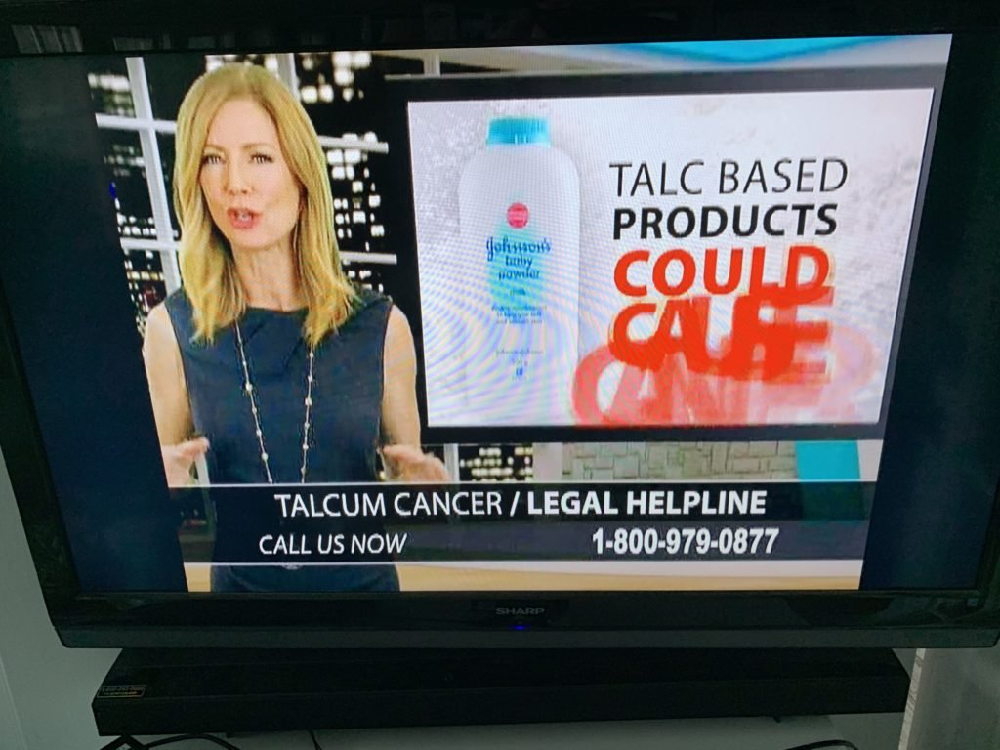

Another day, another bogus lawsuit.

That seems to be the trend in today’s frantic fever to adjudicate every aspect of our lives.

It’s gone much beyond the famous $3 million McDonalds “hot coffee” lawsuit of the 1990s.

We see this with the landmark [$572 million opioid lawsuit](mailto:https://www.nytimes.com/2019/08/26/health/oklahoma-opioids-johnson-and-johnson.html) against Johnson & Johnson in Oklahoma, boiling down all the complexities of a multi-faceted crisis to the workings of one big bad company in a single court case.

This, even though the company’s pharmaceutical subsidiary only sold two opioid drugs for a period of a decade and it represented [just 1 percent](mailto:https://www.reuters.com/article/us-usa-opioids-litigation-oklahoma/oklahoma-judge-to-rule-in-17-billion-opioid-lawsuit-against-jj-idUSKCN1VG0V2) of the entire U.S. opioid market. The lawyers hired by the Attorney General of Oklahoma will net a handsome $90 million as a result of this suit. The [rest of the money](mailto:https://oag.publishpath.com/Websites/oag/images/Exhibit%20s4734%20-%20State%27s%20Opioid%20Abatement%20Plan.pdf) will be allocated to the state of Oklahoma for education, addiction centers, and the general budget, without much oversight. Something is rotten in the state of Oklahoma.

Though the Food & Drug Administration shares in the blame for the opioid crisis, owing to its [1995 endorsement](mailto:https://www.cbsnews.com/video/opioid-epidemic-did-the-fda-ignite-the-crisis-60-minutes/) of opioids for “chronic pain” when the science only supported short-term use, the issue is simply too complex to relegate to a single trial.

In California, a recent jury trial on glyphosate, the herbicide in Round-up, gives us a similar example.

Dozens of international environmental agencies, hundreds of studies, and millions more farmers have attested that glyphosate is both safe and not carcinogenic, including our own Environmental Protection Agency.

But in July, the jury [returned a verdict](mailto:https://www.reuters.com/article/us-bayer-glyphosate-lawsuit/in-roundup-case-u-s-judge-cuts-2-billion-verdict-against-bayer-to-86-million-idUSKCN1UL03G) against Bayer subsidiary Monsanto, ordering the firm to pay $86.7 million to a couple who claimed the herbicide contributed to their case of non-Hodgkin’s lymphoma. That’s drastically reduced from the $2 billion the trial attorneys sought, but will still net them a good payday and spawn hundreds of similar lawsuits.

Again, this is relegating science to the courts of justice. And consumers will be the ones to pay. No doubt, the power of the courts is a mighty one, and intended to provide justice to those who have been wronged.

But have we been led astray?

Known as tort law, this part of our legal system was originally designed to punish bad behavior and “civil wrongs”. Today, thousands of law firms exist solely to pursue large torts against corporations that would rather pay out moderate sums than face the burden of unpredictable trials. These costs end up raising the costs for both consumers and taxpayers, as more resources must be used in litigating the concerns and helping pay for the exorbitant levels of purported damage.

In the Chicago area, [one group estimated](mailto:https://cookcountyrecord.com/stories/513240758-hidden-tort-tax-from-heavy-lawsuit-activity-costing-chicago-area-residents-800-each-every-year-new-report-says) that tort abuse brought by bogus lawsuits resulted in a cost of $3.8 billion to the city and county last year alone.

It’s no wonder tort lawyers are some of the biggest advertisers in the nation.

Across the United States, television commercials and highway billboards taken out by tort law firms implore consumers to “call now “ to “cash in” on the major settlement that is set to pay out huge winnings.

The conditions for joining the lawsuit are general if not spurious. Have you been a bad car wreck involving a Toyota Camry? Did you use baby powder in the years between 1980 and 1995? 

Many lawsuits arise because of “pricing discrepancies” (prices rounded to 99 cents rather than the dollar) as witnessed by the dozens of Amazon or Banana Republic settlements you may have seen in your inbox. These lawsuits are filed with the intention of getting big paydays for the attorneys who conjure them up, not civil justice.

It’s no wonder that firms, once they achieve a certain size, are forced to raise prices to push back against these many frivolous suits.

These lawsuits end up costing consumers dearly. And it shouldn’t be that way.

That’s why we need legal reform in our country. By capping the payments from these exorbitant lawsuits, actually defining who can be a defendant, and bringing legitimate science into the courtroom, this can be achieved.

Yes, bad actors must be punished. But we cannot continue to allow bogus lawsuits launched by dubious lawyers looking more for a payday than actual justice. We, as both consumers and citizens, deserve better.

https://www.insidesources.com/have-we-reached-peak-lawsuit/
