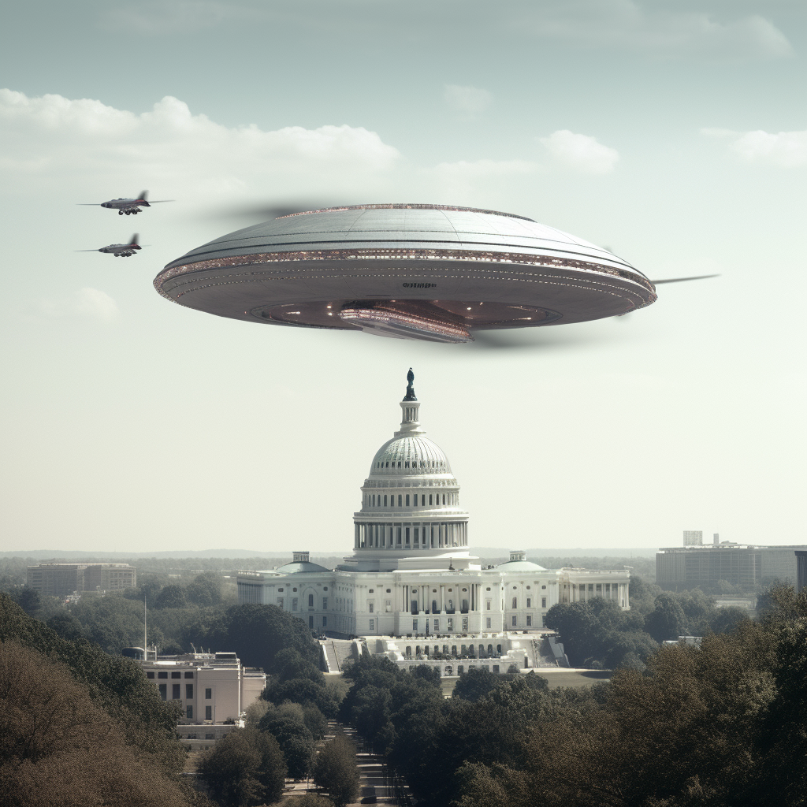

My latest interview on [Andrew Donaldson](https://twitter.com/four4thefire)'s [Heard Tell Radio](https://app.redcircle.com/shows/4b87f374-cace-44ea-960c-30f9bf37bcff/donations) is a bit of a wild one.

To begin, I discuss the growing movement for government disclosure on UAPs (Unidentified Anomalous Phenomena) or UFOs, and why it's important for transparency and accountability.

To simplify it, we know the government has classified or withheld various projects, events, or sightings of things in our skies. There are also legitimate reports of craft retreival and reverse engineering programs, that could either be non-human technology or foreign technology from adversaries such as Russia, China, or elsewhere. There are now pending congressional bills or statutes that require elements of the executive branch (intelligence, military, or otherwise) to disclose this to the American people.

I'm unsure what exactly we'll learn, but we know there have been significant efforts to stop these diclosures and keep programs – and likely billions of dollars – hidden from the American populace. It's high time to end this and finally achieve UAP Disclosure.

I decided to clip this part of the interview separately, for obvious reasons. You can listen below on [YouTube](https://youtu.be/41fUF43AOEo?si=vvID-EfA_sUbR26W).

https://youtu.be/41fUF43AOEo?si=vvID-EfA\_sUbR26W

In the rest of the interview, we discuss President Biden's executive order on AI (artifical intelligence), which I wrote about recently in the National Interest.

You can listen to the full interview here on [YouTube](https://www.youtube.com/watch?v=bAWCTuyCVRM) or via your podcast players on HeardTell:

<iframe style="border-radius:12px" src="https://open.spotify.com/embed/episode/0mUCAbsloalqVzIxoAnNsy?utm_source=generator" width="100%" height="352" frameborder="0" allowfullscreen allow="autoplay; clipboard-write; encrypted-media; fullscreen; picture-in-picture" loading="lazy"></iframe>

<iframe allow="autoplay *; encrypted-media *; fullscreen *; clipboard-write" frameborder="0" height="175" style="width:100%;max-width:660px;overflow:hidden;border-radius:10px;" sandbox="allow-forms allow-popups allow-same-origin allow-scripts allow-storage-access-by-user-activation allow-top-navigation-by-user-activation" src="https://embed.podcasts.apple.com/us/podcast/bidens-poll-numbers-aliens-ai-privacy-oh-my-w-yael/id1570693090?i=1000633996178"></iframe>
