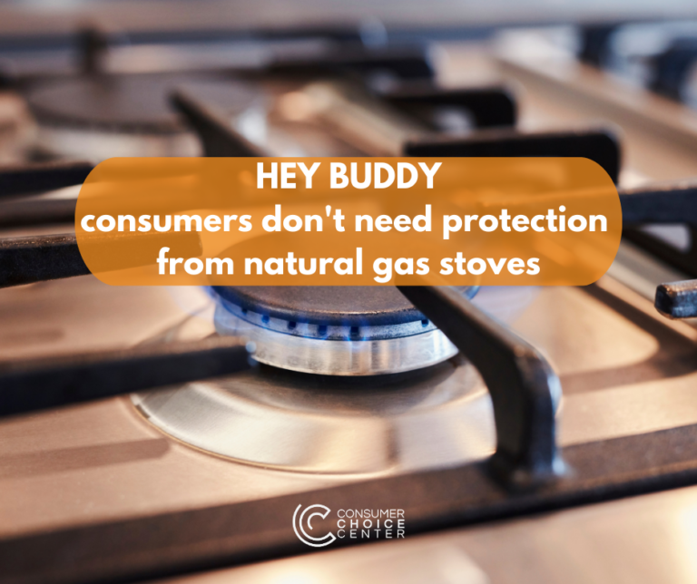

The degrowther cacophony of environmentalists, bureaucrats, and supposed consumer advocates has found a new enemy to protect you from: the gas stove in your kitchen.

As spelled out by U.S. Consumer Product Safety Commissioner Richard Trumka Jr. in a [recent Bloomberg interview](https://www.bloomberg.com/news/articles/2023-01-09/us-safety-agency-to-consider-ban-on-gas-stoves-amid-health-fears?srnd=green&sref=Vi7wu7Hv), a federal “ban on gas stoves is on the table amid rising concern about harmful indoor air pollutants.”

Trumka joins the chorus of [enterprising journalists](https://www.usnews.com/news/us/articles/2022-01-27/study-gas-stoves-worse-for-climate-than-previously-thought), [academics](https://www.mercurynews.com/2022/01/27/study-gas-stoves-greater-climate-threat-than-previously-thought/), and [green activists](https://www.weforum.org/agenda/2022/02/gas-stoves-climate-change-study-methane/) (and even the World Economic Forum) who have taken up the agency’s call to not only make a health case against kitchen stoves that heat food with natural gas, but also the environmental and _moral one._

An article in New York Magazine [asked](https://www.curbed.com/2023/01/ban-gas-stoves-natural-gas.html), rather innocently, “are gas stoves the new cigarettes?” We all know what follows.

Humbly, Trumka [later clarified](https://twitter.com/TrumkaCPSC/status/1612553459462721536) the agency wouldn’t propose _banning_ them, but would instead only apply strict regulations to “new products,” following cities like San Francisco and New York City, and entire states like New York (no surprise) that have [already enacted bans](https://edition.cnn.com/2022/02/17/politics/natural-gas-ban-preemptive-laws-gop-climate/index.html) on natural gas hook-ups for new construction. It should be noted that the majority of these proposed actions were based on _environmental_ claims rather than health claims, and the most prominent advocates have been “environmental law” experts and the like.

Of course, they’ll say they don’t want to _outlaw_ gas stoves in your home or dispatch agents to rip them from your kitchens and load them onto flatbeds. That’s silly. They just want to use the force of laws, guidance, and incentives to _nudge_ consumers away from a natural gas standard. The federal government’s ineptly named _Inflation Reduction Act_ will go a long way.

If you voluntarily swap your gas stove for an electric one, the IRA deems you [eligible](https://www.marketwatch.com/story/biden-does-not-support-banning-gas-stoves-white-house-says-11673470202) for a tax rebate of up to $840 — which would easily subsidize your lifestyle “choice”. This is similar to the law’s incentives for buying electric vehicles, installing solar panels, and fitting new construction with green-friendly tech.

While subsidies for your home kitchen may be all the rage, it’s understandable why this issue has become a cultural flashpoint.

For average consumers, the advantages of using a gas stove are plentiful. For one, they heat quickly and efficiently, reducing the time and energy used to cook a meal. They offer heat moderation that any meal would require. And because natural gas is a separate utility hook-up, it means that in the case of brownouts or power outages, you can still cook, boil water, and heat your food.

Restaurant chefs are slavishly reliant on natural gas to provide the best source of heat for lunchtimes and dinners for hungry patrons, as are Americans of more modest income who can more cheaply provide food at home using natural gas than increasing their electricity bill.

The disadvantages of natural gas stoves, according to the activists, are they could leak nitrogen oxides into your home, which, when wedded with improper ventilation, presents a risk for childhood asthma and other health concerns. In addition, that gas leakage could contribute to greenhouse emissions, which links it to climate change.

When Trumka first entertained a natural gas stove ban — on a December private Zoom meeting with the Public Interest Research Group Education Fund — the asthma risk was front and center. He went so far as to call it a “hazard,” which boggled our minds at Consumer Choice Center, considering [the extent of our work](https://consumerchoicecenter.org/?s=hazard) clarifying the errors of legislating based on risks instead of hazards.

https://youtu.be/kir\_VBo6XEA?t=106

For a look into the studies, economist Emily Oster recently [did this on her Substack](https://www.parentdata.org/p/gas-stoves-and-asthma), and her conclusion is that the risks claimed by researchers are actually so minimal that they aren’t worth taking seriously for anyone who has a properly vented kitchen and up-to-date appliances.

While indoor air pollution is indeed a serious hazard, it is not one that affects US households. Hood vents, air conditioning, and modern construction have avoided this issue for nearly all Americans, [as the EPA admits](https://www.epa.gov/report-environment/indoor-air-quality). The effect on climate change is also negligent, considering that conversion to all-electric stoves does nothing to clean up the energy grid or move all electricity generation to carbon-neutral alternatives.

Why then is this issue gathering so much steam among consumer advocates like PIRG, [which began a campaign against natural gas stoves](https://pirg.org/edfund/resources/gas-stoves-a-hidden-health-risk-in-plain-sight/) early last year?

While they may be sincere in their aims, it amounts to yet another crusade against consumer choice. People know the risks of gas stoves and the cost-benefit analysis that comes with purchasing one. Having a gas stove with children running around isn’t ideal, and in most cases, an induction stove is likely even more efficient and desirable.

But the entire purpose of having a variety of stoves is to offer users — professional chefs and home cooks alike — the option that fits best with their lifestyle and budget. There are always risks when it comes to home appliances, energy applications, and what we bring into our homes.

But we would rather trust consumers to make this decision than a regulatory agency with its own agenda.

_Published on the [Consumer Choice Center's website](https://consumerchoicecenter.org/hey-buddy-consumers-dont-need-protection-from-natural-gas-stoves/)._
