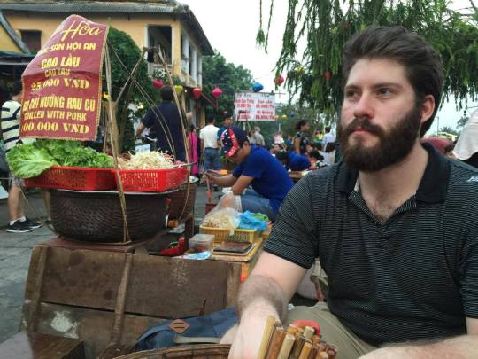
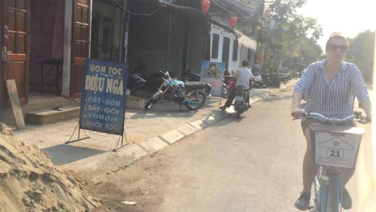

Right through puffs of smoke and soot we did motorbike. Sucking it in for the pure joy of it. Even though 90 percent of locals always have specially decorated face masks on, we figure we’ll suffer for holiday’s sake. Besides, we can leave anytime, they cannot. Even within the country. In order to change residences, they must appeal to two sets of authorities who govern Hộ khẩu, the country registration system. No permission, no move. You can even be illegal in the town over. It’s bonkers. But that’s the practical extension of Uncle Ho communism, I suppose.

No one drives here, they weave and duck. Small carts, smaller babies taking their third steps, and fellow motorbikers always within a whisker of completely careening into oncoming traffic. The Vietnamese brush, perhaps.

And we’re just in Hội An, Vietnam, the town in the eastern part of the country renowned for its beaches, canal rides, and paper lanterns. Somehow tailors hold monopoly despite all the grit and muggy air. Anything is done within just a few hours. Entire dresses, suits, jackets, and shirts, made to order and cut on demand. But it’s always done by someone else. It’s outsourcing to its finest.

Even at select food stands and circles, once you order your pork skewers and fried egg rolls, the simply dressed older man (Anh) rushes to another food stand to place an order for what he doesn’t have. Or he’ll phone in Auntie (Có) to bring in a coconut from the backyard. Always at your service, ring the bell. Perhaps these people deserve a bit more than the hand they’ve been dealt in Uncle Ho’s communism. They understand markets more than we ever could.
