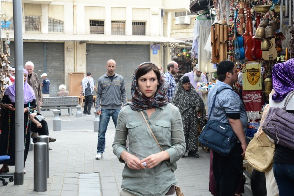
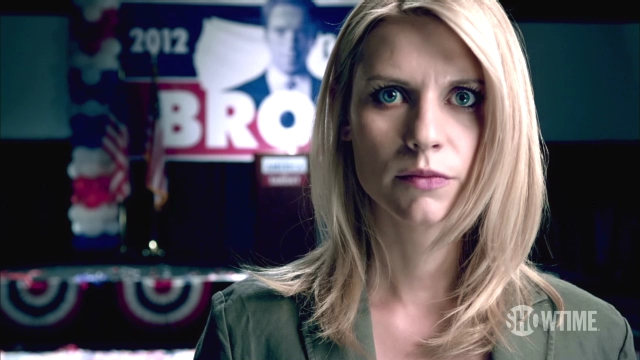
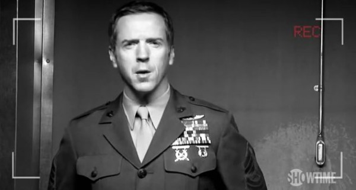
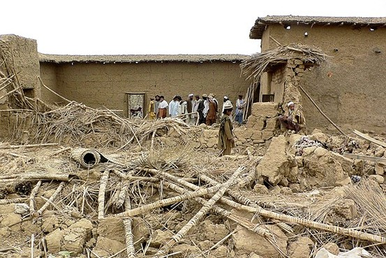
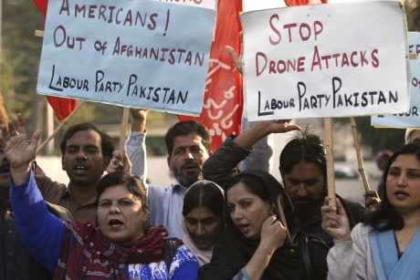
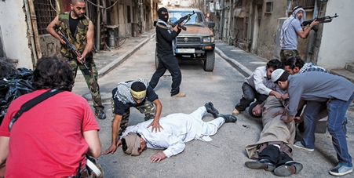
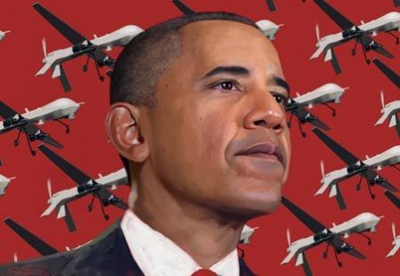

For the casual audience tuning into **Showtime** on Sunday evenings, it’s not likely they’re searching for artful deconstructions of a nation in the midst of clandestine war, illegal surveillance, and retaliatory attacks on civilian populations.

But for the award-winning _Homeland_, still laced with plenty of suspense, sex, and smut, this is precisely what is offered.

Using character studies, thematic elements, and historically significant intrigue, the show manages to put forward questions of patriotism and allegiance in a new age of warfare, concocted by design through the bureaucratic chambers of one of the **United States**’ most secretive agencies.

Most importantly, however, _Homeland_ provides lessons of the negative effects of American empire, otherwise known as “blowback,” defined as the “unintended consequences of covert operations deliberately kept secret from the American public.”

By examining the casualties of all sides in the **War on Terror**,  _Homeland_ uses the power of the small screen to present this complicated but  essential moral issue and invite critical discussions on American foreign policy going forward.

**LAUNCHING PAD OF THE EMPIRE**

The series focuses on **Carrie Matheson**, played by Claire Danes, an unbalanced yet inexplicably talented case officer at the **Central Intelligence Agency** in Langley, Va.

The first season details her mounting suspicions of prisoner-of-war-turned war hero **Nicholas Brody**, who spent 8 years in the custody of so-called **Al Qaeda** terrorists and, as viewers later discover, became sympathetic to their cause after **Aisa**, the eight-year-old son of his captor, **Abu Nazir,** was killed by an American predator drone strike.

The audience plays witness to Brody’s transition as he watches his own government, specifically Vice President **William Walden,** broadcast to the world that “suspected militants” were necessarily wiped out in the bombing, despite the hundreds of children and women also killed but not mentioned in any official report.

**David Estes**, director of the **CIA’s Counterterrorist Center** and **Carrie Matheson**’s boss, once headed up the agency’s predator drone program when Vice President **William Walden** launched the strike and plays a pivotal role in green-lighting various covert and espionage missions throughout the run of the program.

For the purpose of this analysis, however, the most essential element of the show is Brody’s reaction to the drone strike which kills the innocent women and children.

It is this singular event which precipitates Brody’s resentment of the clandestine and murderous actions of American foreign policy and justifies his collaboration with his former captor, the “terrorist mastermind” the CIA is dead-set on reigning in.

The driving need for **Brody** to resort to a suicide attack to avenge the death **Aisa** represents the very idea of “blowback,” as he begins to plan an attack on the U.S. as a reaction to the covert attack initiated by **Walden** and **Estes**.

This is the very real struggle currently facing the **American Empire**, which has spanned an entire decade of wars and occupation in search of an enemy it cannot seem to eliminate.

Many have termed this an ultimate "clash of civilizations,“ brought about by religious and cultural differences reiterated by those who decide to attack the United States.

The government’s official response to attacks against Americans is simply that these are actions of Islamic fundamentalists who are hell-bent on destroying the United States because of some cultural or religious animosity.

"They hate our freedoms,” President **George W. Bush** [explained to the nation](http://www.cnn.com/2001/US/09/20/gen.bush.transcript/) just 9 nine days after the attacks on 9/11, justifying the invasions of **Afghanistan** and later **Iraq**.

This claim, however, is beginning to fall apart.

“There is little connection between suicide terrorism and Islamic fundamentalism, or any one of the world’s religions,” writes **Robert Pape** of the **University of Chicago**, the foremost expert on suicidal terrorism.

The central thesis of his book, [**Dying to Win: The Strategic Logic of Suicide Terrorism**](http://en.wikipedia.org/wiki/Dying_to_Win:_The_Strategic_Logic_of_Suicide_Terrorism), relies on compiled data from every case of suicide terrorism in the last 30 years, casting major doubt on the usually assigned culprit of religious fanaticism by Middle Eastern Arabs.

Pape easily discounts Bush’s claim and all other claims by defenders of the continued **War on Terror** by examining the damaging effect of American troop presence and civilian attacks in foreign nations.

“What nearly all suicide terrorist attacks have in common is a specific secular and strategic goal: to compel modern democracies to withdraw military forces from territory that the terrorists consider to be their homeland,” writes Pape.

Even though Brody is a patriotic American solider, he witnesses the devastating power of the American government’s predator drones and decides to retaliate for what he considers an immoral, unjustified act on innocent civilians.

With over [900 military bases in over 130 countries](http://www.acq.osd.mil/ie/download/bsr/bsr2010baseline.pdf), it is inevitable that domestic populations would grow to resist the presence of American military personnel, especially if bombs and predator drones are routinely seen dropping from the sky.

It has nothing to do with hating freedom or democracy, as Bush suggested.

This what many contemporary neoconservatives, who control the foreign policy of both major political parties, fail to understand about the effect of a burgeoning **American Empire**.

Countries want to be left alone to govern themselves. And they certainly don’t want foreign aircraft hovering above them and dropping bombs on certain “strategic targets” because they apparently pose a threat to the “national interest,” as is [often invoked](http://www.guardian.co.uk/world/2012/oct/23/uk-support-us-drones-pakistan-war-crime) in countries such as Pakistan, Afghanistan, Yemen, and Somalia, where drones have unleashed firepower.

It is not the hate of the American ‘way’ but rather the American 'might’ which enrages those who decide to take arms against the U.S., something _Homeland_ demonstrates quite clearly for the **Showtime**’s casual audience.

**THE REAL LESSONS LEARNED**

Most analysis on _Homeland_ has so far centered on questioning whether the show's portrayal of Muslims plays to offensive stereotypes, rather than questions about 'blowback’ or flawed foreign policy.

In the eyes of some critics, _Homeland_ is just as guilty as governments or mainstream media in painting a broad brush of Muslims and labeling them him “suspected jihadists.”

The _London Guardian_'s **Peter Beaumont** [sums up this argument](http://www.guardian.co.uk/tv-and-radio/2012/oct/13/homeland-drama-offensive-portrayal-islam-arabs) in stating that, “What I do know is how both Arabs and Islamists have been portrayed thus far as violent fanatics, some of whom are powerful and influential infiltrators.”

Columbia University professor **Joseph Massad** , [writing for _Al-Jazeera_](http://www.aljazeera.com/indepth/opinion/2012/10/2012102591525809725.html), goes so far as to charge the show of racism, sexism, and every other “ism” imaginable, declaring the “racialist structure of the show is reflective of American and Israeli fantasies of anti-Muslim American multiculturalism.”

What Beaumont and Massad fail to consider is that the show is inherently focused on suspected terror plots, espionage, and reactions to American foreign policy by Middle Eastern characters— not the life and times of Muslim shopkeepers in **Minnesota**. The idea of all Muslims being profiled and suspected of terrorism is addressed outright in the show multiple times, underscoring the very frustration these authors voice in their criticisms.

This is easily admitted in “[New Car Smell](http://www.imdb.com/title/tt2385585/),” the 4th episode of the second season, when the foreign taxi driver scoffs **Brody**’s attempted use of the credit card when he’s dropped off at CIA headquarters in **Langley**.

“Oh come on man, no cash? These spook types follow me around for days after they see me handing papers to customers,” said the taxi driver, revealing the common frustration Arabs must confront everyday.

This was a smart point inserted by _Homeland_’s writers, but it was apparently lost on show critics.

The _A.V. Club_'s **Todd VanDerWerff**, however, [rightly recognizes](http://www.avclub.com/articles/qa,86751/) the central theme of the show by revisiting the question of what motivates attacks against the U.S.

“After all, Brody’s reasons for turning against the United States might have been foolhardy, but at least they were reasons,” writes VanDerWerff. “Being angry at the government’s drone program and believing it abandons what makes this nation great is a completely justifiable position.”

Massad does redeem himself, however, when he voices poignant criticisms for President **Barack Obama**, who is [apparently a fan of the show](http://articles.nydailynews.com/2012-02-10/news/31048114_1_rah-barack-obama-boss-watches), which remains ironic considering he is the very man responsible for the [biggest drone strike campaign](http://www.guardian.co.uk/commentisfree/2012/jun/11/obama-drone-wars-normalisation-extrajudicial-killing) in the history of American foreign policy.

His drone strikes have so far [killed 3 American citizens without trial or charge](http://www.washingtonpost.com/world/national-security/families-of-americans-killed-by-drones-to-file-suit/2012/07/18/gJQAhbJWtW_story.html), not to mention [foreign nationals](http://killlist.curry.com/), and he maintains a “[Kill List](http://www.washingtonpost.com/wp-dyn/content/article/2010/05/04/AR2010050400930.html)” of individuals who are susceptible to assassination at the push of a button.

These are the types of attacks which inspire more terrorism against the United States, which _Homeland_ goes to great length to show.

**CONCLUSION**

Convicted Times Square bomber **Faisal Shazad** [admitted in open court](http://www.washingtonpost.com/wp-dyn/content/article/2010/05/04/AR2010050400930.html) he was driven to attack the **United State**s after members of his own family were killed in drone campaigns in Pakistan. The same has been cited in [numerous cases as the drone campaigns across the Middle East](http://www.guardian.co.uk/world/2012/oct/07/pakistanis-rally-against-us-drone-strikes) become more numerous and deadly and serve as a back drop in the story line of _Homeland_.

This show allows the human elements of the **War on Terror** to be put on trial, including the very brutal foreign occupations which continue to incite hatred toward America.

What makes _Homeland_ so important therefore, is that it contains real life lessons about 'blowback’ and the unintended consequences of **American Empire**, leaving every viewer ever more skeptical about the true aims of the United States’ foreign policy.

_This article originally appeared on [Liberty In Exile](http://libertyinexile.com/2012/10/31/homeland-and-lessons-of-blowback/)._
