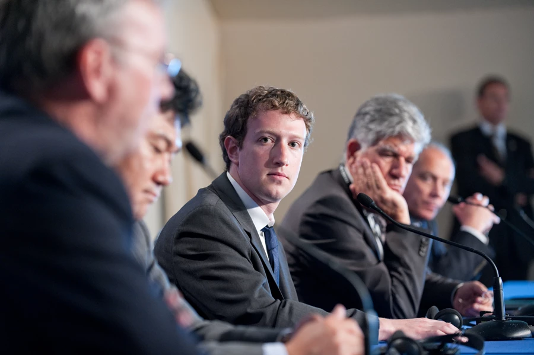

Call it election interference, censorship, or simple editorializing, but Twitter and Facebook's [throttling](mailto:https://www.washingtonexaminer.com/news/twitter-ceo-says-company-communication-to-justify-mass-censorship-of-new-york-post-biden-story-unacceptable) of several _New York Post_ articles this week has drawn lots of criticism.

The stories [allege](mailto:https://www.washingtonexaminer.com/opinion/the-hunter-biden-corruption-story-now-comes-with-receipts-joe-biden-should-have-to-answer-for-it) that Hunter Biden, former Vice President Joe Biden’s son, introduced Ukrainian energy adviser Vadym Pozharskyi to his father after receiving a [cushy](mailto:https://www.washingtonexaminer.com/news/are-hunter-bidens-emails-the-2020-october-surprise) $50,000 a month board seat at the company Burisma. (Other outlets have [contested](https://go.fee.org/e/808113/s-alleged-laptop-an-explainer-/27y7l/61702929?h=S7GuV9dsCt5D5_aMHzxSGiOsvnloQpp3zEmW7B8HXAA) the report).

There is no question that the social networks in question made a bad call. Disabling the link on the various platforms made even more people seek it out, [creating a “Streisand Effect” of mass proportions.](https://fee.org/articles/big-tech-tried-to-censor-the-ny-post-s-hunter-biden-story-they-made-it-huge-instead/)

But the content of the articles isn't what really matters.

The reaction to the _New York Post_ report reveals just how much pressure is put on social networks to perform roles far beyond what they were intended for. We want them to simultaneously police speech online, keep the networks free for open discussion, and be mindful of “fake news" that spreads rapidly.

So, it is important to understand why Facebook and Twitter felt they had to censor the story in the first place—and why all of us are actually to blame. For the last several years, campaigners, activists, and politicians have primed us all to accept the byzantine expectations and regulations put on social networks.

From Netflix documentaries such as _The Social Dilemma_ and _The Great Hack_ to the criticisms of “surveillance capitalism,” many voices are [calling](mailto:https://www.washingtonpost.com/opinions/surveillance-capitalism-has-gone-rogue-we-must-curb-its-excesses/2019/01/24/be463f48-1ffa-11e9-9145-3f74070bbdb9_story.html) for further regulation of social media networks.

Some on the Right smirk as Sen. Josh Hawley pens legislation to [repeal](mailto:https://www.washingtonexaminer.com/opinion/josh-hawleys-section-230-amendment-would-only-make-social-media-censorship-worse) Section 230 of the Communications Decency Act or to [ban](mailto:https://www.digitaltrends.com/news/josh-hawley-social-media-autoplay-infinite-scroll/) “infinite scrolling” on social media apps. Meanwhile, some on the Left cheer as technology CEOs are [dragged](mailto:https://www.washingtonexaminer.com/news/big-tech-faces-off-with-congressional-critics-during-antitrust-house-hearing) before congressional committees and castigated for “allowing” Trump to win in 2016. 

This week, it was [revealed](mailto:https://www.wsj.com/articles/new-york-regulator-urges-oversight-for-social-media-giants-11602683181?mod=djemCybersecruityPro&tpl=cy) that the New York State Department of Financial Services wants a “dedicated regulator” to oversee social media platforms. Other states will likely follow suit.

But what we’re all too loath to admit is that these firms do what any of us would do when under scrutiny: they pivot, they engage in damage control, and they aim to please those with pitchforks outside their doors. It’s the same whether it’s [Black Lives Matter](https://fee.org/articles/is-black-lives-matter-marxist-no-and-yes/) or President Trump.

Facebook has committed to [ending](mailto:https://www.facebook.com/business/help/1838453822893854) all political advertising online (hurting non-profit advocacy groups like mine) and Twitter already implemented a similar policy [last year](mailto:https://www.washingtonexaminer.com/news/twitters-political-advertising-ban-puts-ball-in-facebooks-court), lauded by political figures such as Hillary Clinton and Andrew Yang.

https://twitter.com/AndrewYang/status/1189664911934271488?s=20

https://twitter.com/HillaryClinton/status/1189638596703260678?s=20

Of course, when tech giants censor or delete stories that we perceive to advance or hurt our political “team,” we are all up in arms. But protecting a free and open internet means not using punitive regulations or policies to hamstring social networks because of the scandal of the day.

Internet policy remedies dreamed up in Washington, D.C. will almost always end up hurting those of us who don’t have power or deep pockets. It harms the small businesses that use social networks for advertising, and it sets up more roadblocks for ordinary users who simply want to check in with friends and family. 

Big Tech isn’t powerful because it has money, but because it has delivered superior products, those that have left platforms such as AOL, Myspace, and Yahoo in their wake.

Social networks have evolved from places to connect and share information across borders to intellectual and political battlefields where we wage digital wars.

Of course, there should be regulation in some respect. But it should be smart regulation that keeps platforms relatively free and open and provides incentives for future innovation. The powerful platforms of today can afford to comply with cumbersome rules, while new market entrants cannot. 

That means that with every new proposal to roll back Section 230 protections or require quasi-governmental fact-checking functions around Election Day, we’re depriving consumers of choice and entrepreneurs of the ability to innovate.

Of course, targeted censorship of certain accounts or stories on social media networks is bad. But policy "solutions" dreamed up by technologically illiterate bureaucrats and power-hungry politicians would no doubt be even worse. 

_This article was originally published on [FEE.org](https://fee.org/articles/how-not-to-respond-to-alarming-social-media-censorship/)._
