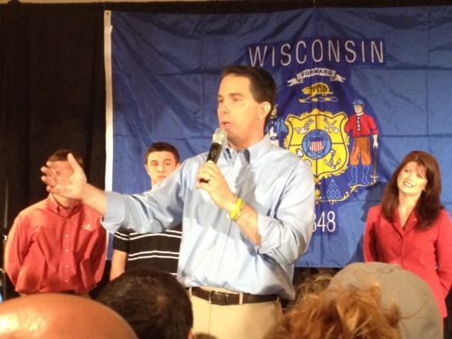

By Yaël Ossowski | Wisconsin Reporter

> MILWAUKEE —  And so it comes to judgment day.
> 
> All across Wisconsin, voters head to the polls to record their voice in what has become the most bitter battle for hearts and minds that the Badger State has ever known.
> 
> On the eve of election day, just nine hours before the first poll opened, hundreds of supporters of embattled Wisconsin Gov. Scott Walker gathered to hear his final words of encouragement at Serb Hall in the south side of Milwaukee.
> 
> After nearly two years of disagreement, distrust and discord, many Walker supporters cheered with enthusiasm but where ready to end the toxic battle that has overtaken their state.
> 
> “Most people are just upset about the recall,” said **Jerry Wallace,** 63, of New Berlin, holding steadfast to his position just a few feet from where Walker was due to speak.

Read more: [Wisconsin Reporter](http://www.wisconsinreporter.com/in-final-night-walker-supporters-rally-to-end-recall-discord)
