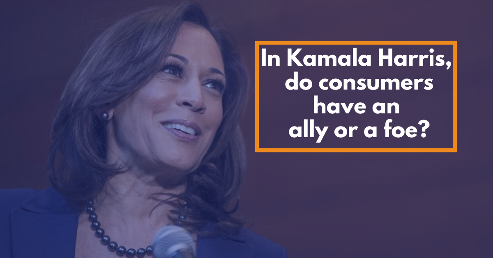

This week, Democratic presidential candidate Joe Biden revealed Sen. Kamala Harris of California as his running mate for the November general election against President Donald Trump.

https://twitter.com/JoeBiden/status/1293666570523168769?s=20

Because Harris' influence on the Biden campaign will loom large, and be important to whomever American voters choose in the fall, it's worth looking at some of her ideas and policies and how they would have an impact on consumers.

Let's take a dip, shall we?

### HEALTHCARE

On her original presidential campaign website and throughout the Democratic primary debates, Harris was [adamant](https://consumerchoicecenter.org/counterpoint-what-about-freedom-to-choose-your-care/) about banning private healthcare insurance in favor of a Medicare For All plan. She later [backed out](https://edition.cnn.com/2019/06/28/politics/kamala-harris-democratic-debate-abolishing-private-insurance/index.html) once she was questioned by party activists.

With that in mind, considering Biden was nominated to be his party's candidate on a platform of not seeking Medicare For All, a plan to expand the government health insurance program to seniors to the entire population, it seems there may be healthy disagreement on this point.

As I've written in a [few outlets](https://consumerchoicecenter.org/what-happened-to-the-right-to-choose-your-healthcare/), the idea of a Medicare For All health insurance system would rob consumers of competition and choice, and likely lead to less quality of healthcare than we actually receive. It would mean that healthcare decisions would be placed in a complex hierarchy of bureaucratic agencies immune from market forces. That would inevitably lead to higher costs overall – no matter who foots the bill.

Harris being on the ticket doesn't mean M4All is now on the docket for the Democratic Party, but it does mean that ideas about the government reorganizing health insurance will certainly be a part of a potential Biden Administration in the future. That'll be something to keep an eye on.

### **TECH**

As we [covered](https://consumerchoicecenter.org/democratic-presidential-debate-how-did-consumer-choice-fare/) during the debates in 2019, Sen. Harris petitioned Twitter to remove President Donald Trump from its service. Those calls weren't central to her rhetoric on tech regulations, but they at least revealed her mindset regarding content on social media platforms, and who should be allowed to have an account. In some speeches, she's come out as more [hawkish](https://reason.com/2019/05/07/kamala-harris-promises-to-pursue-online-censorship-as-president/) on online censorship, which should good everyone worry.

Unlike some of her past primary opponents, she was rather soft on the question of antitrust and whether the tech giants in Silicon Valley should be broken up, which is a relief for consumers.

Most of the animus against tech companies has very little to do with concern for consumers, and much more to do with the new generation of gatekeepers using technology and innovation to provide better services. Most consumers [prefer](https://consumerchoicecenter.org/opinion-facebook-trustbusters-motivated-by-partisan-politics-not-consumer-protection/) these new innovations and want them to thrive, not be broken up.

For some observers, her political career in California and proximity to tech firms mean she'll be an asset rather than a liability on future tech regulation. The outlet Marketwatch [dubbed](https://www.marketwatch.com/story/kamala-harris-is-a-friend-not-foe-of-big-tech-2020-08-12) her a "friend, not a foe, of Big Tech" and the Wall Street Journal [similarly](https://www.wsj.com/articles/silicon-valley-sees-kamala-harris-as-one-of-its-own-11597264624) gave her praise, though with some caution.

### **VAPING**

What isn't a surprise to listeners of [Consumer Choice Radio](http://consumerchoiceradio.com) is that Sen. Harris is no friend of vaping and harm-reducing innovations.

She penned a [letter](https://www.harris.senate.gov/news/press-releases/harris-feinstein-colleagues-slam-fda-e-cigarette-policy-riddled-with-loopholes-for-flavors-that-appeal-to-children) last year accusing the FDA of being soft on vaping and for not banning all vaping products outright. That would have been disastrous for the former smokers who rely on these products.

She took it a step further by linking legal nicotine vaping products to the bootleg THC vaping devices that caused lung injuries throughout 2019, which we've [debunked](https://consumerchoicecenter.org/myths-and-facts-on-vaping/) in our own work at the Consumer Choice Center.

If Harris' worldview remains the same, vapers won't have a friend in the potential future VP.

### **CANNABIS**

And lastly, we come to cannabis, a favorite topic of those who dub Harris "The Cop Who Wants to be (Vice) President," like Elizabeth Nolan Brown of [Reason](https://reason.com/2020/08/11/kamala-harris-is-a-cop-who-wants-to-be-vice-president/).

During Harris' time as a prosecutor in California, her reputation as an anti-cannabis voice was well-known.

But as our friends at Marijuana Moment mention, she's changed her mind over the years, from being a staunch opponent to advocate:

> Though she coauthored an official voter guide argument opposing a California cannabis legalization measure as a prosecutor in 2010 and laughed in the face of a reporter who asked her about the issue in 2014, she went on to sponsor legislation to federally deschedule marijuana in 2019.
> 
> [Where Vice Presidential Candidate Kamala Harris Stands On Marijuana](https://www.marijuanamoment.net/where-vice-presidential-candidate-kamala-harris-stands-on-marijuana/)

Since dropping her campaign to be president, she's become more vocal, making the argument for legalizing cannabis at the federal level, though she's

https://twitter.com/KamalaHarris/status/1213569794131267585?ref\_src=twsrc%5Etfw%7Ctwcamp%5Etweetembed%7Ctwterm%5E1213569794131267585%7Ctwgr%5E&ref\_url=https%3A%2F%2Fwww.marijuanamoment.net%2Fwhere-vice-presidential-candidate-kamala-harris-stands-on-marijuana%2F

Overall, there's a lot to digest on a potential Kamala Harris Vice Presidency. On behalf of consumers, let's hope there's more good than bad.
