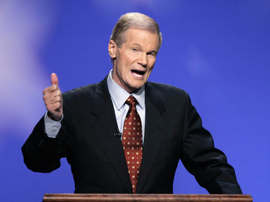

By Yaël Ossowski | Florida Watchdog

> MIAMI — As a powerful member of the **Senate Commerce, Finance and Intelligence committees** and the former state treasurer of **Florida**, Democratic **U.S. Sen. Bill Nelson** is no stranger to the intricacies of backroom politics.  
>   
> With 40 years of successive public service in **Tallahassee** and on**Capitol Hill**, the senator has garnered a reputation as a staunch Democratic statesman known as an “authentic hayseed.”
> 
>   
> But such a long grip on power also has meant budding relationships with key industries and lobbies that seek representation on the Hill.
> 
>   
> As chairman of the Commerce Committee’s space subcommittee and only the [second sitting member](http://www.jsc.nasa.gov/Bios/htmlbios/nelson-b.html) of **Congress** to fly on a space mission, Nelson has been the [foremost advocate](http://www.spacepolitics.com/2012/02/17/nelson-vows-to-fight-for-commercial-crew-funding-in-congress/) for the federal government’s role in funding space and defense — and industries have taken note.

  
Read more: [FloridaWatchdog.org](http://watchdog.org/16349/influence-earmarks-persist-in-fl-senators-term/), [Washington Examiner](http://campaign2012.washingtonexaminer.com/article/earmarks-haunt-nelsons-re-election-campaign/541931)
