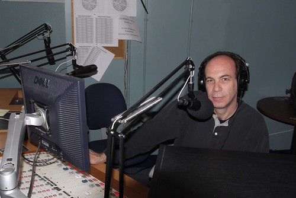
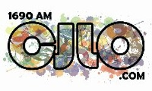

On Friday 01. Feb, 2013, I was invited onto the radio show of my mentor and former colleague **Karl Knox**.  Karl is a kingpin on the Montréal airwaves, starting the radio day on **CJLO 1690AM**, and built up a great career as a stand-up comedian and commentator, headlining shows all across the Great White North. 

We talked about Florida politics, voting troubles, domestic spying, drones, U.S. versus Canadian politics, the marketplace of ideas, free speech, Ron Paul, and the importance of alternative media in the face of corporate control of information.

[**LISTEN HERE**](http://libertyinexile.jellycast.com/files/audio/01febkarlknox.mp3)

Check out his page, [New Media and Politics Canada](http://nmpcanada.blogspot.com/) and catch him everyday on **CJLO 1690AM** in **Montréal** from 8-10am.
