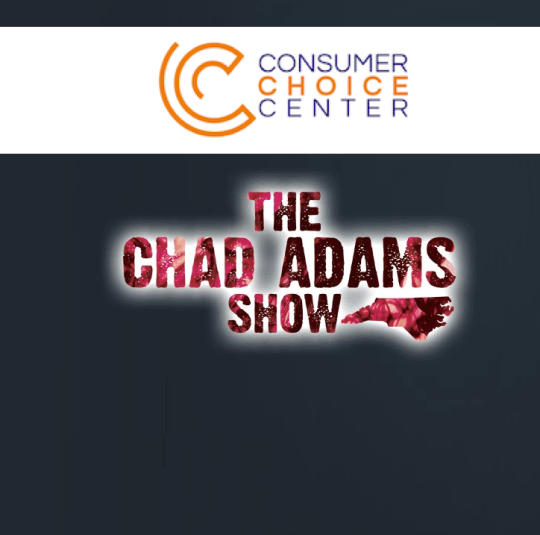

  

Yaël Ossowski, public relations director of the Consumer Choice Center, is interviewed on the Chad Adams Show, broadcast out of Raleigh, North Carolina. Topics include alcohol regulations in North Carolina, the launch of the Consumer Choice Center, and more.

March 3rd, 2017

[thechadadamsshow.com/](https://exit.sc/?url=http%3A%2F%2Fthechadadamsshow.com%2F "http://thechadadamsshow.com/")  
[consumerchoicecenter.org](https://exit.sc/?url=http%3A%2F%2Fconsumerchoicecenter.org "http://consumerchoicecenter.org")
