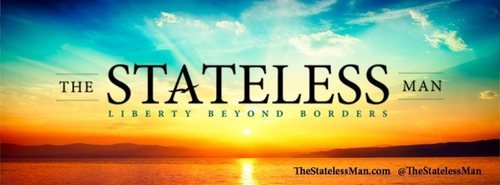

****

**Fergus Hodgson**, [the Stateless Man](http://thestatelessman.com), invited me on his program to discuss my time at the **European Students For Liberty Conference** in Leuven, Belgium, as well as [the article I wrote for the website](http://thestatelessman.com/2013/03/12/esfl/).

**[Download the MP3 here](http://libertyinexile.jellycast.com/files/audio/Yael_StatelessMan_ESFL.mp3)**

Oddly enough, the interview was conducted not long after Fergus also spoke with the legendary Dr. **Ron Paul** on the program, [a clip of which is available here](http://youtu.be/-9nOTLS6q-4).

In my own segment, we talked about the conference as well as the state of freedom on the European continent, recent developments, and how people can find freedom in their own lives.

The interview has been included on the [Liberty In Exile RSS feed](http://libertyinexile.jellycast.com/podcast/feed/2).
