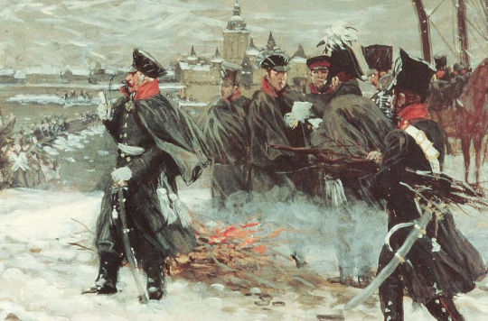

It’s an unfortunate fact of the present that Germans must shudder at the mention of their history. 

Any conversation will reliably either end or begin loyal to [Godwin’s law](https://en.wikipedia.org/wiki/Godwin%27s_law). There will be no discussion of the mature political and economic institutions which created a great civilization out of nothing for hundreds of years in central Europe. Of the empire which produced so much wealth, power, and ingenuity that it will forever live on in its descendants.

This is the story of Prussia. 

When I was a young boy, I remember my grandfather telling me stories of the great emperors and statesmen of the Prussian Empire. He had moved to Canada after the war, but his glorification of Prussian never ceased. Its soldiers fought gallantly, its academics produced reams of important work invoked even today, and its statesmen created what we now know as the modern state.

He was born in a small garrison town outside of Königsberg, the capital of East Prussia.

After the war, it was ransacked by the Soviets. The land decimated, the population chased away or outright massacred. The largest-ever exodus of European souls, some 1.8 million people forced to evacuate in the winter of 1945. And that’s when it ceased to have any connection to Prussia. It’s now an exclave of the Russian Federation.

“Our family is from Prussia, don’t forget that, son,” he would proudly tell me. 

It wasn’t until my twenties that I could fully grasp what that meant.  

Prussia was itself a province of the state we now know as Germany, itself not even 150 years old. It began as a backwater principality known as Brandenburg around modern Berlin in the 1500s. 

Its story is eloquently told by historian Christopher Clark in _Iron Kingdom: The Rise and Downfall of Prussia 1600-1947_.

Reading this book was important for my development both as a student of history and as an inheritor of it. My own life was only two generations removed from living in working in what was known as Prussia, stretching from Cologne to the Baltic Sea.

Often, when speaking to German colleagues about historical observations before the world wars, I’m met with blank stares. Even some confusion. Why would this young North American fellow concern himself with an ancient past since blotched and stained with the political and military machinery of the Nazis?

Frederick the Great was surely a strong military and political leader, but he wasn’t Hitler. Only Hitler was Hitler. Comparisons in history are often weak, unprincipled, and, without a doubt, hyperbole. Each person in examination was operating in a different reality, with different incentives, and a completely different map of the world.

In this context, Clark uses the book to sketch out a very authoritative narrative on the rise of the Prussian Empire and what eventually led to its downfall. Prussia did not come to be Germany, but it was surely absorbed by the German mentality.

As a concept, Prussia is separate from Germany. Modern Germany only came to be in the late 1800s, after unification in 1871. There existed a desire to be an effective balance against France and Great Britain, and the German language and protestant ethic only helped bring so many people together who had since been disjointed. Principalities slowly ceded sovereignty, regional parliaments sent representatives to the greater German Reichstag, and the idea of _Deutschland_ was born.

That’s the story of Germany, the German-speaking modern European power we know today. But Prussia was different. In fact, Prussia was a multi-lingual and multi-confessional empire. Clark is able to beautifully portray this with documents from every archive imaginable. He is able to mix the elite stories of the House of Brandenburg with the relentless laborers of Silesia and religious schoolmasters in Kleve. We learn what united all these individuals in peace and how much they suffered in war. 

The father of modern Prussia, Frederick the Great, is far from the personage one would assume. His mother language was French and he preferred the flute to the sword. It was likely he had a gay lover as a young man, a certain Lt. Hans Hermann von Katte. They planned to run away to the Netherlands to escape Frederick’s certain fate as emperor. Once they were captured, Frederick’s father, Frederick William, had Katte executed in front of his son’s eyes. He wasn’t permitted to look away or close his eyes. He heard the head being severed. His soul hardened, and the die was cast.

From then on, he became a great military leader, forced into the life dreamed for him by his father. He propelled Prussia to the largest gain of territory in such a short period of time and secured his legacy as a great ruler and tactical strategist.

Prussia was a land of enchantment during the 1700s and 1800s. It was comprised of Dutch speakers in the west, Lithuanians in the east, Poles in the south, and more. It had great poets, historians, musicians, and civil administrators. Between the horrendous wars, trade was regionalized and spread throughout the land, especially with the founding of Zollverein, the German customs union likely used as a model for pan-European free trade of the 21st century.

More than anything, Clark removes a veil on a subject once deemed too taboo. The fact that there was a great German-speaking empire with the noblest of intentions and liberties for its subjects. It was forged in the swamps but rose to greatness with iron and blood. His narratives are entertaining, writing sharp, and he opens many tunnels for future historians to reconsider. 

Without such a work in the modern age, it is almost certain that the legacy of Prussia would die, smothered by the sins of the 1930s and 40s. Clark has offered a great masterpiece by which we can understand that the sins of the son do not discount the noble actions of the father.

For anyone who seeks the story of a great modern European empire to disappear from view, I’d recommend Clark’s fantastic book.
