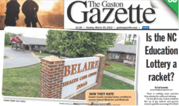

There is nothing more precious than playing the odds and winning.

On any given day, Gaston residents queue up at gas stations and grocery stores to gamble an average $4 of their weekly pay in hopes of getting lucky and winning big in the State Education Lottery, celebrating its sixth anniversary on March 30th.

For some individuals, the payoff has been massive, totaling $75.4 million for Gaston County residents ($73.3 million in Cleveland County) since the first ticket was sold.

This compiles scratch-offs, Mega Millions, Pick 5 and the ever-elusive Powerball game with its Power Play multiplier.

But while the lucky winners are offered gigantic cardboard checks, the backdrop bearing the lottery’s name reminds the audience of the intended beneficiary of the entire gambling operation: the state education system.

Of the $1.46 billion raised by the lottery just last year, close to $420 million was allocated to hiring new teachers, building new schools, educating pre-kindergarteners and offering need-based college scholarships across the state, according to the Lottery Commission.

While this represents a large amount of capital for cash-strapped county education budgets, it is only 28.7 percent of the total lottery revenue—a full $91.8 million less than the 35 percent required by law.

The contravention of the rule was made in the face of last year’s budget crisis, when a the General Assembly directed $26.6 million of emergency funding to the Medicaid program, leaving counties reliant on the education funding out in the cold.

**Budget Politics**

According to the letter of the law, 50 percent of education lottery revenues to counties must be used to hire K-3 teachers and fund prekindergarten programs supporting at-risk 4-year-olds.

Ten percent goes to the College Foundation of North Carolina for scholarships and the remaining 40 percent of capital is allocated to counties in order to build schools.

Much like in neighboring Cleveland County, which has received $2 million to build schools, the majority of the construction dollars in Gaston County has gone directly into paying off debt from past school construction bonds.

Perhaps this is the reason educational leaders have cautioned against viewing the lottery as an end-all solution for budget woes.

“One of the questions I often receive is—where did all the lottery funds go?” said Gaston County Superintendent Reeves McGlohon in his weekly newsletter to parents.

“The reason we get the question is the perception that establishing the lottery solved all public education funding problems, which is simply not true.”

Though Gaston County has received more than $44 million in direct education funding since 2006, the lottery contribution represented a paltry 4 percent of the total budget in 2011.

Moreover, the $427.7 million in federal stimulus money has run out, forcing counties to make uncomfortable cuts, a reality that 240 employees of Gaston County will be faced with this year.

But officials at the North Carolina Education Lottery remain confident of its success.

“The way we see it is: the lottery has made more and more money for the state every year,” said Van Denton, a NC Education Lottery spokesman.

Denton said that there is no question that the lottery has been a boon for education.

“More than 52 percent of the money goes to teachers and we have made a significant effort to offset the cost of school construction.

“And that $9.4 million in commission that lottery retailers have received in Gaston County has certainly been a benefit to the community as a whole,” said Denton.

**Tax on the Poor?**

Despite the cheery outlook of some officials, the lottery is a constant target for critics from both the left and right.

“We’re funding ongoing state programs based on the ability of people to throw money away,” said Chris Fitzsimon, founder and director of the progressive NC Policy Watch, an arm of the NC Justice Center.

“It truly is an offensive way to raise money for the state.”

Especially egregious for Fitzsimon are the results of theJusticeCenter’s annual investigation on the lottery’s impact on poor residents inNorth Carolina.

The study found that the counties with the highest per capita lottery sales also were the counties with the highest poverty rates, affirming Fitzsimon’s classification of the lottery as a “tax on the poor.”

A similar study by the John Locke Foundation found that the counties with disproportionally high lottery sales also suffer from both a low median household income and high levels of unemployment.

Another prominent critic of the NC Education Lottery has been the Tax Foundation based in Washington, D.C.

In 2008, the organization filed a motion supporting the NC Institute for Constitutional Law’s lawsuit against the state, aiming to legally classify the lottery as a tax on its residents.

Ruling against the state would have nullified the passage of the State Lottery Act.

“Inevitably, once you adopt a lottery, you’re going to see the money being diverted to all other functions of government,” said Joseph Henchman, vice president of the Tax Foundation.

“So of course it’s a tax. It’s a way for the state to collect revenue from its residents.

“The most important thing to remember is that money is fungible: if the state can get the money, it will spend it how it wishes based on present needs and concerns—just like a tax,” said Henchman.

**Monopolizing Bad Behavior**

Perhaps the most unsettling fact of the NC Education Lottery is its outright endorsement of predatory gambling, say critics.

“It is wrong for the state to take money from the people in this way,” said Bill Brooks, president of the North Carolina Family Policy Council.

Brooks has been active in warning of the dangers of compulsive gambling the lottery creates.

“When 5 percent of the lottery customers end up buying fifty-five percent of the tickets, that is bound to hurt people and families.

“This is a moral issue that brings together liberals and conservatives,” said Brooks.

Despite being criticized for reaping the cash benefits of bad behavior, the state has been strictly opposed to any other form of competitive gambling.

In 2010, Gov. Perdue signed the Video Poker Ban, aimed at shutting down Internet Sweepstakes Cafes which operate by charging for Internet access instead of fees to play.

Earlier this month, the state Court of Appeals overturned the law, citing its ambiguity and infringement on free speech.

For behavioral economists, the main concern of a state-run lottery is how it is sold and marketed to residents.

“The state is encouraging gambling—promising more than the players will really ever receive,” said Phillip Cook, professor of public policy at Duke University.

“Inevitably, there will be a group that gets caught up and gets hurt in the end.”

The NC Justice Center reports that the average North Carolinian spends $212 on lottery tickets every year, close to 0.5 percent of their annual salary.

According to a study released by Bloomberg News, North Carolina places 16th in the country on the “sucker” index, an indication of which states gamble more on the lottery than they ever receive in winnings.

Dismissing the concerns of critics, lottery officials have no plans to change the game.

“Everyone knows that the lottery should be for fun,” said lottery spokesman Van Denton.

“We don’t do advertisements showing people living ‘the good life’ or anything.

“The games attract diverse players of all ages, sexes, races and income, and they all play for fun — for the benefit of education.”

_Published in the [Gaston Gazette](https://web.archive.org/web/20120429063545/http://www.gastongazette.com/articles/lottery-69102-gaston-million.html#ixzz5YnPwHPgW)_
