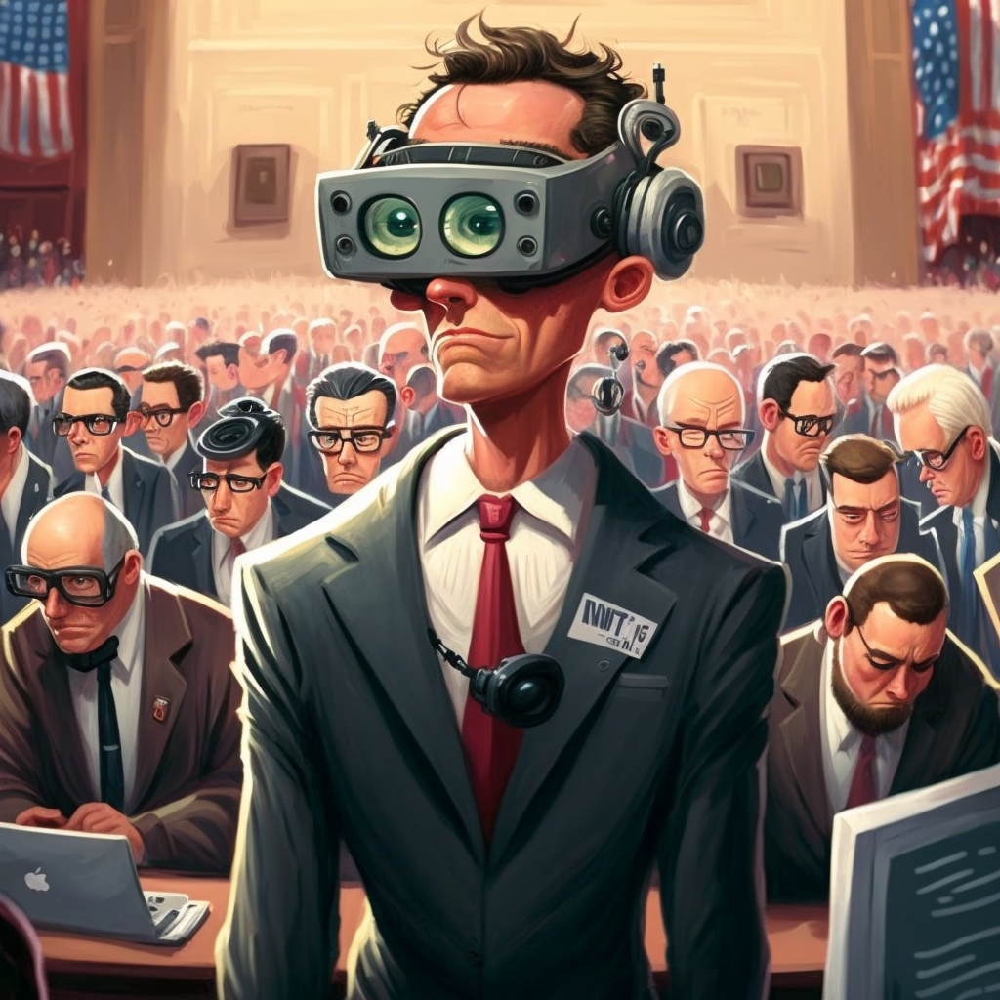

In a courtroom in San Joe, California today, the US government squared off against a social media company and grilled that company’s CEO about its investments in another technology company, and its general business strategy for the new field of wearable virtual reality.

The app in question, the fitness VR app _Within_, is poised to be acquired by social media giant Meta (formerly Facebook) for use on its virtual reality headsets and ecosystem.

The deal itself has not yet been finalized, but that hasn’t stopped the nation’s antitrust agency from flexing its muscles in Silicon Valley.

When Meta CEO Mark Zuckerberg took the stand today, lawyers from the Federal Trade Commission [aimed to pepper him](https://twitter.com/YaelOss/status/1605310793192378368?s=20&t=ZV8YY8-N1N_ZcPfMfUCwiw) on the overall business strategy of Meta’s well-known pivot to the metaverse, or virtual reality space, and whether his plans were about…business success?

If the FTC succeeds, it will halt Meta’s purchase of the workout app Within, developed by Los Angeles developers beginning in 2014. While that may put smiles on the faces of some regulators and populist politicians in Washington, D.C., it will do nothing for consumers. And it may even harm the future development of this entire sector.

At [last estimate](https://finance.yahoo.com/news/citi-says-metaverse-economy-could-142208855.html), the entire “metaverse economy” is projected to one day be worth either $800 billion or even trillions by 2030. Meta itself has poured in an [ungodly $10 billion](https://techcrunch.com/2022/10/20/metas-10b-metaverse-investment-is-not-enough-according-to-animoca-brands-yat-siu/?guccounter=1&guce_referrer=aHR0cHM6Ly9kdWNrZHVja2dvLmNvbS8&guce_referrer_sig=AQAAAI2tpIIgskzaDgE0D3du66WO2X1yxXkkoLQ32CCRA15qZ3p7Ms6DTFjh9gCZI2w6AmY2jPhdUqbJvYRkRkT4RJNn13A8Dn3ywib76CwGIipOOA8Itm_nn05XN2t3oFWHMR0gfweOJ8j3FikZ4YOUae0jGJVN6K5r24_KJIlcpX7V) in the last year alone, and its own products are still rather limited in terms of user adoption.

The fact that the FTC and other regulators are trying to kneecap virtual reality, before it really even begins, is more startling than anything else.

If the last two decades of economic growth and innovation from Silicon Valley have taught us anything, it is that capital, talent, and business acumen are crucial ingredients for success and user satisfaction, but it isn’t everything. A supportive infrastructure, an investment-friendly climate, and a high demand for developers and skilled employees are also necessary and bring with them exponential benefits.

The companies and firms that have spun off from talent formerly of giants like Google and PayPal — not to speak of Elon Musk, Peter Thiel, and the rest of the PayPay Mafia — have undoubtedly made consumers’ lives better, and helped our economy grow beyond leaps and bounds.

Among those successes, there have been thousands more failures, but those have been at the hands of consumers and users rather than government agencies and federal lawsuits by regulators. And if the media coverage surrounding this case gives any indication, it seems much of this action stems not from antitrust law or precedent, but rather as a kind of _payback_.

The Associated Press ran a bizarre “[analysis](https://www.usnews.com/news/business/articles/2022-12-16/ftc-didnt-stop-facebook-instagram-how-about-meta-within)” last week, framing the FTC v. Meta/Within case as some kind of retribution for Facebook’s acquisition of Instagram in 2012. Back then, that decision was [largely panned](https://www.huffpost.com/entry/instagram-facebook-acquisition_n_1412623) by technology journalists and never received a peep from regulators. Since then, it is grown to become one of the most popular apps found in app stores.

Considering Instagram’s success in the last decade, thanks to investments and entrepreneurial prowess by Meta, as some kind of evidence to halt all future mergers and acquisitions of a company that over a billion global consumers is not only wrong, but it begs the question of why the FTC is even involved in the first place.

Consumers benefit when competitors compete, when innovators innovate, and when laws provide regulatory clarity and guidance to protect consumers and police bad actors.

But this case seems more like a hunt for ghosts of Christmas past rather than protecting us from any real harm. And it may do more damage than regulators estimate.

My colleague Satya Marar [summed this up in RealClear](https://www.realclearmarkets.com/articles/2022/11/03/an_overzealous_ftc_isnt_good_for_consumers_or_startups_862655.html) last month:

> Start-ups depend on millions in investment to develop and deploy their products. Investors value these firms based not only on the viability of their products, but on the firm’s potential resale value. Larger firms also often acquire smaller ones to apply their resources, existing expertise and economies of scale to further develop their ideas or to expand them to more users.
> 
> Making mergers and acquisitions more expensive, without strong evidence they’ll hurt consumers, makes it tougher for start-ups to attract the capital they need and will only deter innovators from striking out on their own or developing ideas that could improve our lives in [an environment where](https://techcrunch.com/2021/05/19/restrictions-on-acquisitions-would-stifle-the-us-startup-ecosystem-not-rein-in-big-tech/?stream=top) 90% of start-ups eventually fail and 58% expect to be acquired.

The job of the FTC is not to protect consumers from innovations that have not yet happened. That should be the furthered thing for its mission. Rather, it should be focused on consumer welfare, punishing bad actors that take advantage of consumers, break laws, and promote real consumer harm.

Mergers and acquisitions provide value for consumers because they match great ideas and technology with the funding and support to scale them for public benefit. Especially considering the metaverse is so new, it is frankly bewildering that we would be wasting millions in taxpayer dollars to chase down an investment before it even bears fruit — just because a company was too successful last time.

When it comes to our regulatory agencies, we have to ask who they are looking out for when it comes to consumer wants and wishes: the consumers that wish to benefit from future innovations.? Or incumbent players who want to slay the largest dragon in the room.

In this case, it seems the FTC has stretched a bit too far, and consumers may be worse off for it.

_Published on the [Consumer Choice Center's website](https://consumerchoicecenter.org/is-the-ftc-kneecapping-vr-before-it-even-gets-off-the-ground/)._
