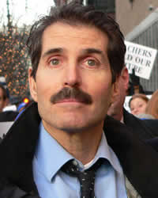

Townhall.com

> But do not despair. If we make reasonable cuts to what government spends, our economy can grow us out of our debt. Cutting doesn’t just make economic sense, it is also the moral thing to do. Henry David Thoreau had it right when he “accepted(ed) the motto … that government is best which governs least.”
> 
> So what should we get rid of?
