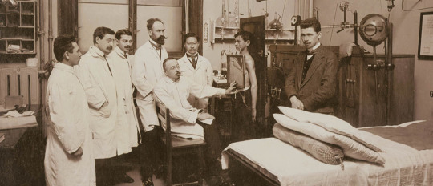

**Since the 18th century the city of Vienna has been on the cutting edge of medical innovation. What is the next frontier?**

**[By Yaël Ossowski | Metropole Magazine](https://www.metropole.at/author/me/)**

Vienna at the fin de siècle was the center of a massive empire that covered 20 percent of Europe. It stretched all the way from the Ukraine to Switzerland, and to the east and south, Hungary, Slovenia, northern Italy and the long Croatian coastline.

As a magnet for the greatest thinkers and innovators at the time, Vienna could draw from all parts of the empire and beyond, attracting Czechs, Hungarians, Dutch and Prussians who were keen to advance human knowledge – especially in medical innovation.

The unique medical and academic institutions of prewar Vienna spawned scores of new methods and practices in the operating room, laboratory and university, enough for German physician Rudolf Virchow to dub Vienna in the 19thcentury the “Mecca of Medicine”.

The medical Golden Age in Vienna -began, as so often these things do, with the Habsburgs, the University of Vienna and some enterprising young medical researchers.

**Imperial Health**

In 1745, a Dutch physician, Gerard van Swieten, Empress Maria Theresa’s personal doctor, reformed Austrian sanitary policy across the empire.

He set up shop at the Medical University of Vienna, routing out the Jesuits and organizing a teaching hospital. He made a career dispelling myths, more keen to use science and reason than faith or superstition as explanations for natural circumstances. This new interest spawned a wave of innovations and discoveries, and an atmosphere that has since produced seven Nobel laureates.

Soon followed the construction of the Allgemeines Krankenhaus ([AKH  – Vienna General Hospital),](https://www.akhwien.at/) commissioned by -Emperor Joseph II and opened in 1784. An architectural marvel in its own right, it became the prime location for understanding the human body and its ills. Attached to the hospital was also the Narrenturm ( Tower of Fools), the circular asylum for the insane, one of the first to separate these inmates from the criminal poor.

Those efforts laid the groundwork for what became the renowned Vienna School of Medicine – the successive generation of brilliant scientists and medical researchers who studied, taught and practiced here. In the halls of the Altes AKH (Vienna’s old General Hospital), they advanced theories and practices, tried out new techniques for surgery and diagnoses, and created entirely new fields to treat illnesses of both body and mind.

**Against Medical Orthodoxy**  

It was here that Hungarian-Austrian Ignaz Semmelweis identified the role of the doctors themselves in spreading disease among their patients, as obstetricians went among the women in labor without washing their hands. His suggestion of using chlorinated lime solution to wash hands before examining patients led to a significant decrease in premature births in his ward.

But in 1861, when he published these findings, the profession wasn’t ready. Semmelweis faced a lifetime of scientific backlash and professional exile for theories considered outlandish, and upsetting to the medical establishment. He was committed to an insane asylum in 1865 and died in obscurity.

Other physicians were more successful at overcoming these attitudes, turning the tide of medical knowledge.

Theodor Billroth, a Prussian doctor and gifted musician, arrived in Vienna in the 1860s where he became chief of surgery, and developed several of the techniques of modern abdominal surgery. Working alongside Czech professor Joseph Škoda, one of the empire’s leading practitioners in the field, he expanded on innovations he had used experimentally in hospitals in Berlin and Zurich.

**Inspiring physicians**  

Vienna-born Karl Landsteiner, known today as the father of hematology and transfusion medicine, developed the system that identifes the main blood types in 1901 while at the Vienna General Hospital. A decade later, working with [Erwin Popper](https://en.wikipedia.org/wiki/Erwin_Popper), he discovered the infectious character of [poliomyelitis](https://en.wikipedia.org/wiki/Poliomyelitis) and isolated the virus that proved the basis for Jonas Salk’s later development of the polio vaccine.

Many leading thinkers found their way to Vienna. Sir Arthur Conan Doyle, the creator of Sherlock Holmes, came to -Vienna in 1890 to study ophthalmology, an experience that shaped the character of Holmes’ amanuensis Dr. Watson. The same goes for Austrian novelist and playwright Arthur Schnitzler, whose mastery of the stream of conscious style may have influenced James Joyce, and was the envy of Sigmund Freud, who wondered how it was that the author seemed to understand from instinct what had taken him decades of study. Taking on the nature of human sexuality, Schnitzler’s plays and books were some of the first burned by the Nazis in the 1930s.

Most famously, however, Austrian medical innovation is personified by Freud himself and the field of psychoanalysis, born and made in Vienna. Through his identification and study of the unconscious, Freud chartered a path against medical orthodoxy, much like Semmelweis, which remains the backbone of modern psychology today.

**Diagnosing in the digital age**

In the modern age, Austrian medical innovation has had more to do with the experience of treatment than with practices and tools. Technology has significantly lowered the cost of medical procedures, affording reasonable care to all citizens.

Since the 1970s, Austria’s universal health care has provided a safety net and blanket for its citizens, although stresses on the system from the aging of the population and a shortage of hospital beds have created a need for new innovations to meet the demands.

Seeing these gaps, medical startups are aiming to fill the void.

HappyMed, a firm in Vienna’s 16th district, uses virtual reality to calm patients before and during medical procedures. Patients have reported feeling less stressed and anxious, thus reducing the need for prescription drugs before major operations.

HappyMed has received critical support from the business incubator INiTS, that has also helped finance a vaccine development firm, chemical research facilities and Blue Danube Robotics, a company that provides devices to help disabled and elderly people to live ordinary lives.  

GetTreated, a medical startup from -Yerevan, Armenia, has found a way to mesh technology, travel and medicine that appeals to many expats and native Austrians. It matches patients from anywhere in the world with doctors in Armenia who provide services at a fraction of the cost and hassle of traditional health care systems.  

“We started this to make affordable medical treatments accessible to anyone, without the red tape,” said Raffi Elliott, founder and CEO of GetTreated. “Most of the treatments we offer are available in Austria as well, and are even covered by the Austrian state health insurance, but we still get about 15 percent of our patients from Austria.”

The main reasons cited are price, speed, and ease, Elliott told Metropole. As a €45 billion industry worldwide, he sees medical tourism as an answer to the growing costs and complexities of navigating state health care systems. (See related story, p 26.)

“Our startup innovates by simplifying the process of safely comparing clinics, finding the right doctor, securely sharing medical documents and booking the entire trip online,” he said. “We basically act as the Expedia for medical tourism.”

Startups like these are beginning to spring up, and could multiply as more needs present themselves. With such a rich tradition of medical innovation and experiments, Austria may be able to play an important role in helping craft the health care system of the future. The only question is whether the state can keep up.

_Check out the full article on [Metropole.at](https://www.metropole.at/just-what-the-doctor-ordered/)_
