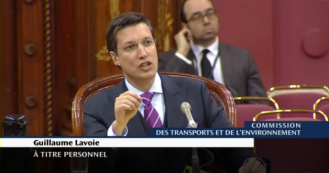

Par Yaël Ossowski | [Huffington Post Québec](http://quebec.huffingtonpost.ca/yael-ossowski/legaliser-uber-quebec-montreal-taxi-industrie-permis_b_9277278.html)

Lorsque la province s'agite face à la présence des nouvelles technologies qui risquent d'offrir de meilleurs services aux Québécois, les échanges les plus importants prennent lieu à l'Assemblée nationale du Québec.

Pas entre les députés, mais la dure vérité offerte à la [Commission des transports et de l'environnement](http://www.assnat.qc.ca/fr/travaux-parlementaires/commissions/cte-39-1/index.html).

Pendant que la commission interrogeait divers experts et parties prenantes, des chauffeurs de taxi manifestaient à Montréal et en dehors, offrant aux médias des coups de klaxon et des slogans agressifs, et [des œufs et de la farine](http://globalnews.ca/news/2522328/montreal-taxi-protest-promises-to-take-over-downtown/) pour les chauffeurs qui osent travailler pour quelque revenu supplémentaire avec Uber, la compagnie de covoiturage.

Jeudi le 18 février, la commission a reçu M. Guillaume Lavoie pour l'entendre à propos de la légalisation des services de covoiturage comme Uber, Sidecar et Lyft. Il a été très franc envers les députés présents à la commission, offrant une vérité très dure : il faut laisser nos industries évoluer.

> «[Si on veut éviter les monopoles tant dans l'industrie classique que dans l'industrie nouvelle, il faudra absolument ouvrir le marché afin de susciter une concurrence et l'émergence de champions locaux parce qu'on aura donné des signaux clairs dans le cadre réglementaire.](http://www.assnat.qc.ca/fr/travaux-parlementaires/commissions/cte-41-1/journal-debats/CTE-160218.html)»

_Source: [assnat.qc.ca](http://www.assnat.qc.ca/fr/video-audio/archives-parlementaires/travaux-commissions/AudioVideo-63061.html)_

Monsieur Lavoie, il faut remarquer, [est très loin](http://projetmontreal.org/les-elus/guillaume-lavoie/) d'être un fainéant ou un activiste professionnel. Il est présentement un conseiller municipal de la Ville de Montréal et porte-parole de l'opposition officielle en matière de finances, de relations gouvernementales et de relations internationales. Il est le fondateur et ex-directeur exécutif de Mission Leadership Québec et le co-fondateur du Collège néo-classique.

Les conseillers de Montréal ont une vraie expérience avec les services de covoiturage. En effet, ces nouveaux services se sont d'abord établis à Montréal avant de s'étendre au reste de la province. Une certaine expertise locale existe donc, ce que M. Lavoie n'a pas manqué de rappeler devant l'Assemblée nationale.

Puisque la décision de légaliser ou non les services de covoiturage au Québec aura un très grand impact sur tout le secteur des services de transports, il paraît essentiel que d'autres voix s'élèvent dans le débat public pour appuyer les positions de M. Lavoie.

Des réflexions comme les siennes ne sont pas seulement une preuve de l'ouverture à l'innovation et au développement économique au Québec, mais sont également essentielles si nous souhaitons favoriser l'émergence d'une nouvelle génération d'entrepreneurs prêts à relever les défis économiques et sociaux de demain. Il nous faut donc une révolution dans la façon dont nous utilisons nos services de taxis et de covoiturage à Montréal.

«Il est très clair que les Québécois sont perdants de l'état actuel des choses qui vise à réduire la concurrence afin de soutenir une minorité de rentiers, propriétaires de permis», [ajoute Vincent Geloso](https://vincentgeloso.files.wordpress.com/2016/02/c3a9chec-annoncc3a9.pdf), chercheur associé à [l'Institut Économique de Montréal](http://www.iedm.org/fr/e).

M. Geloso, qui poursuit présentement un doctorat en histoire économique à la London School of Economics, a [présenté sur son site web son analyse de l'industrie de taxi](https://vincentgeloso.files.wordpress.com/2016/02/c3a9chec-annoncc3a9.pdf) et les «méfaits continus de la restriction de la concurrence pour les consommateurs».

«\[S\]euls les chauffeurs longtemps établis sont gagnants du système actuel. Les consommateurs et les nouveaux chauffeurs sont les perdants principaux», a-t-il ajouté. «Il est temps de débattre de la meilleure façon de corriger cette erreur qui nuit à tout le monde, sauf à une minorité de propriétaires de permis bien établis dans le processus politique.»

Ce n'est certainement pas le gouvernement qui nous permettra d'avancer dans cette direction. On ne peut qu'encourager M. Lavoie, M. Geloso et tous ceux qui soutiennent les services de covoiturage et la nouvelle économie collaborative.

[Lire sur Huffington Post Québec](http://quebec.huffingtonpost.ca/yael-ossowski/legaliser-uber-quebec-montreal-taxi-industrie-permis_b_9277278.html)
