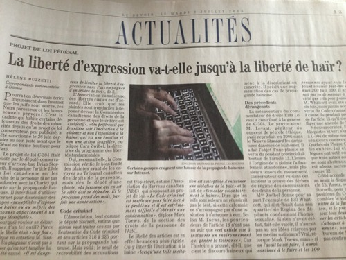

Dès que j'y retourne au Canada, on propose de modifier la [**Loi canadienne sur les droits de la personne**](http://laws-lois.justice.gc.ca/fra/lois/h-6/) au nom de « libéraliser » la liberté d'expression.

Le député conservateur **Brian Storseth** a soumis une loi l'année passée [proposant la suppression de l'article 13](http://www.parl.gc.ca/HousePublications/Publication.aspx?Language=F&Mode=1&DocId=6249906&File=4) sur la « propagande haineuse ».

Le Senat l'a approuvée le 26 juin.

L'article interdisait des communications qui pourraient « aborder ou faire aborder des questions susceptibles d’exposer à la haine ou au mépris des personnes appartenant à un groupe identifiable ». Comme si ce n'était pas assez odieux pour les citoyens canadiens, il décrivait aussi le processus par lequel les détracteurs seraient punis par un juge ou tribunal.

L'idée que des Canadiens soient pénalisés pour leurs mots et expressions n'est pas qu'honteuse pour notre époque, mais aussi un affront aux fondements de la civilisation occidentale.

Face aux abus prônés par le système de la « bien-pensance », nous devons applaudir l'adoption du changement. Cela représente une victoire pour la liberté d'expression.

Tandis qu'à la presse québécoise, malheureusement, la mesure n'a pas été interprétée de telle façon.

Quant au Devoir, mon quotidien francophone préféré, ils se demandent si la suppression de la loi nous donnera [« la liberté de haïr »](http://www.ledevoir.com/politique/canada/381995/la-liberte-d-expression-va-t-elle-jusqu-a-la-liberte-de-hair).

> 

Comme j'ai [souvent dit ailleurs](http://libertyinexile.jellycast.com/files/audio/01febkarlknox.mp3), la liberté d'expression doit être rigide, firme et absolue. Le moment qu'on commence à catégoriser et définir des exceptions, le principe perd son poids.

Peut-être Le Devoir deviendra conscient qu'il est une média qui doit _garantir_ la liberté d'expression, pas la détruire.

J'ai défendu l'idée de la liberté d'expression et la suppression de cet article avec Karl Knox sur son émission de radio à CJLO 1690AM au mois de février. Voici [l'extrait](http://www.youtube.com/watch?feature=player_detailpage&v=Y1CYwz_E9lU#t=1065s).
