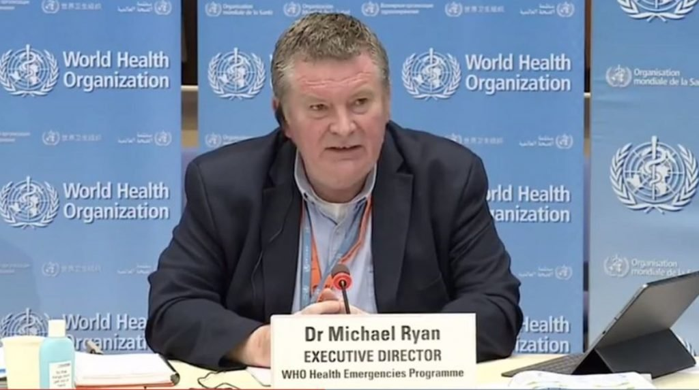

Aunque la Organización Mundial de la Salud (OMS) le pide a las naciones que se abstengan de imponer cierres, muchos gobiernos siguen utilizando esta estrategia.

Durante meses, una abrumadora [mayoría](https://www.unicef.org/press-releases/dont-let-children-be-hidden-victims-covid-19-pandemic) de la población del planeta ha estado sujeta a confinamientos crueles y desconcertantes: negocios cerrados, viajes restringidos y reuniones sociales reducidas al mínimo.

Los efectos de la pandemia de COVID-19 han hundido nuestras economías, han mantenido separados a nuestros seres queridos, han hecho descarrilar los funerales y han hecho que la libertad personal y económica sea tan víctima como nuestra salud. Un informe reciente [afirma](https://www.marketwatch.com/story/today-in-scary-numbers-pandemic-could-cost-global-economy-82-trillion-2020-05-19) que podría costarnos 82 billones de dólares a nivel mundial en los próximos cinco años, aproximadamente lo mismo que nuestro PIB mundial anual.

Muchos de estos cierres iniciales fueron justificados por recomendaciones de la Organización Mundial de la Salud (OMS).

El director general de la OMS, el Dr. Tedros Adhanom Ghebreyesus, en una actualización de la estrategia en abril, pidió a las naciones que [continuaran](https://www.npr.org/sections/goatsandsoda/2020/04/15/834021103/who-sets-6-conditions-for-ending-a-coronavirus-lockdown) con los bloqueos hasta que la enfermedad estuviera bajo control.

Pero ahora, más de seis meses después de que los confinamientos se convirtieran en una herramienta política favorita de los gobiernos alrededor del mundo, la OMS está pidiendo su rápido fin.

El Dr. David Nabarro, el enviado especial de la OMS para COVID-19, le [dijo](https://www.youtube.com/watch?v=x8oH7cBxgwE&feature=youtu.be&t=915) a Andrew Neil de _Spectator UK_ la semana pasada que los políticos se habían equivocado al usar los bloqueos como el "método de control primario" para combatir COVID-19.

https://youtu.be/x8oH7cBxgwE

"Los cierres sólo tienen una consecuencia que nunca jamás se debe menospreciar, y es hacer que la gente pobre sea mucho más pobre", dijo Nabarro.

El Dr. Michael Ryan, Director del Programa de Emergencias Sanitarias de la OMS, [ofreció una opinión similar](https://uk.reuters.com/article/uk-health-coronavirus-who-idUKKBN26U1ZW).

"Lo que queremos tratar de evitar - y a veces es inevitable y lo aceptamos - pero lo que queremos tratar de evitar son estos cierres masivos que tanto castigan a las comunidades, a la sociedad y a todo lo demás", dijo el Dr. Ryan, hablando en una sesión informativa en Ginebra. 

Estas son declaraciones sorprendentes de una organización que ha sido una autoridad clave y una voz moral responsable de manejar la respuesta global a la pandemia.

Las indicaciones de la OMS han sustentado todos y cada uno de los cierres nacionales y locales, amenazando con empujar a 150 millones de personas a la [pobreza](https://www.cnn.com/2020/10/07/economy/global-poverty-rate-coronavirus/index.html) para finales de año.

Como declaró Nabarro, la gran mayoría de las personas perjudicadas por estos cierres han sido las que han salido peor paradas.

Todos conocemos a personas que han perdido sus negocios, han perdido su trabajo y han visto cómo los ahorros de toda su vida se han esfumado. Eso es especialmente cierto para aquellos que trabajan en las industrias de servicios y hospitalidad, que han sido diezmadas por las políticas de cierre.

Y aunque la OMS pide a las naciones que se abstengan de imponer cierres, muchos gobiernos siguen utilizando esta estrategia. Las escuelas de muchos estados de los Estados Unidos siguen cerradas, los bares y restaurantes están fuera de los límites, y las grandes reuniones, aparte de las protestas por la justicia social, son condenadas y cerradas por la fuerza.

Los efectos de los prolongados cierres en los jóvenes son ahora más claros. Un estudio [reciente](https://www.ed.ac.uk/news/2020/shutting-schools-increases-covid-19-deaths-study-f) de la Universidad de Edimburgo dice que mantener las escuelas cerradas aumentará el número de muertes por COVID-19. Además, el estudio dice que los cierres "prolongan la epidemia, en algunos casos resultando en más muertes a largo plazo".

Si queremos evitar más daños, debemos poner fin inmediatamente a estas políticas desastrosas. Cualquier nuevo llamado a imponer cierres debe ser visto con el mayor escepticismo.

Es hora de que la locura termine. No sólo porque lo dice la Organización Mundial de la Salud (OMS), sino porque nuestras vidas dependen de ello.

Como los médicos y científicos establecieron en la [Declaración de Grand Barrington](https://gbdeclaration.org/) firmada este mes en Massachusetts, los "impactos en la salud física y mental de las políticas prevalecientes de COVID-19" han causado por sí mismos efectos devastadores en la salud tanto a corto como a largo plazo.

No podemos seguir arriesgando nuestra salud y bienestar a largo plazo cerrando nuestras economías y afectando a nuestra gente a corto plazo. Esa es la única manera de avanzar si queremos recuperarnos de los efectos ruinosos de políticas gubernamentales en torno al COVID-19.

_Publicado en [Fee.org](https://fee.org.es/articulos/la-oms-da-marcha-atr%C3%A1s-ahora-no-aconseja-los-confinamientos/)_
