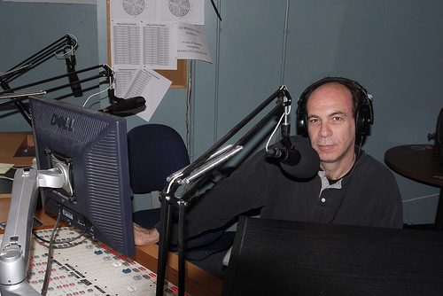

On Friday 15. Feb, 2013, I was invited onto the radio show of my mentor and former colleague [**Karl Knox**](http://twitter.com/knoxkp).

> _Karl Knox, progressive radio host_

Karl is a kingpin on the Montréal airwaves, starting the radio day on [CJLO 1690AM](http://cjlo.com), and built up a great career as a stand-up comedian and commentator, headlining shows all across the Great White North.

As this was his last show on the CJLO airwaves for a while, he invited me on to give quick perspectives on the State of the Union, unilateral presidential actions, corrupt banks, too big to fail, why the EU is anti-democratic and run by the bankers, and much more.

It was fun as always.

[LISTEN HERE](http://libertyinexile.jellycast.com/files/audio/KarlKnox15.feb.mp3)

Check out his page, [New Media and Politics Canada](http://nmpcanada.blogspot.com/) and follow him on Twitter [@knoxkp](http://twitter.com/knoxkp).

The show has been included in the [Liberty In Exile feed](http://libertyinexile.jellycast.com/podcast/feed/2).
