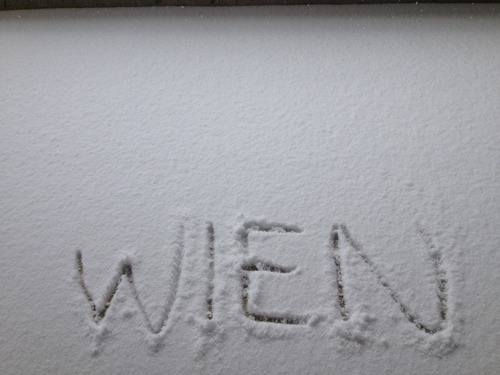
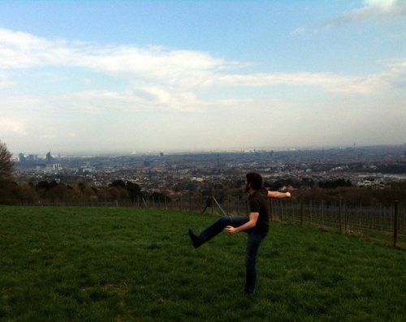

> **What began as a curious trip to discover my philosophical and paternal roots has now cemented my life passions and pursuits.** 

In early 2011, I arrived in Vienna, Austria to finish my last semester of undergraduate education.

I expected to make a lot of friends, touch up on Austrian economics at the home university of Mises and Hayek, learn some German, and come to understand a part of my grandfather’s past impossible to convey with words or images alone.

It’s been a full 2 years since then, and I’ve returned to the same city with more friends in all corners, more skepticism of centralized power, more understanding and appreciation for the German language and the Ossowski family history, and a timeless love with a beautiful Austrian woman I met on my original journey.

I’ve left behind the continent and nations of my birth and adoption, but I couldn’t be happier.

> 

Without the courage to make the move across the ocean, I don’t think I could have truly understood what this city means to me as a thinker, lover, and a man.

It allowed me to bloom and perfect my primary languages while I attempted to adopt new ones.

It allowed me to grasp what love is, should be, and can be if the right circumstances allow.

It allowed me to think beyond myself and elevate my concern to the rudimentary level of so many policies, rituals, and customs I once only read of in books and manifested only through thoughts.

While I will in no way master a life and culture in the same virtuous way in this grand Imperial city, I will do everything I can to pursue my dreams and desires with the broad stroke of the pen, the booming of the microphone, and beyond.

Of course, I have barely even begun to unravel les mystères de la vie, but that’s the great part about learning in this life.

I’ll be learning about the arts and sciences just as much as I’ll be learning about culture and the broader definitions of l'être humain, all bringing me closer and closer to my own personal Truth – if it exists.

And nothing could be more fitting in my 23rd year than to begin that learning anew in the city of Wien.

Lieben und Leben.
