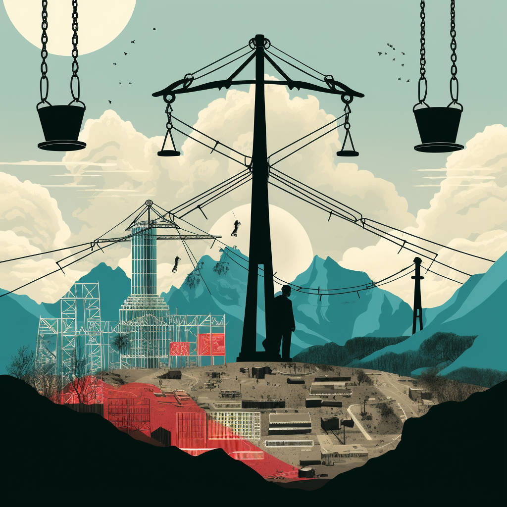

Nearly half of all US states have [pledged](https://www.cesa.org/projects/100-clean-energy-collaborative/guide/table-of-100-clean-energy-states/) to go totally carbon-free by at least 2050.

While many states and the federal government are pushing and subsidizing entrepreneurs to scale up carbon-free alternatives to fossil fuels such as nuclear energy, wind, and solar – other states are hoping to reach their goals by seemingly suing oil and gas companies into extinction.

Though American consumers have been the primary customers for fossil fuel companies, several Democratic state attorneys generals have staged elaborate lawsuits hoping to legally pin climate change on a handful of companies.

Minnesota Attorney General Keith Ellison [has been](https://www.ag.state.mn.us/Office/Communications/2023/03/23_EnergyCompanies.asp) at the forefront, but he’s had plenty of support and funding along the way, including from key law firms across the country and the billionaire former New York mayor, Michael Bloomberg.

Though our judicial system is supposed to be immune from political agendas, these third-parties target certain industries and corporations for litigation, hoping to tip the balance in prominent cases being heard across the country.

This trend is so troubling that the House Committee on Oversight and Accountability held a [hearing](https://oversight.house.gov/hearing/unsuitable-litigation-oversight-of-third-party-litigation-funding/) in September to evaluate this threat. But missing from that congressional discussion about deep-pocketed, heavily coordinated movements to influence legal action was the subject of climate litigation.

In September, the largest climate change lawsuit was [filed](https://www.cnn.com/2023/09/16/us/california-lawsuit-oil-companies/index.html) by the state of California against five major oil companies and associates, alleging public deception about climate risks associated with fossil fuels.

With an economy twice that of Russia, California [becomes](https://www.cnn.com/2023/09/16/us/california-lawsuit-oil-companies/index.html) not just the biggest U.S. state to sue energy companies, but the largest economy to do so. California has thrown its weight around before, suing auto manufacturers over greenhouse emissions and legally banning the sale of new combustion-powered vehicles by 2035.

California’s vendetta against oil and gas may seem impractical, but the fact that 17 states followed their lead on the eventual gas-powered car ban shows that “as California goes, so goes the nation” is more than just a saying.

Nonetheless, California faces the same uphill battle as its unsuccessful auto industry lawsuit. One environmental law professor at Yale University [told](https://www.wsj.com/us-news/law/can-climate-lawsuits-against-energy-giants-succeed-courts-could-soon-give-clues-e63f4d47) the Wall Street Journal, “the entire modern economy relies on the oil industry, and it could be hard to pin liability solely on companies.”

The lawsuit itself, however, will do nothing to promote climate progress. In fact, it will only add to consumer burdens, should they be successful. Gas prices are already disproportionately high in California, at [55 percent higher](https://abcnews.go.com/Business/gasoline-prices-california-80-cents-month/story?id=103561636#:~:text=In%20California%2C%20the%20average%20price,industry%20analysts%20told%20ABC%20News.) than the national average. But worse yet is the protracted, multi-million-dollar campaign waged by third parties to pressure energy producers and persuade the public they’ve been deceived.

Deep-pocketed private donors have persuaded organizations and attorneys to take up climate litigation, pouring millions into institutions like the Center for Climate Integrity (CCI) who aggressively encourage state and local governments to sue energy producers. Allies like the Rockefeller Family Fund not only help funnel money to CCI – about $10 million, in fact – but also host legal forums and initiate climate ligation support among elected officials.

Senator Ted Cruz and U.S. Representative James Comer raised these concerns, [pointing out](https://www.commerce.senate.gov/2023/9/sen-cruz-chairman-comer-demand-answers-from-law-firm-regarding-acting-nhtsa-administrator-s-role-in-frivolous-lawsuits-aimed-at-bankrupting-oil-companies) the chief law firm litigating climate lawsuits, Sher Edling, is essentially paid to target energy companies. Rather than implementing contingency fees, “the lawsuits are being funded, tax-free, by wealthy liberals via dark money pass-through funds.”

Beyond that, billionaire Michael Bloomberg has put legal muscle behind the movement, seeding the NYU School of Law’s Environment and Energy State Impact Center with [$6 million](https://philanthropynewsdigest.org/news/bloomberg-helps-launch-nyu-center-for-environmental-litigation) to offer lawyers as “Special Assistant Attorneys General.” These attorneys, embedded at the state level, provide more legal horsepower to pursue climate suits.

Most recently, a [congressional ethics probe](https://www.foxnews.com/politics/biden-official-dogged-ethics-probe-faces-key-senate-vote-taxpayer-funded-salary-serious-scandal) was opened on Ann Carlson, unconfirmed acting administrator of the National Highway Traffic Safety Administration (NHTSA), for her extreme agenda and prior partnership with Sher Edling. The members allege she was involved in coordinating the law firm’s efforts to pursue climate litigation and worked to [raise money](https://www.foxnews.com/politics/group-leo-dicaprio-funneled-grants-fund-climate-lawsuits-moved-largest-us-dark-money-network) through dark money funds to support that work.

This public campaign to vilify energy producers ignores the reality that we rely on fossil fuels and need them to lead America’s energy transition, as they have for years now.

Data from 2022 shows oil and gas [represented](https://www.eia.gov/totalenergy/data/monthly/pdf/sec1_7.pdf) nearly 70 percent of American energy consumption, and the U.S. Energy Information Administration reports global consumption of liquid fuels (gasoline and diesel) will remain high for the next decade.

Despite this, these lawsuits target energy producers in hopes of shrinking the role of American oil and gas development and starving consumers of affordable energy sources, even if there are no ready replacements.

The public relations and legal war against energy producers is the wrong path for real change –  a mistake only amplified by dark money and partisan networks to encourage more climate lawsuits. It’s time we pursue common sense solutions, rather than misleading the public with disingenuous lawsuits that won’t combat climate change, and won’t make our lives any better.

_Yaël Ossowski is a consumer and tech advocate and deputy director at the Consumer Choice Center_

Published on [Orange County Register](https://www.ocregister.com/2023/11/20/legal-attacks-on-fossil-fuels-will-only-make-us-poorer/) ([archive link](https://archive.li/1714c)).

Syndicated:

Daily Bulletin: [https://www.dailybulletin.com/2023/11/20/legal-attacks-on-fossil-fuels-will-only-make-us-poorer/](https://www.dailybulletin.com/2023/11/20/legal-attacks-on-fossil-fuels-will-only-make-us-poorer/)

Daily Breeze: [https://www.dailybreeze.com/2023/11/20/legal-attacks-on-fossil-fuels-will-only-make-us-poorer/](https://www.dailybreeze.com/2023/11/20/legal-attacks-on-fossil-fuels-will-only-make-us-poorer/)

Los Angeles Daily News: [https://www.dailynews.com/2023/11/20/legal-attacks-on-fossil-fuels-will-only-make-us-poorer/](https://www.dailynews.com/2023/11/20/legal-attacks-on-fossil-fuels-will-only-make-us-poorer/)

Pasadena Star News: [https://www.pasadenastarnews.com/2023/11/20/legal-attacks-on-fossil-fuels-will-only-make-us-poorer/](https://www.pasadenastarnews.com/2023/11/20/legal-attacks-on-fossil-fuels-will-only-make-us-poorer/)

Redlands Daily Facts: [https://www.redlandsdailyfacts.com/2023/11/20/legal-attacks-on-fossil-fuels-will-only-make-us-poorer/](https://www.redlandsdailyfacts.com/2023/11/20/legal-attacks-on-fossil-fuels-will-only-make-us-poorer/)

Press Telegram: [https://www.presstelegram.com/2023/11/20/legal-attacks-on-fossil-fuels-will-only-make-us-poorer/](https://www.presstelegram.com/2023/11/20/legal-attacks-on-fossil-fuels-will-only-make-us-poorer/)

Press Enterprise: [https://www.pressenterprise.com/2023/11/20/legal-attacks-on-fossil-fuels-will-only-make-us-poorer/](https://www.pressenterprise.com/2023/11/20/legal-attacks-on-fossil-fuels-will-only-make-us-poorer/)

San Bernardino Sun: [https://www.sbsun.com/2023/11/20/legal-attacks-on-fossil-fuels-will-only-make-us-poorer/](https://www.sbsun.com/2023/11/20/legal-attacks-on-fossil-fuels-will-only-make-us-poorer/)

San Gabriel Valley Tribune: [https://www.sgvtribune.com/2023/11/20/legal-attacks-on-fossil-fuels-will-only-make-us-poorer/](https://www.sgvtribune.com/2023/11/20/legal-attacks-on-fossil-fuels-will-only-make-us-poorer/)

Whittier Daily News: [https://www.whittierdailynews.com/2023/11/20/legal-attacks-on-fossil-fuels-will-only-make-us-poorer/](https://www.whittierdailynews.com/2023/11/20/legal-attacks-on-fossil-fuels-will-only-make-us-poorer/)
