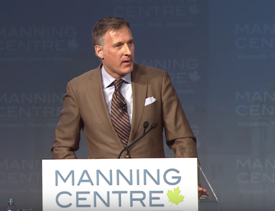
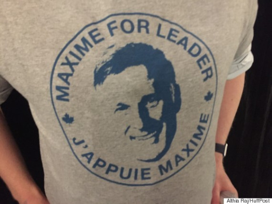

_Source: [YouTube](https://www.youtube.com/watch?v=K7m6TzW5ZCA&nohtml5=False)_

His name is Maxime Bernier and he has all the great qualities of a small-town politician.

He makes a point of visiting every part of his constituency while he’s in office. He saves resources by not printing up posters at election time, and he gets elected with higher and higher margins each time, even if his party is losing on the vote nationwide. He even put out a [60s-style jingle to entice voters](https://soundcloud.com/maxime-bernier-2015/jingle-radio-maxime-bernier-2015-version-1) in his riding of Beauce, Quebec.

He’s no ordinary small-town politician, though.

Bernier is also a principled Conservative with a penchant for a political philosophy that favors small government, lower taxes and more individual freedom.

He quotes free market economists like Frédéric Bastiat and Friedrich Hayek in Parliament, and never shies from [offering lessons in economics](https://openparliament.ca/debates/2011/6/22/maxime-bernier-3/) to the NDP and Liberals.

And he’s not just all talk.

Elected to the Parliament of Canada of 2006, he became Minister of Industry and later Minister of Foreign Affairs in the Stephen Harper Conservative government. He stuck to his principles and [even upset some of his caucus colleagues](http://www.thecanadianencyclopedia.ca/en/article/peter-mackay-and-maxime-bernier-going-their-own-way/) in the process. He’s still a strong Member of Parliament who often grabs attention with his floor speeches.

> “I would prefer if entrepreneurs could be true entrepreneurs and focus on what they do best–creating wealth for themselves–because, in the end, this also creates wealth for all of society,” he said on the floor of the Parliament as Minister of State (Small Business and Tourism) in 2011.
> 
> “The western world’s economic and political history has shown that more wealth is generated in the countries with the most economic freedom.”

Better than that, he’s from Quebec, which isn’t well known for producing anything close to politicians who champion economic freedom.

Now he’s ready to take his libertarian-minded principles and set them into leading the Conservative Party of Canada, as he [announced his leadership bid on April 7 in Ottawa](http://www.theglobeandmail.com/news/politics/quebec-mp-maxime-bernier-formally-launches-conservative-leadership-bid/article29553587/).

“I don’t like the left-right distinction, I’m a politician who believes in individual liberty,” said Bernier in a speech at the [Conservative Futures event](https://www.youtube.com/watch?v=Ee57txSMo8o)

in Barie, Ontario. last month. “If you ask me if we should have more or less state intervention in our lives, I’d say less.”

If you ask Bernier, it’s certain that a tide is soon to change in Canadian politics.  

Not just because of the policies of the Trudeau government, but also because Canadians are catching on the dangerous policies which may be saddling them with debt for years to come.

That includes the $30 billion deficit produced by the Liberal government at the same time as the [$1 billion bailout of Bombardier by the province of Quebec](http://www.wsj.com/articles/canada-questions-bombardiers-1-billion-bailout-1447202197).

As someone who describes himself as fiscally conservative and socially liberal, Bernier has a key advantage of appealing to young people who aren’t necessarily ardent fans of political parties.

That’s perhaps why dozens of young activists showed up to support Bernier at the Manning Centre Conference in February wearing their [“Maxime For Leader” shirts](http://www.huffingtonpost.ca/2016/04/07/maxime-bernier-conservative-leadership-race-2017_n_9632374.html).

_(Photo: Althia Raj/HuffPost)_

A Canadian politician who criticizes corporate welfare in the same breath as championing fairness for the small business entrepreneur and less federal intervention in the competencies of provinces is not someone people are used to hearing.

Young people especially, who crave more individual freedom to jumpstart their lives and careers and are skeptical about billion-dollar benefits, see something attractive in Mr. Bernier.

And that’s a fact that could give Prime Minister Justin Trudeau a run for his money if Maxime Bernier wins the Conservative Party leadership race next year.
