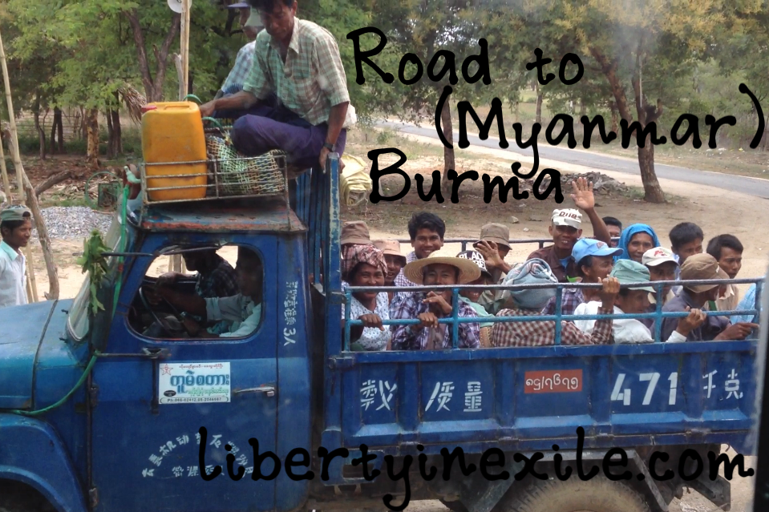

### 

### [DIRECT LINK TO MP3](http://libertyinexile.jellycast.com/files/audio/libertyinexileroadtomyamarburma.mp3)

This 26. August show was broadcast from the **Freiheit Studio** in Vienna, Austria on the [Liberty Radio Network](http://lrn.fm) and the [No Agenda Stream](http://noagendastream.com).

This week’s episode isn’t about news or analysis, but rather it’s a recap of my recent trip to the country of Burma, known today as Myanmar.

I recount my own experiences with the government, the people, and the sprawling religion and culture which help give comfort to the citizens living in a military dictatorship.

It is my goal to have a video documentary on Burma out within a few weeks, compiling all the video and audio I was able to capture during my 8-day stay.

Next week will feature an episode on Bali, Indonesia, where I learned a bit of the local language, some of the customs, and how to try to catch a wave on a surfboard.

# SHOWNOTES

- Inside Burma: Land of Fear – A Film by John Pilger [johnpilger.com](http://johnpilger.com/videos/inside-burma-land-of-fear)
- Bunny Phyoe- Yan Ma Phyit Tot Boo [youtube.com](http://www.youtube.com/watch?v=F71YtyaYfvg)

## ****LINKS TO FOLLOW****

- Website: [libertyinexile.com](http://libertyinexile.com/)
- Twitter: [@YaelOss](http://twitter.com/yaeloss)
- Facebook: [fb.com/libertyinexile](http://facebook.com/libertyinexile)
- iTunes: [Apple.com](https://itunes.apple.com/us/podcast/liberty-in-exile/id362000651)

_Originally appeared on [libertyinexile.com](http://libertyinexile.com/2013/08/26/road-to-mandalay-burma/)_
