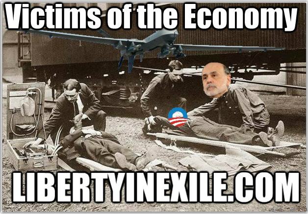

### 

### [DIRECT LINK TO MP3](http://libertyinexile.jellycast.com/files/audio/libertyinexile14feb2013.mp3)

  
  
This 14. February 2013 show was broadcast from the **Sunshine State Studio** on the [No Agenda Stream](http://noagendastream.com) with special guest and friend **Alan Holmes**, CEO of [**Hm Media Strategies**](http://www.hmsocialmedia.com/about).

Alan and I know each other from the days of the grind in North Carolina, struggling along as victims of the economy and just trying to get by.  
  
Now we get together to hit on key subjects and areas related to everything going on in the realm of technology, politics, and government control.  
  
Specifically we talked about crafting a social media business, **Hm Media Strategies**, what it takes to make money on social media, President Obama’s pseudo deficit cuts, illegal unilateral actions, drone strikes, Malcolm X, thriving without government, and much more.

# SHOWNOTES

## ****HM MEDIA****

- About — hmsocialmedia. [hmsocialmedia.com](http://www.hmsocialmedia.com/about)

## ****RULE THE INTERNETS****

- Facebook Is Said to Create Mobile Location-Tracking App. [bloomberg.com](http://www.bloomberg.com/news/2013-02-04/facebook-is-said-to-create-mobile-location-tracking-app.html)
- Kenya tracks Facebook, Twitter for election hate speech. [reuters.com](http://www.reuters.com/article/2013/02/05/net-us-kenya-elections-socialmedia-idUSBRE9140IS20130205?feedName=worldNews&feedType=RSS)
- The Government Is Still Trying to Spy on a Lot of Your Twitter and Google Data [theatlanticwire.com](http://www.theatlanticwire.com/technology/2013/01/google-twitter-government-information-requests/61491/)
- Geeks are the New Guardians of Our Civil Liberties. [technologyreview.com](http://www.technologyreview.com/news/510641/geeks-are-the-new-guardians-of-our-civil-liberties/)
- Are you offending people on social media? That’ll be 4 years in prison [youtube.com](http://www.youtube.com/watch?feature=youtube_gdata&v=JdrbqFqe3yo)
- CBS and CNET Liable For ALL BitTorrent Piracy, Artists Tell Court. [torrentfreak.com](http://torrentfreak.com/cbs-and-cnet-liable-for-all-bittorrent-piracy-artists-tell-court-130214/)

## ****STATE OF THE UNION****

- The 2013 State of the Union Address (Enhanced Version) [youtube.com](http://www.youtube.com/watch?v=S7doAXkmGJw)
- Sen. Rand Paul’s ‘Tea Party’ Response to the State of the Union Address [youtube.com](http://www.youtube.com/watch?v=rG5wlQcRfbQ)
- The History of the U.S. Minimum Wage [oregonstate.edu](http://oregonstate.edu/instruct/anth484/minwage.html)

## ****MALCOLM X****

- MALCOLM X: The problem is still here — on white liberals [youtube.com](http://www.youtube.com/watch?v=9LukWzli19M)

## ****DRONE NATION****

- EXCLUSIVE: Justice Department memo reveals legal case for drone strikes on Americans [openchannel.nbcnews.com](http://openchannel.nbcnews.com/_news/2013/02/04/16843014-exclusive-justice-department-memo-reveals-legal-case-for-drone-strikes-on-americans)
- ‘Progressive’ David Corn: U.S. Has Right To Kill Traitors With Drones. [realclearpolitics.com](http://www.realclearpolitics.com/video/2013/02/07/corn_us_has_right_to_kill_traitors_with_drones.html)
- Drone Strikes’ Risks to Get Rare Moment in the Public Eye [nytimes.com](http://www.nytimes.com/2013/02/06/world/middleeast/with-brennan-pick-a-light-on-drone-strikes-hazards.html?_r=0)

## ****POLICE STATE****

- Through utilisation of the federal No-Fly list, authorities are increasingly subjecting individuals to de facto exile. [aljazeera.com](http://www.aljazeera.com/indepth/opinion/2013/02/201324165957645514.html)

## ****DRUG NATION****

- Just 10 Months Left Before State Run Pot Stores Are Scheduled To Open [youtube.com](http://www.youtube.com/watch?feature=youtube_gdata&v=_DByF6e9ZY8)
- Shrinking U.S. labor unions see relief in marijuana industry. [reuters.com](http://www.reuters.com/article/2013/02/06/us-usa-marijuana-unions-idUSBRE91507E20130206)
- A Group of Drug War Profiteers Are Asking Eric Holder to Stop Legal Pot in Colorado and Washington [reason.com](http://reason.com/blog/2013/02/08/a-group-of-drug-war-profiteers-are-askin)

## ****VIDEO CLIPS****

- [Dropbox Link](https://www.dropbox.com/sh/69guhza8tdtr2ii/kskynAXc_C)

## ****LINKS TO FOLLOW****

- Linkblog: [linkblog.yael.es](http://news.freeyael.com/)
- Twitter: [@YaelOss](http://twitter.com/yaeloss), [@oh\_HOLMES](https://twitter.com/oh_HOLMES)
- Hm Media Strategies: [facebook.com](http://www.facebook.com/hmMediaStrategies)
