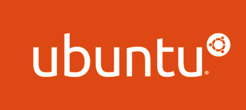

Monopolies are never a good thing.

Especially not when they’re reinforced by culture, society, and every aspect of business.

For the operating system world, at first it was Microsoft. Slowly, it’s becoming Apple. In a world with a free market, a perfect monopoly would never actually come to fruition–it’s just unfortunate that we don’t live in one.

I remember reading in **Noam Chomsky**’s 1996 book [World Orders: Old and](http://www.amazon.com/World-Orders-Old-Noam-Chomsky/dp/0231101570) [New](http://www.amazon.com/World-Orders-Old-Noam-Chomsky/dp/0231101570) about how Microsoft became such a large and expansive company. Chomsky  says it began when the federal government began installing the Windows OS on all the computers in the bureaucracy, sinking literally billions of dollars into Microsoft overnight.

For 12 years now, I’ve used Windows without really thinking about it. It’s how I learned to make websites, record podcasts, and surf the web.

And doing all that in the last few years has opened me up to the open-source community. I’ve maintained my own [news rivers](http://river.freeyael.com), [RSS feeds](http://links.yael.es), [linkblogs](http://linkblog.freeyael.com), and more on [**Dave Winer**](http://davewiner.com)’s [OPML system](http://home.opml.org), keeping my information ordered and my updates accessible to all.

The [Frontier community](http://www.scriptweb.com/FrontierAsOpenSource.html) naturally led me to the different programs and initiatives promoted by coders at **Github** and maintainers of the Twitter API, and opened my eyes to Linux.

And now, with a new Acer machine for less than $350, I thought it was time to switch to [**Ubuntu**](http://ubuntu.com).

> 

I must say that it feels rather free to download an entire OS from a website and install it directly without concern for a license or paying huge sums. I feel like I’ve broken away from the monopolistic world of computer life.

After a week of trying it, I’d say Ubuntu is the best OS I’ve ever used. The functionality works great, it’s smooth, fast, and very responsive to every command and line of code. And the open-source community supporting Ubuntu makes it quite a delight to use.

If ever there is a compatibility issue, chances are someone, somewhere has solved it in an online forum. (Hence how I was able to tune into Netflix from Austria and install podcasting software within minutes).

I’m only beginning to learn how to code, but the need to rely on essential programming makes it feel like I’m contributing to something larger than myself, and I look forward to becoming more involved.

So, that’s my switch to [**Ubuntu**](http://ubuntu.com).

It’s free, freeing, and freedom defined.

Happy trails.
