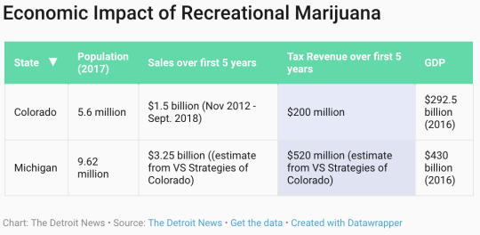

Michiganians voted Tuesday to introduce a new industry to the state that is expected to bring in $765 million in revenue over the next year and thousands of new jobs.

What we’re talking about is legal cannabis.

Look no further than the state of Colorado to see the incredible effects of legal cannabis on the economy, whether it’s the new influx of tax revenue, massive job growth, or discovering the plant’s health advantages.

By August, Colorado already hit $1 billion in legal cannabis sales for the year, bringing in over $200 million in taxes. Last year’s sales hit $1.5 billion. With a higher population and a GDP close to $100 million greater than Colorado, Michigan will have a lot to look forward to once it goes green.

However, federal law has continued to provide financial obstacles to states that have legalized medicinal or recreational marijuana.

If you’ve ever purchased cannabis legally with a medical card or in a state with recreational sales, you likely bought the product with cash. The lack of payment options is due to banks operating under federal law, which still prohibits the consumption and selling of marijuana after being (included with bath salts and heroin) listed under Schedule 1 of The Controlled Substances Act.

**A history of injustice**

Marijuana was added to this list in 1971 when the act was initially introduced during the Nixon administration, which notoriously began the national War on Drugs. Since then, the federal government has spent over $1 trillion in futile, anti-drug efforts. This is apparent when observing the fact that there were “8.2 million marijuana arrests between 2001 and 2010, 88 percent … for simply having marijuana.”

Here’s what characterizes a Schedule 1 drug:

To begin, the drug or other substance must have a high potential for abuse. Second, the drug or other substance has no currently accepted medical treatment use in the United States. Last, the drug has a lack of accepted safety for use under medical supervision.

As we now know, marijuana has shown to be an effective agent against a multitude of illnesses and disorders, ranging from treating chronic pain to providing relief for cancer patients.

The strongest argument prohibitionists explore is the fact that marijuana, like many drugs available today (such as caffeine, alcohol, or tobacco), could be heavily abused. This view isn’t wrong. Someone could become dependent on marijuana to the point they can no longer be as productive as they otherwise would be.

Despite that, there are zero recorded marijuana-induced deaths in the United States.

**The way forward**

In Michigan, the ballot initiative on cannabis brought to voters this week was brought forward by the Coalition to Regulate Marijuana Like Alcohol. A seller must obtain the required licenses, you must be 21 years of age to purchase, sell, or consume, and it’s still illegal to drive under the influence. This is very similar to buying your favorite six-pack.

But, there’s always a catch.

Even though Michigan voters decided to legalize recreational marijuana, it won’t be exactly like alcohol. It’s still illegal at the federal level, meaning you will likely be limited to purchasing cannabis with only cash.

At this point, only a small number of banks and credit unions will accept cannabis-related capital. In June of this year, Forbes noted, “411 banks and credit unions in the U.S. were ‘actively’ operating accounts for marijuana businesses, according to a report from the Treasury Department’s Financial Crimes Enforcement Network (FinCEN).”

While this number continues to rise, it’s not on pace to keep up with an exponentially growing number of new dispensaries and growers from all over the country. Putting that in jeopardy has been former Attorney General Jeff Sessions, who back in January gave the green light to federal prosecutors to enforce federal law on banks that work directly with cannabis-related ventures. Risk-averse banks are unlikely to forfeit eligibility of Federal Deposit Insurance for marijuana businesses.

Despite the risk, there have a been a few notable proposals in California that have looked to curb this issue. Republican Congressman Dana Rohrabacher recently came out claiming he’s working directly with President Donald Trump to push marijuana reform, specifically legalizing medical marijuana at the federal level. That in turn, would likely lead to the rescheduling of marijuana. With minimal details about the possible legislation available, the following solution provided would be contingent on cannabis staying on as a Schedule 1 drug. That means this predicament could no longer be an issue by next year.

The most viable and practical solution introduced to California’s state legislature is SB-930. As explained in our article in MG Magazine, the bill “would allow the formation of private cannabis limited-charter banks and credit unions. These banks would be allowed to deal only with cannabis firms, allowing them to legally pay vendors, take out loans, and pay their tax bills at the end of the year.” By receiving banking licenses from the state level, cannabis firms would be able to bank their profits, and tax payments, legally.

**Lessons from Canada**

At our northern border, Canada took the step of becoming the largest industrialized country to legalize cannabis on Oct. 17. Unlike the many pockets of legalization and prohibition here in the U.S., Canada’s new policy establishes an entirely new, legal market. As long as citizens follow the rules governed by the provinces, cannabis firms can take out loans and lines of credit, open bank accounts, and pay their employees with direct deposit. And citizens can purchase using a number of payment methods, not just cash.

The difference between how the cannabis markets operate, however, is still not uniform across the country. Each province has created rules and restrictions on who may sell the product. In Ontario and Quebec, the state liquor stores have a monopoly on cannabis sales. In Saskatchewan and Manitoba, private retailers are allowed to operate. Some provinces, like Quebec, ban home growing, even though federal allows citizens to grow up to six plants.

Regardless of the jurisdictional and regulatory differences, the fact remains that Canadians are freely able to buy cannabis in a commercial setting, taxes are collected, and banks and auxiliary services can benefit. Achieving the same in Michigan will require changes in federal law, but we can at least move forward one aspect of this battle come Election Day.

What’s clear is that a private solution is favored over a public one if our goal is maximum innovation and efficiency. A public bank operated by government bureaucrats would lead to a burden on Michigan taxpayers and hinder economic growth. But there are other ways to innovate and be creative to find solutions.

In Michigan, we like to embrace our craft beer industry with a sense of pride. We understand and love the art and innovation that come with brewing a solid beer. If we want to join the 21st century, it’s time we do the same with marijuana, just like voters said on Tuesday.

_Garett Roush is the North American leadership manager with Students For Liberty and a fellow with the Consumer Choice Center._

_Yaël Ossowski is deputy director of the Consumer Choice Center._

Published in [Detroit News](https://www.detroitnews.com/story/opinion/2018/11/07/marijuana-promises-economic-benefit-poses-financial-questions/1904480002/)
