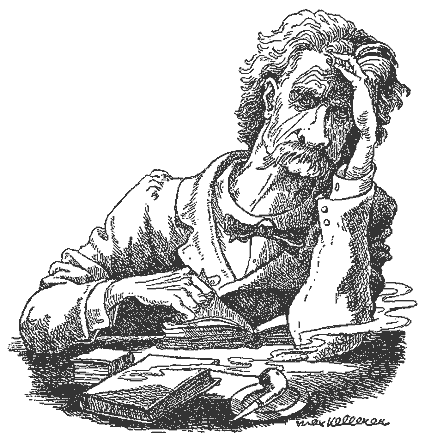

“Surely there is not another language that is so slipshod and systemless, and so slippery and elusive to the grasp. 

One is washed about in it, hither and thither, in the most helpless way; and when at last he thinks he has captured a rule which offers firm ground to take a rest on amid the general rage and turmoil of the ten parts of speech, he turns over the page and reads, “Let the pupil make careful note of the following **exceptions**." 

He runs his eye down and finds that there are more exceptions to the rule than instances of it. So overboard he goes again, to hunt for another Ararat and find another quicksand. Such has been, and continues to be, my experience.”  

– Mark Twain, “The Awful German Language”
