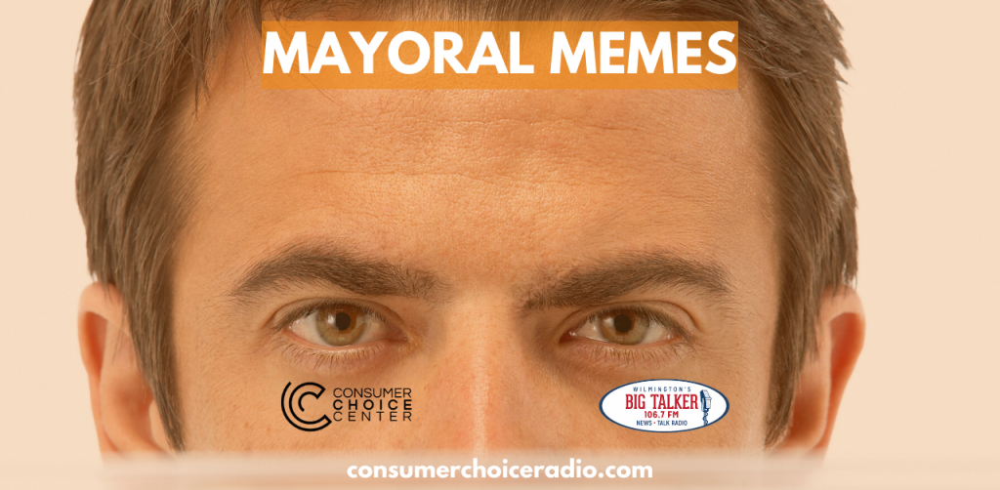

<figure>

<figcaption>

Consumer Choice Radio: Ep. 6

</figcaption>

</figure>

https://youtu.be/Y95aimDkuJU

Consumer Choice Radio, hosted by Yaël Ossowski (@YaelOss) & David Clement (@ClementLiberty).

- Huawei finally charged; why do the Chinese want Yaël's credit report?
- Bloomberg's leaked tape and Stop-And-Frisk Apology
- The mayoral memes are hitting hard
- The unions are going against Bernie
- Trump at the Daytona 500 will be an absolute BONANZA
- Los Angeles expunges cannabis criminal records
- Awesome Consumer Choice Center hits around the world

Shownotes: [https://consumerchoicecenter.org/radio/ep5](https://consumerchoicecenter.org/radio/ep1/)

Broadcast on The Big Talker 106.7 WFBT FM on 15. Feb. 2020.

[consumerchoiceradio.com](http://consumerchoiceradio.com)
