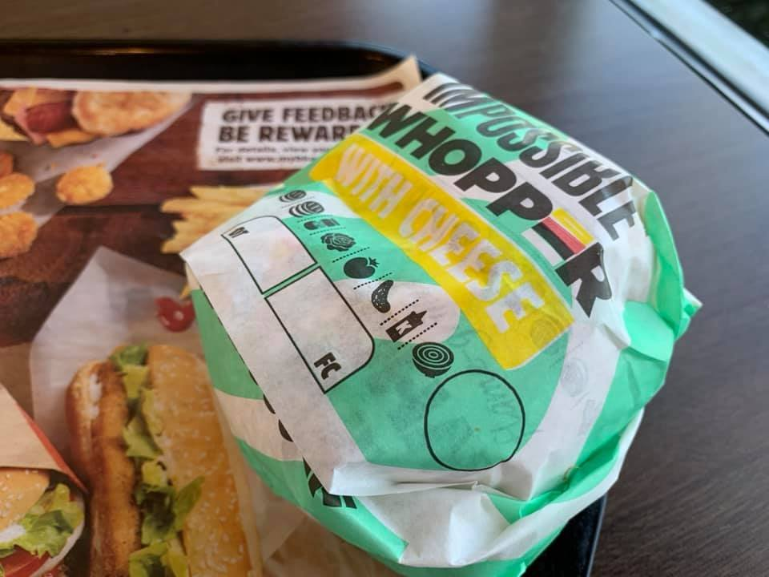

I have seen the future, and it's a meatless Whopper.

 I'm a big fan of the trend of meat alternatives.

I first had an Impossible Burger in Charlotte sometime last year, and have since tried the Beyond Meat burgers and sausages you can buy at Whole Foods.

Each one tastes like meat, bleeds like meat (in the case of Impossible), and I could imagine a future where I would eat it all the time.

Why I think these alternatives are so great: Face it, there are plenty of people who love eating meat, but probably want to eat less of it, for health reasons, environmental, or lifestyle.

As such, these new innovations, created by companies, provide the perfect avenue for that.

It's another reminder that we need more innovations from companies, not imposed and regulated solutions provided by government. Final point.
