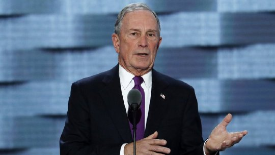

by [Yaël Ossowski](http://www.washingtonexaminer.com/author/Yael+Ossowski) | [Jun 30, 2017, 8:00 PM](http://www.washingtonexaminer.com/michael-bloombergs-nanny-crusade-will-make-people-poorer/article/2627555#) | [Washington Examiner](http://www.washingtonexaminer.com/michael-bloombergs-nanny-crusade-will-make-people-poorer/article/2627555)  

If we were to prioritize threats like former New York City Mayor Michael Bloomberg, the world’s biggest enemies would reside in the bottoms of soda cans and within the lining of cigarettes.

Launching his American Cities Initiative at the U.S. Conference of Mayors’ Annual Meeting in Miami on Monday, [he unveiled his plan](http://www.prnewswire.com/news-releases/michael-r-bloomberg-announces-200-million-american-cities-initiative-to-help-us-cities-innovate-solve-problems-and-work-together-in-new-ways-300479386.html) to spend $200 million over the course of 3 years to speed up regulation in city governments.

The proposal by Bloomberg’s charity, Bloomberg Philanthropies, will give cash-starved municipalities a chance to dig themselves out of financial strain – as long as they comply with with Bloomberg’s vision.

If Bloomberg’s agenda from his mayoral days are any indication, his war on sugar and tobacco will be key to any city receiving money.

There is no other public figure who has so readily assumed the role of “ultimate nanny” than [Bloomberg](http://www.nydailynews.com/new-york/bloomberg-public-health-crusades-land-heaven-article-1.3087239). He’s shown himself as a crusader prepared to use the force of government to raise taxes and prices on products he deems unhealthy and even dangerous. If only to save the people from themselves.

“I’ve always believed that a critical role of government is to help protect people from harm,” wrote Bloomberg in a letter published on his news website [last month](https://www.bloomberg.com/view/articles/2017-05-31/small-steps-can-save-millions-of-lives).

Bloomberg’s worldwide crusade against sugar and tobacco has consumed the better part of his life after politics, earning [him a position](http://www.un.org/climatechange/summit/2014/01/secretary-general-appoints-michael-bloomberg-of-united-states-special-envoy-for-cities-and-climate-change/) as the United Nation’s Special Envoy for Cities and Climate Change and a key financier of projects to raise so-called “sin” taxes across the United States and the world.

In 2016, [he dropped](https://www.forbes.com/sites/katevinton/2016/11/09/michael-bloomberg-scores-with-18-million-on-measures-taxing-soda-in-san-francisco-oakland-this-election/#293bda2f102d) $18 million into the campaigns for soda taxes in Oakland and San Francisco, in addition to the $500,000 he spent on the California ballot initiative to increase the tax on cigarettes by $2 a pack.

Back in 2014, he spent more than $650,000 to fund the campaign to introduce the nation’s first-ever soda tax in Berkeley.

Most notably, he spent [$1.6 million](http://fortune.com/2016/11/03/michael-bloomberg-soda-taxes/) to pass the soda tax in Philadelphia in 2016, an issue that became highlighted throughout the course of the presidential campaign and drove a wedge between the top two Democratic contenders.

Sen. Bernie Sanders, I-Vt., couldn’t call himself a fan of these initiatives. He decried soda taxes as “regressive” measures that “[disproportionately increase taxes on low-income families](http://www.alternet.org/food/do-soda-taxes-hurt-low-income-people-hillary-and-bernie-spar-over-issue).” Hillary Clinton supported the measure.

Is Sanders right to reject “sin” taxes as an answer to rising obesity? It seems he’s correct.

Though Bloomberg’s project represents a noble goal – reducing childhood and adult obesity – its actual impact is to make already low-income people poorer, and hasn’t yet produced any clear results on obesity.

In the case of Mexico, the largest jurisdiction which passed a tax on sugar-sweetened sodas in 2014, it’s quite clear that [sales of sodas](http://www.foxnews.com/food-drink/2017/02/24/mexico-sees-sharp-decline-in-soda-purchases-after-sugar-tax-study-finds.html) dropped as a result of the tax.

However, as [Mexican researchers](http://cie.itam.mx/sites/default/files/cie/15-04.pdf) learned once they broke down the figures, low-income households paid a higher proportion of the soda taxes overall.

This likely means that soda taxes deterred higher-income individuals from buying and consuming soda, but not lower-income individuals: those who the government was originally trying to help. What’s more, it seems those who stopped purchasing sodas switched to alternatives with [just as many calories](http://www.fooddrinktax.eu/mexican-soda-tax-lead-reduction-total-calorie-consumption-finds-study/), such as fruit juices or energy drinks.

That would mean the tax was at best a source of revenue for the national government, and at worst, a fierce killer of local shops and commerce.

An [economic survey](http://www.diplomaticourier.com/unintended-consequences-economic-impact-sugar-tax-small-stores-bakeries-mexico/) of the effect of the tax found that more than 30,000 Mexican stores which sold sodas were forced to close in the first half of 2016.

Bloomberg Philanthropies has mostly avoided questions about the tax by [paying for practically every study which claims its success](http://www.bmj.com/content/352/bmj.h6704), but none have underscored exactly what it means for obesity or the well-being of the overall population. The same goes for the [Berkeley soda tax](http://time.com/4743286/berkeley-soda-tax/).

Considering the soda tax is still very new in many municipalities, the effects of those taxes will likely take some time to surface. But at least for the lower-income populations who face the brunt of these taxes disproportionately, as proven in Mexico, the truth is already known.

And if Bloomberg wants to continue expanding soda and sugar taxes across the country, it’ll create the same same result.

Despite that, it is clear that reducing childhood obesity or ridding our homes and restaurants of smoke is indeed a goal we all share.

But as to whether we should adopt ad hoc tax hikes which only signal fixing the problem rather than actually addressing it, it’s quite clear that Mr. Bloomberg should stick to his day job: working at the U.N. and making speeches.

_Yaël Ossowski ([@YaelOss](https://twitter.com/YaelOss?ref_src=twsrc%5Egoogle%7Ctwcamp%5Eserp%7Ctwgr%5Eauthor)) is a Canadian journalist and public relations director at the Consumer Choice Center._
