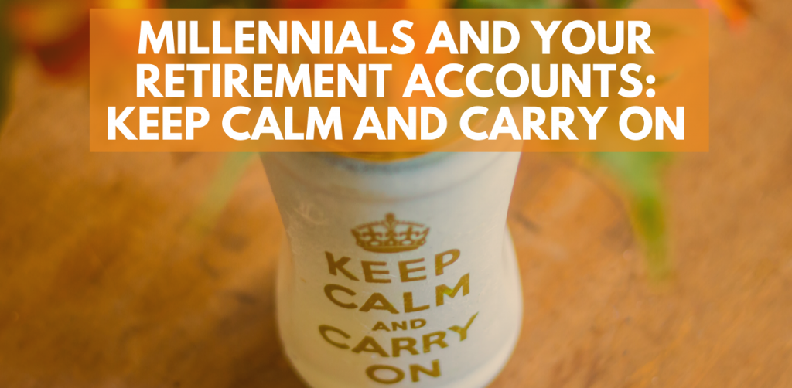
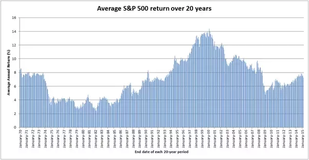

It's here.

Whether it was Tom Hanks [contracting](https://abcnews.go.com/US/tom-hanks-taking-day-time-testing-positive-coronavirus/story?id=69574692) the novel coronavirus, or the [shutting down](http://www.startribune.com/when-american-sports-leagues-shut-down-they-got-it-right/568761192/) of most major sports league events in an effort to avoid further infections, the pandemic has arrived.

We've been speaking about this for [weeks](http://consumerchoiceradio.com) on Consumer Choice Radio – at first, the story was about the lies and deceptions of the Chinese Communist Party in the city of Wuhan, where coronavirus first broke out.

Now, it's about the economic and social toll it will take on billions throughout the globe, and the measures taken by governments to reduce the possibility of further community spread.

https://youtu.be/CU1HcjNfCq0

Many of you may be working from home now, or quarantined without an opportunity to work.

Most of us will use that time to tune into the news: TV, radio, Internet, and anything else you can get your hands on. And while some of that will be useful, there is nothing positive to be gained from watching the financial news.

Of course, we're dealing with a Black Swan of a situation: no one saw this coming, and now the markets are reacting.

But if you're a millennial worker and you're watching the value of your retirement accounts like your 401(K) flutter like a clipped butterfly, you shouldn't.

Now is exactly the wrong time to think about trading your positions and investments for cash. And that's not financial advice, it's commonsense.

We should keep in mind that the S&P 500 Index (a stock market index of 500 large U.S. companies) has a 7.9% average annual yield – and that's with all the dips, crashes, recessions, and everything else we've seen over the past few decades. The long trend is growth, no matter the news of the day.

<figure>

<figcaption>

The average annual return over **any 20-year period** is **7.19%** (including dividends).  
  
On this chart, you can see the return of each 20-year period (starting from Jan 1950-Jan 1970 until Mar 1995 - Mar 2015).

</figcaption>

</figure>

Our generation is actually [quite good](https://finance.yahoo.com/news/millennial-workers-pace-more-retirement-140000749.html) at saving for retirement, diversifying more than the baby boomers, so that should position us quite well.

Whatever the impact will be on the S&P or the NASDAQ the next few weeks, it's bad news bears – for now. But the world will soon get back to normal. Extreme measures are being taken now so they don't have to be taken later. That's why we have to Keep Calm and Carry On.

It's tempting for many young workers to see red arrows pointing downwards and sell, sell, sell on their retirement accounts, but that's wrong.

We're living in a temporary moment of extraordinary means and measures. But it'll soon pass.

Businesses will open back up and serve thirsty, hungry, and demanding customers. Travel will kick back up as people need to get on with their lives. The wedding planners and bakers and baseball stars and bank tellers will be back in their work outfits before we know it.

And once that happens, once the virus has been contained and people feel safe and confident enough to engage in normal commerce, the market will creep back up. The losses of today will be the gains of tomorrow.

That's why it's vital to wait it out – don't become the sucker of the season who sold everything because the news said so.

We're still living in the great times humanity has ever produced. We're richer, healthier, live longer, have more information at our fingertips, more material wealth, and can communicate with dozens of people instantaneously with a moment's notice.

We mustn't succumb to the fear, and we can't throw away everything we've built up when one small wrench gets thrown our way. Keep Calm, Carry On, and continue saving.

And while you're self-quarantining, why don't you listen to the backlog of Consumer Choice Radio episodes? They're just waiting for you, right now, right here. Or maybe on [Spotify](https://open.spotify.com/show/0jcFISTwalBmpOgMKHrweC). Or [Youtube](https://www.youtube.com/playlist?list=PL3yZIblmB62iavhK6hZIKnaw__3skuzjn).

<iframe width="560" height="315" src="https://www.youtube.com/embed/videoseries?list=PL3yZIblmB62iavhK6hZIKnaw__3skuzjn" frameborder="0" allow="accelerometer; autoplay; encrypted-media; gyroscope; picture-in-picture" allowfullscreen></iframe>
