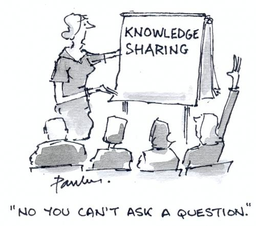
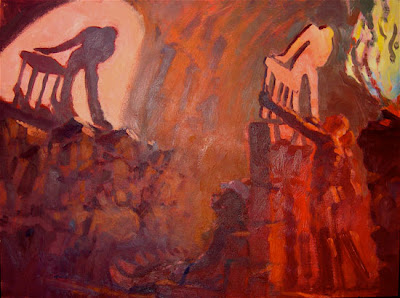

I have always been an individual both surrounded and fascinated by information. For the past 10 years, I have used the internet, books, magazines, newspapers, and television programs to craft my vision and understanding of the world. Before I was able to travel throughout so many beautiful European countries, I was merely a man informed by written word and visual footage, an adequate but uneventful preparation.

And now, as the evolution of technology yields so much control to individuals, I have invested much time and energy into the study, understanding, and practice of the personalization of information. It is a trend unacknowledged by some yet embraced by all, a true paradigm shift for to the accumulation of information and enlightenment. Some use it in the form of Netflix for choosing what movies they shall enjoy, or  social media for how they shall interact with their immediate circle of intimates. Others find blogs which mirror their points of view or websites which display beautiful pictures and photographs which inspire them to create their own art. In all matters, individuals are becoming their own gatekeepers for access to information. It has proven powerful enough to overturn old world orders, such as the Arab Spring, or to create a common bridge to previously untouchable populations, such as the rising internet generation in totalitarian China.

In my own experience, I was able to inform myself on the anti-democratic undertones of the European Union, the ever-present dangers of ambitious military empire, and the fundamental flaws in the world monetary system. Previously unaware of any of these issues, my own desire to pursue knowledge through technological means is what inspired the fundamental understanding I enjoy today. Specifically, this was achieved by simply finding videos and documentaries, reading foreign press, and engaging with bloggers and commentators in different countries. Without the help of a formal classroom and professor, I was able to acquire such a deep understanding of profoundly complex issues that my level of awareness attained a peak acuteness, which I hope will only continue to rise as I attempt to swiftly steer my sensory predisposition for learning.

What does this mean for the next step in the management of information in my life? It means that I have found my calling with RSS–Really Simple Syndication. By connecting to channels which allow constant flows of rivers of information, I am certain to guarantee cognizance as I personally see fit. No longer will I be forced to be exposed to the streams of undesirable information which permeate the majority of mainstream sources. Instead, I will be able to consistently avoid the misinformation and propaganda which has polluted the minds of the populace for so long; such pollution of the mind has allowed the power structure to exploit nationalism for justification of war and misery, to use fear to achieve long-range goals diminishing personal freedoms, and to use mysticism and celebrity culture to openly endorse and promote a willing suspension of critical thinking.

RSS is the means to achieve the detachment from the shackles in Plato’s allegorical cave, where puppets and shadows are used to manipulate the minds of the imprisoned populace, dictating to them that the stories and historical narratives they have been taught repeatedly are infallible truth.These are the axiomatic assumptions we are unquestioningly told to believe without skepticism, whether they be about the world monetary system of the necessity of preemptive war as a means to eventually bring a world of peace. The ability to adequately management your delivery mechanism of information is what allows individuals the opportunity afforded once they are able to [break free from the cave](http://www.historyguide.org/intellect/allegory.html):

> And now look again, and see what will naturally follow if the prisoners are released and disabused of their error. At first, when any of them is liberated and compelled suddenly to stand up and turn his neck round and walk and look towards the light, he will suffer sharp pains; the glare will distress him, and he will be unable to see the realities of which in his former state he had seen the shadows; and then conceive some one saying to him, that what he saw before was an illusion, but that now, when he is approaching nearer to being and his eye is turned towards more real existence, he has a clearer vision, -what will be his reply? And you may further imagine that his instructor is pointing to the objects as they pass and requiring him to name them, -will he not be perplexed? Will he not fancy that the shadows which he formerly saw are truer than the objects which are now shown to him?
> 
> _Plato,_ The Republic, _Book IV_

In my own personal attempt to achieve that end, I turn towards [Dave Winer’s River2](http://www.google.com/url?sa=t&rct=j&q=&esrc=s&source=web&cd=2&ved=0CCoQFjAB&url=http%3A%2F%2Friver2.newsriver.org%2F&ei=q2HATs23C8PqrQeHt_S_AQ&usg=AFQjCNGKxyG2Cq-Es6IPk5OTO8lHkChmww&sig2=N9CN0EU-McNLwONdpWRgyw) news aggregator. This allows me to connect the multitude of different sources, languages, and focuses my mind is inclined to pay attention to in its desire for knowledge accumulation. My own river is located [here](http://news.freeyael.com). It is a continuous experiment in the management of information, but I am hopeful that a continued strive will fully detach me from the world which has produced so many noble lies.
