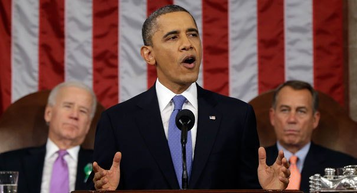

By Yaël Ossowski | [Watchdog.org](http://watchdog.org/130254/chief-executive/)

When **President** **Barack Obama** chooses to enforce select portions of federal law, is he playing the part of chief executive or skirting around **Congress** and, by extension, the **U.S.** **Constitution**?

That’s the question House Republicans put forth in a [**House Judiciary Committee** meeting](http://judiciary.house.gov/index.cfm/hearings?ID=4B00641F-3944-4308-BF89-F68AA9FF4653) Wednesday, stacking the witness panel with four fellow House GOP members and three law professors all too ready to deliver their thoughts on prosecutorial discretion, the notion that the chief executive can selectively enforce federal laws.

“President Obama’s decision to ignore the constitutional limits on his authority subverts the rule of law and threatens the individual liberty that our system of separated powers is designed to protect,” said **House Judiciary Committee** Chairman **Bob Goodlatte**, a Republican congressman from **Virginia**, in his [opening speech](http://judiciary.house.gov/index.cfm/hearings?Id=4B00641F-3944-4308-BF89-F68AA9FF4653&Statement_id=69F307C8-A488-45A4-9EF0-7A252E3FBC90).

House GOP committee members and witnesses invoked the three different scenarios in which they believedObama “subverted” the law: the president’s decision to [delay the insurance mandate for certain employers](http://watchdog.org/130044/executive-order-obamacare/), to give [more discretion](http://watchdog.org/21764/ossowski-obamas-pledge-to-halt-deportations-a-legal-immigrants-take/) to immigration officers when dealing with illegal immigrants and the[federal redefinition](http://www.washingtonpost.com/opinions/how-obama-has-gutted-welfore-reform/2012/09/06/885b0092-f835-11e1-8b93-c4f4ab1c8d13_story.html) of welfare standards.

Republican members of the committee were similarly peeved about the [lax enforcement of the federal government](http://watchdog.org/105497/marijuana-moratoriums-washington-cities-stall-legal-pot/)‘s drug laws in states like **Washington** and **Colorado**, which recently legalized the sale and possession of marijuana.

And they didn’t shy from making their discontent known.

“We’ve become a nation of random enforcement,” said **Rep.** **Lamar Smith**, a Republican from **Texas** who sits on the committee. “That’s what happens in a dictatorship or totalitarian society.”

His fellow Republicans castigated the executive branch for going “beyond the authority” granted by the Constitution.

The minority **Democrats** ofthe committee chalked up complaints to nothing more than political theater.

“This is political theater. This is why we’re here,” said Democratic **Illinois Rep. Luis Gutiérrez**. “Let’s not kid ourselves.”

**Rep.** **Sheila Jackson-Lee**, D-Texas, lambasted the suggestions of encroaching authoritative rule, putting her faith in the president’s decisions and limits on power.

“Maybe in **Ukraine** or **Sudan** or **South Sudan**, but not here,” she said. “To suggest that we have a chief executive in office who is dangerous and raw is just wrong.”

Beyond the partisan voices, legal experts did bring some level of criticism aimed at the **White House.**

**Jonathan Turley**, a George Washington University law professor asked to testify at the hearing, summed it up as an institutional rather than political struggle, playing down the bickering of the political parties to point out a fundamental shift in the limits on executive power.

“What the president achieved unilaterally is what he was denied by the Congress,” described Turley when speaking of Obama’s discretion toward immigration enforcement. His sentiments were echoed by others on the panel.

“I would suggest that you not stand idly by and let the president take your power away,” said **Elizabeth Foley**, a law professor at **Florida International University** in Miami. She provided the rationale the Congress could use in order to take the chief executive to court.

What also troubled so many committee members in their opening speeches was the president’s decision to delay the health insurance mandate for select businesses until 2015, a decision delivered as a [blog post](http://www.treasury.gov/connect/blog/Pages/Continuing-to-Implement-the-ACA-in-a-Careful-Thoughtful-Manner-.aspx) on the **U.S. Treasury**‘s website.

In this sense, congressional Republicans were put in the strange position of defending the total enforcement of the **Affordable Care Act**, which they’ve strongly opposed since it was introduced in 2009.

The point then raised, therefore, was if a chief executive chooses not to enforce parts of the federal law, such as the date of the **Obamacare** mandate, are they exceeding their authority?

**Goodlatte** mentioned the possibility of a congressional lawsuit aimed at Obama for breaching his constitutional duties, but it was met with skeptical analysis from the law professors testifying before the committee.

“Almost all statutes grant some discretionary authority,” said **Duke University**law professor **Christopher Schroeder**. “These choices are not in tension with executing the laws, they are part and parcel of what it means to execute the laws.”

The four GOP congressmen present as witnesses at the hearing, **Rep. Jim Gerlach** of **Pennsylvania**, **Rep. Diane Black** of **Tennessee**, **Rep. Tom Rice**of **Georgia**, and **Rep**. **Ron DeSantis** of **Florida**, each discussed [bills they had introduced](http://judiciary.house.gov/index.cfm/hearings?ID=4B00641F-3944-4308-BF89-F68AA9FF4653) to make sure Obama enforced the laws on the books.

Even with the full force of a committee stacked with party allies, it’s doubtful any conclusive action will be brought forward. By framing the issue as a political one, Republicans revealed the absolute level of political opposition between the three branches of government, much more than any true abuse of executive power.

_This article was published on [Watchdog.org](http://watchdog.org/130254/chief-executive/)._
