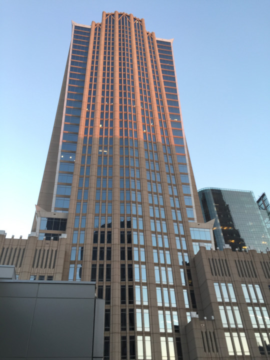

Without so much as a care, my family moved to North Carolina from the French-speaking Canadian province of Québec when I was a 5-year-old lad.  

The reason for our move was purely economic, and it has affected our lives for the better in innumerable ways. We learned all about the quirks of southern living and adapted quickly. Our family lived in relative financial security while still remaining cost-conscious as frequent shoppers at the second-hand store. My brothers and I worked every summer washing cars at the local Auto Bell car wash. What a gig. My sister worked with a local vet who had a nose for good wine and liked to travel to large African countries.

At the age of 15, each one of us did our time back home in Québec, working wherever we could get s job. We brushed up on French, learned about our family history while forging a new one, and saved up money to buy our first cars. We spent the summer working, but felt sad because we missed being with our friends in North Carolina. That made going back that much sweeter.

We even produced southern accents, though mine has slowly faded away from years of continental exploring beyond American shores. Strangely, a Canadian English accent has since formed in the back of my palette, despite only having lived in a French province in the land of maple. Weird, eh? My southern expressions somehow always seep out, mostly with the boys. Even while standing under the stars in an Alpine republic. That’s life, son.

In North Carolina, we came to understand how the past horrors of racism had evolved into lessons for the current generation. All people were to be treated equally, and there wasn’t much question about it. The civil rights movement had some roots here, and we came to be proud of it. We had nothing to do it, but the American creed made us feel like we did.

There was less diversity in the advanced level classes at school, but I considered that a fluke. I only got in because my parents made me take a special test in the fourth grade. Any memory of what it was about has since evaporated from my temples, but it meant forever that more was expected of me in classes and we had more homework. Maybe I wouldn’t have been able to succeed with my parents arranging for me to take the special test. Or maybe I was destined for happiness no matter what.

Regardless, we got along with everyone and everyone listened to everyone else’s music. People even listened to my French Canadian tunes. Our school was known for being very cross-cultural and rather egalitarian. Besides, jokes don’t really have different colors or hair type. They’re just as funny to everyone. Especially about that guy in English class no one likes. What a character.

We were able to receive a half-decent primary and secondary school education, and my siblings and I made countless friends.

I just went to the wedding of one of these friends last week. What a delightful event. It was held in the heart of downtown Charlotte, nestled between the skyscrapers which have now become so iconic for the banking capital of the south. It was a romantic affair with all the necessary Southern flair: a beautiful bride in white, the white teeth of the groom, and a lot of microphone hogging. All for a good time.

At our house growing up, we always faced a weird kind of dilemma. We were southern raised, but québécois-infused. We could all speak another language and we had foreign relatives who always came to town in large camping cars. Every friend who came to the house loved hearing the foreign sounds bouncing up and down between the first and second floor.

That allowed us to have a connection to the Hispanic kids in our classes. They spoke two languages and had weird relatives visiting at times as well. They ate different food, learned curse words in a different language, and learned to appreciate where they came from while still molding themselves to the American creed. They did the Pledge of Allegiance as we did, as everyone did. You didn’t really question it.

Now and then in my late 20s, I visit North Carolina and bask in the southern fried goodness I knew in my youth. But now, it’s more hip. Up and down the United States, people know about Raleigh and Charlotte, and the Outer Banks and Asheville. They’ve heard about our great BBQ, the obsession with college sports which I still can’t grasp, and the NASCAR culture which is its own special breed. Maybe they. an even name a local brewery or two.

This week, I saw another side of my home state. In the city of Charlotte, just 20 minutes from my hometown, a police altercation claimed the life of a black man who held up his hands without protest. A bullet entered his body and the streets of Charlotte would never be the same. The violence and anger sprang up just days after we had enjoyed the bliss of my friend’s wedding downtown. The same streets where we had wished them a newlywed farewell in the 70s Corvette, metal cans in tow, had since been flooded with tear gas and debris from certain riot.

What had happened to this North Carolina that I call home? The racial divisions flared up, the battle of that gunshot carried over to days of protests and worry and looting and shooting and uncertainty. Whose side are we on, what do we stand for? How can we have peace when shots are fired and bodies fall onto the pavement?

I had arrived back home to enjoy time with family and friends and to immerse myself in the spirit of the beautiful state which formed my youth.

Though it may be faced with its biggest test yet, it’s clear that the people are better and stronger than we may imagine. Solidarity and calls for peace are the order of the day. The political divisions are already fading away.

Some of us were not born here by accident, but chose to come to make a life and committed ourselves to make it peaceful and successful and everything else we can desire. It’s clear the people of North Carolina will rise above it – we always have.

We’re the Tar Heel State, the state where battles have been fought, rights have been won, and we’ve made it work despite it all.

That’s the North Carolina I love and that I call home.
