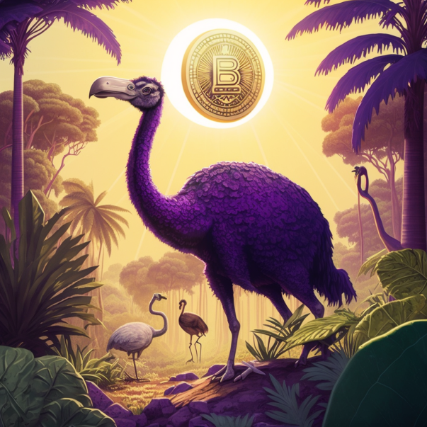

If I were to venture a guess, would you consider yourself a _HODLer_?

For most of you, that’s probably a solid hell yes. You probably have a well-guarded stash of Bitcoin in cold storage with geographically distributed private keys, or a solid hardware signing device with your seed phrase engraved into metal and locked away.

For the savings crowd, those are a given. **And the tools are spectacular**.

But for those who want to use Bitcoin more actively, meaning in daily interactions, we have also bountiful supply of new protocols, tools, and code projects that deliver Bitcoin-enabled alternatives to your usual tech stack.

Enter **Nostr**, a decentralized protocol that uses signatures of public/private key pairs to post notes on clients that replicate to relays, all operating independently. It’s a decentralized social media service that has more flexibility and control than you’d ever find on Twitter or Facebook. Plus, you can never be censored.

There are web clients you can use online ([snort.social](https://snort.social), [hamstr.to](https://hamstr.to), [iris.to](https://iris.to)), apps for your phone ([Damus](https://damus.io/), [Amethyst](https://github.com/vitorpamplona/amethyst)), and even coinjoin and gaming projects that have implemented Nostr (even chess!).

What makes the protocol so popular among Bitcoiners is that, unlike so many other social media, _Bitcoin is the native currency_. More specifically, it’s Bitcoin’s second layer of lightning (having its creator and successful client developers be Bitcoiners also helps).

By implementing lightning addresses, payments, invoices, and now “zaps” (sending sats for individual posts), an average user on Nostr will use Bitcoin on lightning more than even your more dedicated orange-piller.

* * *

> [Please check out our sponsor 21Bitcoin and save up to 20% on fees using “FIXTHEMONEY” - Thank you!](https://21bitcoin.app.link/invite/?code=FIXTHEMONEY)

* * *

As a default, clients allow users to list their lightning addresses in their profile, allowing anyone to send instant payments from either custodial or noncustodial lightning wallets. And posting a lightning invoice on your feed (you know, the terribly long piece of jargon you send yourself on Signal) automtically renders into a QR code and button that anyone in the world can pay. It’s magic.

It’s a true playground for many elements of Bitcoin and lightning that have, thus far, not seen the excitment and popularity present among normies and NFT types on chains like Ethereum or Polygon.

And though the project has its core Bitcoin following (the Bitcoin Twitter migration), there have been thousands of users who’ve been onboarded through nostr and been introduced to Bitcoin and lightning for the first time. It doesn’t take much imagination to see how more widely used the Nostr protocol could be than perhaps Bitcoin itself.

Just yesterday, journalists from the mainstream libertarian Reason Magazine [hosted a livestream](https://www.youtube.com/live/pi2JbHWd_BM) all about Nostr with JB55, the builder of the nostr app Damus, and nostr superfan NVK, maker of the Coldcard, honing in on the promises of decentralized social media that are actually coming true with Nostr.

All this is being developed at hyperspeed before our eyes, exactly at a time when users are souring on centralized tech services like Twitter and others that have their own downfalls (think moderation and censoring). Jack Dorsey, the founder of Twitter, is not only a Nostr mainstay, but has committed several Bitcoin to bounties and developers to aid its growth.

Other decentralized services like Mastodon were once thought to be the answer to growing tech centralization. But as anyone using a Mastodon instance can tell (and I ran one for 2 years), the moderators of a particular instance are more like supergods than benevolent dictators. The decentralization exists in name, but not in practice.

If you haven’t given Nostr a try, you should definitely see what is happening in this magical Bitcoin playground (links above). Niko and I post our Nostr pubkeys on each of the posts here on the _Fix The Money_ substack, and I hope to engage with many more people around the world who care about decentralization and practice use of Bitcoin.

Let’s get to Nostrin’!

_Contact:_

[fixthemoney@substack.com](mailto:fixthemoney@substack.com)

**Niko**: [@nikojilch](https://twitter.com/nikojilch) / nostr: npub1st4elxz4dphx2qxpuaklvs855zetnkglu8dvszdxamgqn5q3pk5svflv5p

**Yaël**: [@yaeloss](https://twitter.com/yaeloss) / nostr: npub15dnln6cukw3yrflnv3hnrntdt9amh0uw466u6tns05ymqp3nal4qzz3lfc

[Share](https://fixthemoney.substack.com/p/the-case-against-charlie-munger?utm_source=substack&utm_medium=email&utm_content=share&action=share&token=eyJ1c2VyX2lkIjoxMDUxOTU3LCJwb3N0X2lkIjoxMDM1MDEyOTgsImlhdCI6MTY3NzI0Nzg0NCwiZXhwIjoxNjc5ODM5ODQ0LCJpc3MiOiJwdWItODM0NjE1Iiwic3ViIjoicG9zdC1yZWFjdGlvbiJ9.uGU5t1oaSgOuOVB-9_UTxWQrJju_i9ddn9zMzYHhyRU)

_Originally published on [Fix The Money](https://www.fixthemoney.net/p/nostr-a-funky-decentralized-protocol) ([archive link](https://archive.ph/7f33m))._

* * *

##### _This post is **sponsored** by…_

#### **[21bitcoin](https://21bitcoin.app.link/invite/?code=FIXTHEMONEY) - The easy way to buy, sell, save and send Bitcoin.**

**21bitcoin** is a Bitcoin-only app, not an exchange. No distractions, individual savings plan, very low fees, first-class personal support, and a German bank account. Based in the Austrian Alps, available throughout Europe. **[Download now](https://21bitcoin.app.link/invite/?code=FIXTHEMONEY)**.

**Use code “FIXTHEMONEY” to get up to 20% off your fees :)**

[Check out 21bitcoin](https://21bitcoin.app.link/invite/?code=FIXTHEMONEY)

* * *

**Not your keys, not your coins!** You need a hardware wallet. Check out the **[Bitbox02](https://shiftcrypto.ch/fixthemoney)** - Swiss-made, secure, beautiful, open source, Tor support, _Bitcoin only_ and all-around awesome!

**Use code “FIXTHEMONEY” to get 5% off :)**

[Show me the Bitbox02](https://shiftcrypto.ch/fixthemoney)

