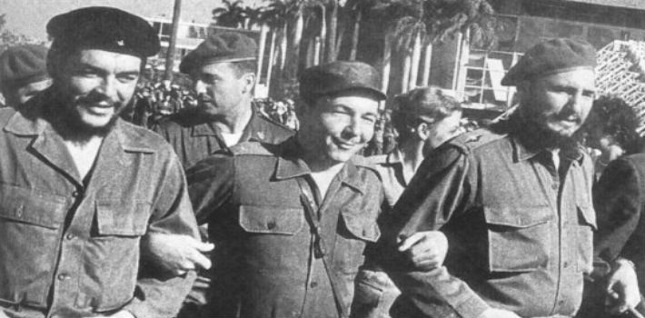
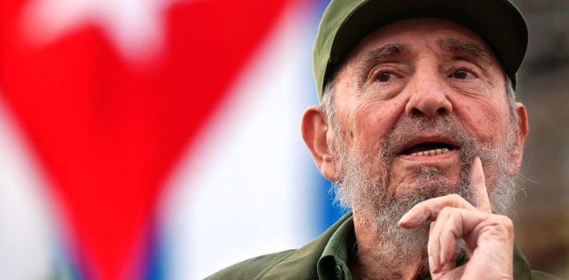
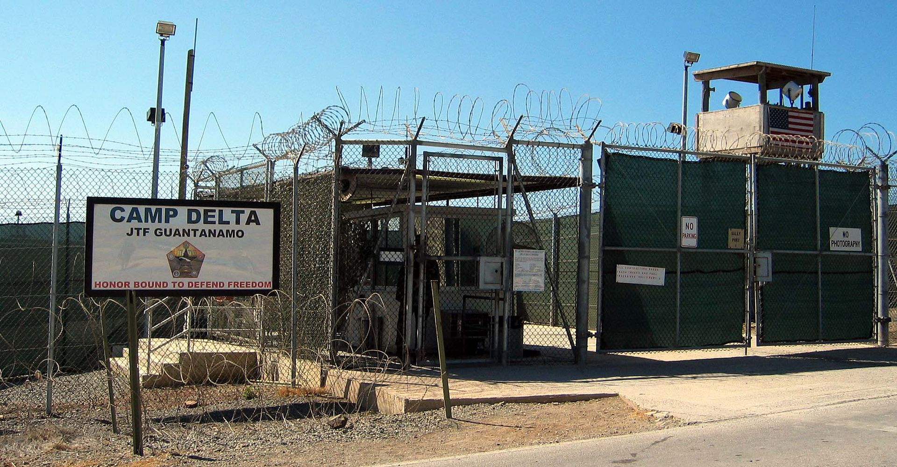
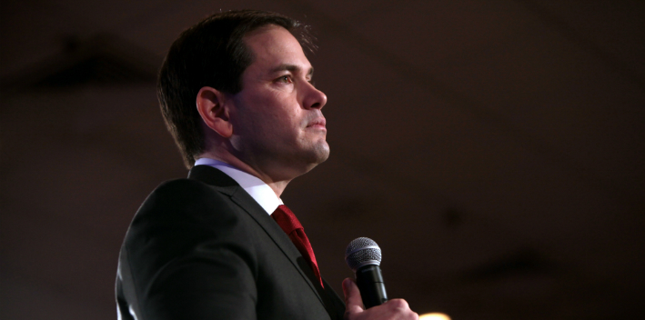

#### American Embargo Impedes the Means for Bottom-Up Change

By **[Yaël Ossowski](http://panampost.com/author/yael-ossowski/ "Yaël Ossowski")** | [PanAm Post](http://panampost.com/yael-ossowski/2014/01/14/one-million-canadians-cuba-every-year-us-citizens/)     

(En [Español](http://es.panampost.com/yael-ossowski/2014/01/14/canadienses-viajan-a-cuba-cada-ano-por-que-los-estadounidenses-no/))

In the freezing slush and rain of winter, the vacation posters represent total serenity and warmth.

“Check out Cuba’s glamorous vacations deals,” reads one. “Glorious beaches, ocean, and relaxation,” reads another.

In the frigid arctic shelf nation of Canada, these advertisements for resorts in Cuba are littered across bus stop shelters and billboards on the highway.

All-inclusive packages for less than CAN$1000 promise flights, a hotel, drinks, and royal treatment for Canadians escaping the frozen northern tundra for the Caribbean sun and sand _a la Cubana_.

The [top travel publications adore](http://www.tasteandtravelmagazine.com/havana.html) it; my friends and family who’ve been say it’s a paradise on the cheap, just a three-hour flight from Montreal.

Close to 1 million Canadians visited the island nation last year, [according to the Canadian government](http://www.canadainternational.gc.ca/cuba/bilateral_relations_bilaterales/canada_cuba.aspx?menu_id=7), making up 40 percent of all tourists, more than any other nationality.

But while Cuba is seen as a rite of passage for Canadian travelers, it’s outright [illegal for citizens](http://www.treasury.gov/resource-center/sanctions/Programs/pages/cuba.aspx) and residents of the United States. Why?

It dates from 1960, a year after communist revolutionaries, led by Fidel Castro, overthrew the [US-backed dictatorship](http://www.presidency.ucsb.edu/ws/index.php?pid=25660) of Fulgencio Batista. Cuban peasants, fed up with the oppression of the Batista regime and the huge economic and political influence of the United States, joined Castro’s cause and gave the Western world, seemingly spooked by socialism, a vivid example of a worker-led socialist revolution.

The US Congress, called to action by wealthy US landowners and businessmen in Cuba whose land had been seized in the revolution, enacted an embargo banning commercial exports to Cuba, later extended to all goods and services.

These provisions outlawed US American travel to Cuba, and severely penalized any US enterprise conducting business on the island. Such engagement could serve to prop up the regime and legitimize the political repression and land seizures that came along with the socialist revolution of 1959.

In the decades since, this has left Cuba politically and economically isolated — forced to rely on the Soviet Union for trade during the 1970s and 1980s, and on Venezuela in the modern age for energy and rudimentary trade.

As such, the island nation has had few options for widespread economic prosperity. This led the socialist utopian idea of a reformed Cuban society to quickly fail, and for despotic and authoritarian rule by Castro to take hold.

In the time since, the United States has remained cold and distant from its Cuban neighbor, located just 90 miles off the Florida Keys. The only significant US interaction with Cuban soil has been her naval base at Guantanamo Bay, granted by way of the[1920s-era Cuban Constitution](http://en.wikipedia.org/wiki/Platt_Amendment), written by US diplomats. This is where alleged Al-Qaeda fighters have been interrogated and incarcerated by the US military, conveniently outside the scope of domestic law.

At least in the last few years, thanks to executive orders from Democratic Presidents [Bill Clinton](http://www.treasury.gov/resource-center/sanctions/Documents/12854.pdf) and [Barack Obama](http://www.whitehouse.gov/the-press-office/2011/01/14/reaching-out-cuban-people), restrictions on US travel have been somewhat eased, but only for specially sanctioned “[people-to-people](http://www.treasury.gov/resource-center/sanctions/Programs/Documents/cuba_trav_adv.pdf)” missions granted by the US Department of Treasury. These trips are [extremely restricted](http://www.treasury.gov/resource-center/sanctions/Programs/Documents/cuba_trav_adv.pdf) and intended only for “cultural exchange” with Cubans, far from the resort towns and beaches advertised in Canada.

Critics, such as Senator Marco Rubio (R-FL), a son of Cuban exiles, label these trips “propaganda tours,” a charge thrown at hip-hop stars Jay-Z and Beyonce [when they visited the island](http://www.politico.com/story/2013/04/marco-rubio-jay-z-beyonce-cuba-89792.html) in 2013. Over 400,000 US Americans visited Cuba through this special arrangement in 2011, [primarily seen as “education tours”](http://www.npr.org/2012/02/06/146474813/u-s-travel-to-cuba-grows-as-restrictions-are-eased) and mission trips to help the desolate population, still ravaged by [years of economic isolation](http://www.dailymail.co.uk/travel/holidaytypeshub/article-586756/Cuba-poor-proud-beautiful.html) and failed central planning.

The main argument for the continued embargo, it is argued, is to attempt to convince the Cuban regime, now headed by Fidel Castro’s brother Raul, to abandon its socialist policies and embrace economic freedom for its people.

[As I wrote in 2012](http://watchdog.org/57594/fl-south-florida-lawmakers-keep-tight-control-on-cuban-american-policy/), this comes down to the significant influence practiced by Cuban-American politicians from south Florida, such as Rubio and Representative Ileana Ros-Lehtinen (R-FL). They’ve kept the noose tightened on Cuba in order to satisfy the millions of Cuban exiles now in Florida, who’ve fled the Castro regime since the 1960s and are convinced that punishment is the only way forward.

The essential question to ask in 2014, therefore, is how can the United States directly influence a nation to change its course of policy?

Sanctions, it seems, almost 54 years in, have ravaged the nation’s people and done nothing but increase support for the totalitarian regime.

In the wake of so many disastrous wars, direct military intervention seems unfruitful, but was once a serious proposal offered by US military leaders.

Apart from attempting to assassinate Castro or encourage Cuban rebellion against the government at the [Bay of Pigs](http://en.wikipedia.org/wiki/Bay_of_Pigs_Invasion), US leaders almost embraced a false-flag operation to justify the invasion of Cuban shores.

Operation Northwoods was a [strategy dreamt up by the US military](http://www.smeggys.co.uk/operation_northwoods.php?image=05#tt) in 1962 to provide a “pretext which would provide for US military intervention in Cuba.” The authors recommended dressing up US Americans in Cuban military uniforms and attacking Guantanamo Bay, sinking US military ships, and even staging a funeral to legitimize the loss of US soldiers. Further, the plan outlined how US-backed Cuban agents would initiate several bombings in several American cities, targeting high-profile members of the Cuban exile community in south Florida.

All this was proposed “since it would seem desirable to use legitimate provocation as the basis for U.S. military intervention in Cuba a cover and deception plan,” [according to the documents](http://media.nara.gov/media/images/36/15/36-1469a.jpg) declassified in 1997.

Thankfully, such a plan was never pursued.

So if military intervention won’t work, and sanctions haven’t proved effective, what’s next?

What is needed to free Cuba, it seems, is to stop the ongoing embargo which deprives Cuban citizens of so many freedoms they otherwise would have.

Most of the blame can and should be placed at the hands of the ruling socialist regime, which has deprived its people of so many opportunities, but the buck does not stop there. As the revolutions in the Middle East and North Africa demonstrate, determined people can find a way to subvert authoritarianism and bring about greater democracy.

But in order to get there, they need the means. They need trade. They need to be able to improve their economic conditions and have helpful partners in the US government. They need the economic opportunity which would be immediately granted once US Americans are free to spend money in Cuba, travel to Cuba, and trade with Cuban businesses.

Embracing the status quo when it comes to the island nation, once imagined as the US backyard playground, will no longer hold. Only freedom to live and trade will set the population free, and the US government has almost a more vital role than the Cubans themselves.

_This article was published on [PanAmPost](http://panampost.com/yael-ossowski/2014/01/14/one-million-canadians-cuba-every-year-us-citizens/)._
