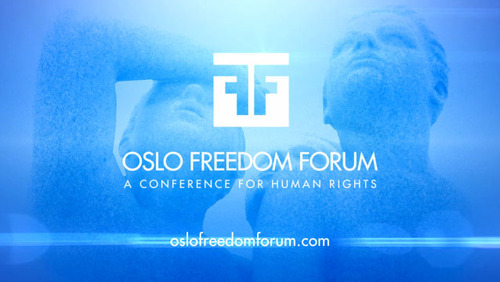
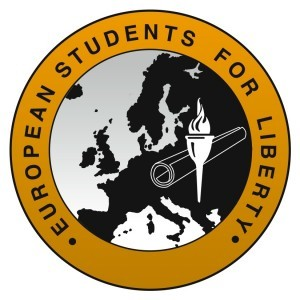

_**“Challenging Power”**_

> 
> 
> _“Hundreds of the world’s most influential dissidents, innovators, journalists, philanthropists, and policymakers will unite in the Norwegian capital for a three-day summit exploring how best to challenge authoritarianism and promote free and open societies.”_

This week I will be in attendance at the [**Oslo Freedom Forum**](http://www.oslofreedomforum.com/) here in Norway. 

The conference will be from May 13-15 and will feature great speeches, panels, and informal meeting sessions filled to the brim with the most innovative people advocating for Human Rights across the globe.

I will be writing articles, Tweeting without pause, gathering contacts on the fly, and spreading the message of individual freedom along with some of my [Executive Board colleagues](http://studentsforliberty.org/european-leadership/) of **E****uropean Students For Liberty**.

> 

The full speaker’s list can be found [here](http://www.oslofreedomforum.com/pdfs/2013OFFProgram.pdf), along with all the topics and subjects to be covered over the next three action-packed days.

Here are some of my favorites I’ve already picked out:

> THE ASYMMETRIC ACTIVIST
> 
> **Chen Guangcheng** - _China’s inevitable transformation_
> 
> **Hannah Song** - _North Korea’s Rising Civil society_
> 
> **Lobsang Sangay** - _Democracy in Exile_ (Very close to the name of my very own [podcast](http://libertyinexile.com))
> 
> WOMEN UNDER THREAT
> 
> **Jenan Moussa -** _Syria’s Uncovered Story_
> 
> THE POWER OF MEDIA
> 
> **Sasa Vucinic -** _Investing in Free Press_
> 
> **Jamie Kirchick-** _Devil’s Advocates_ (I will attempt to grill him on why he labeled former Czech President **Vaclav** Kalus a “[failure](http://www.spiegel.de/international/europe/bad-king-klaus-the-failings-of-a-czech-president-a-885928.html)”)
> 
> THE INSTRUMENTS OF CHANGE
> 
> **Srdja Popovic -** _Revolution 101_
> 
> A CLIMATE OF FEAR
> 
> **Mads Brügger** - _Rule of Law for sale_
> 
> FAÇADE CAPITALISM AND ITS THREAT TO HUMAN RIGHTS
> 
> **Donald Boudreaux** - _The Case for Economic Freedom_ (Naturally)
> 
> **Chee Soon Juan** - _The Myth of the Benevolent Dictator_

The Freedom Forum starts with a bang tomorrow with a press conference at the **Grand Hotel**, followed by workshops on **Data Protection** and **Technology Innovation** which prove essential for protecting peaceful protesters.

More to come from Oslo. Keep [**European Students For Liberty** on your radar](http://www.facebook.com/EuropeSFL)!

> 
