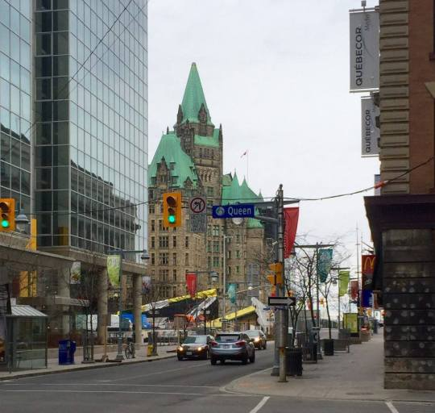

It’s an oddity that I would only explore the capital city of my birth nation well into my 20s. 

Then again, it’s a curse which befalls most natives of colossal and reaching lands. One can live an entire life alienated from the decreed city of administrative bureaucracy, far from paper pushers and stamps. At least the paper pushers with the really big stamps. 

Indeed, instead of living in a city of paper and rules for rules’ sake, one can dedicate themselves to the endless beauty found between shores and valleys elsewhere, far from smoky rooms and bribes of epic proportions. In all cases, beauty trumps bureaucracy. And sleaze. But that’s another point. 

The City of Ottawa is alien even to the the most unseemly creatures from the lagoon. 

It’s a part-time government town but a full-time city of compromise. Les francophones sont nombreux, but kept just out of reach. It doesn’t make much sense from a geographical perspective, unless your entire aim is to quell the imbalance between the French barons in Montreal and the English lords in Toronto. Check. 

The weekend is a time to take a vacation from being in the city and depart for your respective linguistic capital. Flights to Toronto and Montreal are really the only reason anyone would walk through the doors of the airport. 

The people are what one expects when they see a smiling Canadian on a postcard. They talk soft and they really care about how you’re doing. “But really, how are you doing today, buddy?” It’s a pleasant change. 

It’s a peculiar capital. It’s mild and soft and further confuses you about what it means to be Canadian. Or maybe it’s reassuring? It’s a weird compromise.
