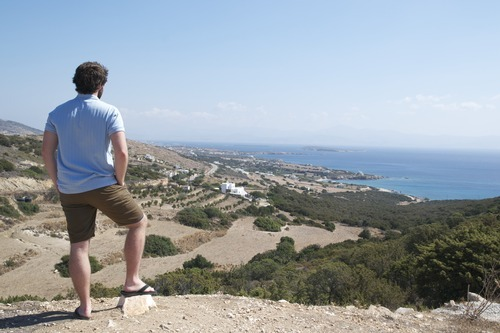
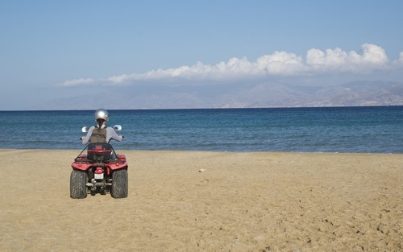
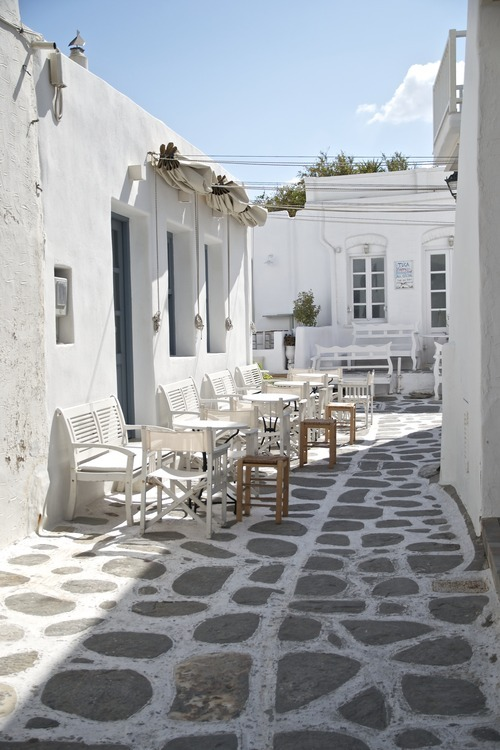
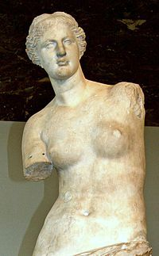

I could see the front of my two feet every few seconds. I would play a game to see how much of my shoe I could actually bring into my field of vision with each step taken.

It had been about 10 solid minutes that I was pushing the four-wheeler with my arms while staring straight down. I had deemed the vehicle a victim of gas depletion, but Melanie insisted I didn’t inspect the gas tank enough, but I told her it was a ridiculous notion. I’m a man, I exclaimed. Men know how to tell how much gas in the tank. But so it goes.

An Italian couple stopped and offered to help. A thirty-something couple on their honeymoon. People marry so late these days. They must have busy careers.

Of course in Europe, I’m not sure you could ever say people have busy careers. They have sometimes up to 5 weeks of vacation. That’s unfathomable to my North American work ethic and slave mentality. Surely, one must work and work and rarely ever ask to enough time to one’s self! How wrong I am.

It’s day 6 of our spontaneous Greek island trip. We had originally planned for South Korea (too expensive), Morocco (Air France pilots decided to strike and our flight was cancelled), and briefly flirted with Japan (will put off until January). The land of Plato, Aristotle, and lots of brunettes instead won our hearts. I hugged the nice Italian man from behind as we pulled into the gas station. I thought he was Melanie for a second. It made for an awkward moment.

After filling up the gas tank for just over 10 Euros (chump change, I say) we made our way to a beach on the opposite side of the island. Of course, our version of getting there in our smartphone-fused brains is quite different from reality. It’s 3D when we anticipate 2D and too many dimensions when the time actually counts.

Why haven’t we invented these beaming mechanisms yet? Did the intended inventor instead devote his attention to some kind of iPhone app for 99 cents? The one that shows you the closest pizza place or updates you on the football scores. People will do anything for money. But more will spend it.

Driving past so many concrete homes, I’m reminded of conversations with my friend Mayowa from Nigeria. He was stunned North Americans built so many structures with wood. “How efficient,” I remember him telling me at my family’s lake house in South Carolina. My dad was very happy to discuss the type of wood we used for the upper roof and sidewalls. Not to mention the wooden staircase he put on a special angle. It took a lot of work and skill, that I know. He has big plans in the works. Big plans.

I’m certain my dad would be quite confused with the concrete construction across Greek islands. He visited a few with my mother before I was born, right around my age, but I doubt he had his mind on the manner and material of residential construction. But my dad has an engineer’s mind, so I’m probably wrong. That’s what happens when you have an artist’s mind. You’re often wrong. But at least you can admit it fluidly. Engineers are so reluctant to reveal their chagrin.

At last, we saw the allure of the blue ocean. It’s always within view on Greek islands. Like it’s the local currency. We parked, enjoyed some sand, some reading, and snorkeling.

I’d say the greatest part about trotting across a Greek island on a four-wheeler is just how easy it is to park on the beach, pack up, and leave again. Obviously, to another beach. Or to the next restaurant where they have tzatziki, fried aubergine, and extremely cheap house wine.

If it isn’t for the beaches and food, then I presume I love the four-wheeler for the natural gas-guzzler in me. The one who loves the smell of dispensed gasoline, hot rubber tires, and the whining of a 2-cycle engine. While I’m no engineer, I certainly inherit those preferred inclinations from my dad.

Now the hours tick until we take our next ferry trip. A 6-hour long journey in total, but with a stopover on Serifos island for a quick lunch en route to Milos island, where the colors of the water match rare jewels and the horseshoe shape gives the island and its population of less than 5,000 some character.

It’s where the _Venus de Milo_ was discovered, the sculpture of the goddess Aphrodite carved over 2,000 years ago.  I’ve seen it in books, magazines, and thousands of replicas at antique shops up and down the east coast of the United States. Now the original sits in the Louvre Museum in Paris. I bet the original sculptor never saw that coming.
