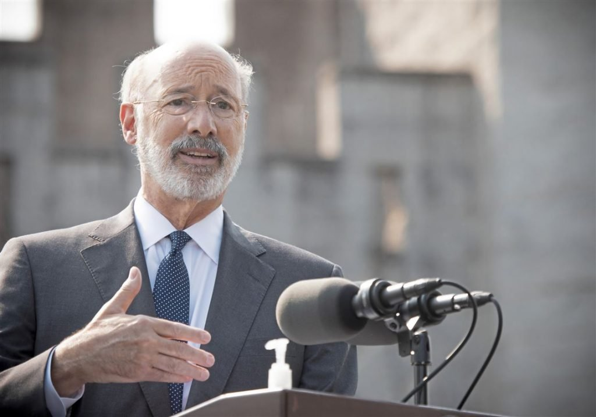

by David Clement and Yaël Ossowski

If the General Assembly takes up Gov. Tom Wolf’s call, Pennsylvania could become the 12th state to legalize recreational cannabis. They should absolutely follow through. But it won’t end there.

Legalizing cannabis is a no-brainer. Any negatives from legalization pale in comparison with the costs of prohibition. The failed war on drugs has criminalized otherwise peaceful citizens, torn minority communities apart and locked up far too many of our friends, family and neighbors. We know the cost.

But legalization in itself isn’t virtuous. State legislators must ensure that legislation does not end up causing even more problems. We need only look at other states, as well as our friendly neighbor to the north, to understand why smart cannabis legalization is necessary.

To begin, it has been suggested that Pennsylvania use its model of state retail of alcohol — namely through the Pennsylvania Liquor Control Board — as a template for selling cannabis products. Though Harrisburg legislators are tempted, this would be an outright disaster.

The state should lean on the private sector and avoid treating cannabis like alcohol. It is well known that Pennsylvania’s alcohol retail market is one of the most archaic and anti-consumer markets in the country, one that artificially raises prices, causes massive inconvenience and pushes thousands of Pennsylvanians to buy alcohol out-of-state. We especially saw this during the pandemic. That’s hardly an example to emulate.

In states where it is legal, cannabis retail is offered by licensed private businesses rather than state monopolies. Ontario, Canada’s most populous province, now has only private retail storefronts and is proceeding to have a retail market where licenses are uncapped. That means there can be better competition, a more responsive market and better customer service than in a state store.

A licensed private retail market would be wise for Pennsylvanians, as it would allow the market to determine the number of stores available to consumers, rather than a bureaucracy in Harrisburg.

The legal market would be dynamic enough to respond to consumer demand, an important factor in prying consumers away from the illegal market. Stopping the black market would help raise the tax revenue Mr. Wolf intends to offer to minority communities and small businesses in need of assistance post-COVID-19.

Added to that, Pennsylvania should ensure that taxation and regulation of cannabis products are reasonable and fair.

Though Colorado and Washington have raised an impressive amount of revenue since legalization, California — with higher-than-average taxation, counties that don’t allow legal shops, and a myriad of red tape governing who can grow and sell — has one of the largest cannabis black markets in the country. Nearly 80% of cannabis consumed in the state remains in the illegal market, depriving the state treasury of much-needed revenue, but also locking out entrepreneurs who could otherwise operate successful dispensaries and contribute to their communities.

Another issue is which products will be legal to sell and use.

Canada, the largest industrialized country to legalize cannabis, mandated that only dried cannabis and oils be made legal on day one. That meant harm-reducing alternatives, such as beverages or edibles, were not available for sale until the next year. Giving the green light on product variety would benefit consumers and the retailers who are permitted to sell legal products, and would help the legal market compete against illegal alternatives.

If the General Assembly acts, there will be a lot of temptation to treat cannabis as nothing more than a cash crop for government coffers. But if legislators want to help benefit the minority communities who have been hurt by prohibition, future consumers and prospects for raising enough revenue to ease the pain caused by the pandemic, they would be wise to enact a smart cannabis policy.

_David Clement and Yael Ossowski are North American affairs manager and deputy director, respectively, at the Consumer Choice Center, a global consumer advocacy group._

This article was published in the [Pittsburgh Post-Gazette](https://www.post-gazette.com/opinion/2020/09/16/David-Clement-and-Yael-Ossowski-Pa-can-and-should-legalize-cannabis-but-do-it-right/stories/202009160044). You can find the [PDF version](http://yael.ca/wp-content/uploads/2020/09/Pittsburgh-Post-Gazette.pdf) here (archive [#1](https://archive.ph/yAVA9), [#2](https://web.archive.org/web/20260108133911/https://www.post-gazette.com/opinion/2020/09/16/David-Clement-and-Yael-Ossowski-Pa-can-and-should-legalize-cannabis-but-do-it-right/stories/202009160044 "#2")).
